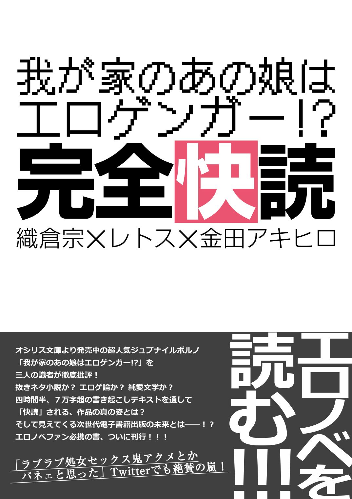

---
　

　

　

　

　

> 「でも、好きですし」
> 「その、エロ絵が？」
> 「エロ絵が、です」
> *（午後１２時の男　『我が家のあの娘はエロゲンガー！？』より）*

　

　

　

　

---
　

　

　――２０１５年８月某日。夏コミ開催日も差し迫ったある夜、Skypeのチャットルームに三人の男が集まった。何のために？　そう、エロノベを語るために。どうして？　そう、エロノベが好きだから。そしてその三人は静かに語り始める。熱く己の思いをぶつけ合うために――

これは、そんな感じですげぇ頭悪い感じにエロノベ脳をこじらしちゃった三人が、途方も無くしょうもない話を四時間半もしちゃったっていう、そういう記録です。ゆっくり楽しんでいってね！

　

　

　

*■座談会、開幕！*

*■座談会、開幕！*

*金田*　さて始まりました、座談会企画：『「我が家のあの娘はエロゲンガー!?」完全快読』。ということで、本日はお集まりいただきありがとうございます。あと、お仕事お疲れ様です（笑）。

**金田**　さて始まりました、座談会企画：『「我が家のあの娘はエロゲンガー!?」完全快読』。ということで、本日はお集まりいただきありがとうございます。あと、お仕事お疲れ様です（笑）。

織倉＆レトス　おつかれさまでーす（笑）。

金田　では、まずは軽く自己紹介からお願いします。
織倉　織倉 宗です。漢字で書かれちゃったんで読めない人がいるかもしれないんですけど「おりくら　はじめ」です。よろしくお願いします。
レトス　もともとは普通のラノベ読みだったんですが、なぜかエロラノベ買いまくってるレトスです。よろしくお願いします。
織倉　エロラノベ読まれるんですか？
レトス　エロラノベ月10冊はいかないですけど、５～６冊は読んでますね。
織倉　５～６冊だと、オシリス文庫が３～４冊占めると思うんでそのほかだと１～２冊くらい？
レトス　３～４くらいですね、それプラス。月当たりで。あと家に人からもらった美少女文庫が１００冊くらいあるという。
織倉＆金田　（笑）。
金田　すごい友人関係ですね。
織倉　あまり普通の友人関係じゃないなそれ。
レトス　新興エロラノベレーベルが出たらとりあえず買ってます
金田　強者ぞろいだな……。ええと、先に回答いただいたアンケート結果（※注：事前に座談会各テーマについての質問を参加者に配布していた）を見ると、お二人ともオシリス文庫は全巻そろえてらっしゃるということで。
織倉　世の中に何人居るんだろうなそれ。
レトス　この世に２人とかじゃないかなと。
織倉　ペガサスの時代を知ってる人がまず少ないんじゃないかなぁ。（※オシリス文庫は２０１４年４月に、旧名のペガサス文庫からレーベル名を変更している。）
金田　えー、続いて私の自己紹介ですが。金田アキヒロと申します。今回企画主催させていただいた首謀者です。評論本は初めてなんですけど、作品愛だけでぶちきらせていただきたいと思います。至らないところはあるかと思いますがお付き合いください。

■読者の皆様へ