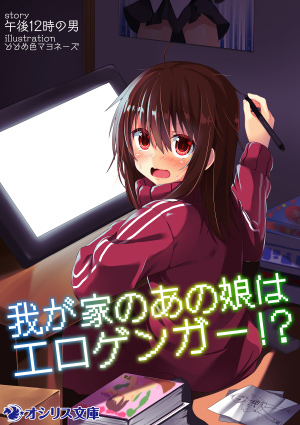
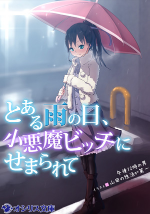
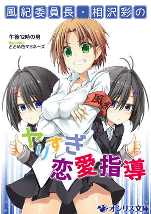
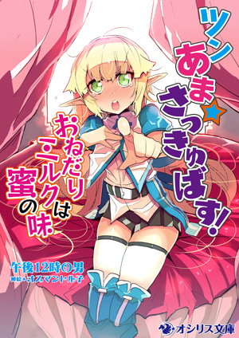
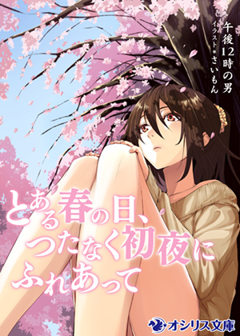
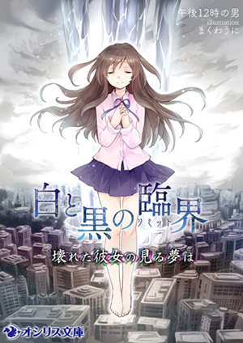
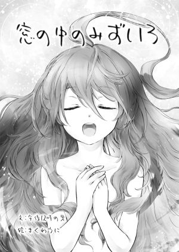

---
　

　

　

　

　

>「でも、好きですし」
>
>「その、エロ絵が？」
>
>「エロ絵が、です」

*（午後１２時の男　『我が家のあの娘はエロゲンガー！？』より）*

　

　

　

　

　

---
　

　

　――２０１５年８月某日。夏コミ開催日も差し迫ったある夜、Skypeのチャットルームに三人の男が集まった。何のために？　そう、エロノベを語るために。どうして？　そう、エロノベが好きだから。そしてその三人は静かに語り始める。熱く己の思いをぶつけ合うために――

これは、そんな感じですげぇ頭悪い感じにエロノベ脳をこじらしちゃった三人が、途方も無くしょうもない話を四時間半もしちゃったっていう、そういう記録です。ゆっくり楽しんでいってね！

　

　

　

**■座談会、開幕！**

**金田**　さて始まりました、座談会企画：『「我が家のあの娘はエロゲンガー!?」完全快読』。ということで、本日はお集まりいただきありがとうございます。あと、お仕事お疲れ様です（笑）。

**織倉＆レトス**　おつかれさまでーす（笑）。

**金田**　では、まずは軽く自己紹介からお願いします。

**織倉**　織倉 宗です。漢字で書かれちゃったんで読めない人がいるかもしれないんですけど「おりくら**　はじめ」です。よろしくお願いします。

**レトス**　もともとは普通のラノベ読みだったんですが、なぜかエロラノベ買いまくってるレトスです。よろしくお願いします。

**織倉**　エロラノベ読まれるんですか？

**レトス**　エロラノベ月10冊はいかないですけど、５～６冊は読んでますね。

**織倉**　５～６冊だと、オシリス文庫が３～４冊占めると思うんでそのほかだと１～２冊くらい？

**レトス**　３～４くらいですね、それプラス。月当たりで。あと家に人からもらった美少女文庫が１００冊くらいあるという。

**織倉＆金田**　（笑）。

**金田**　すごい友人関係ですね。

**織倉**　あまり普通の友人関係じゃないなそれ。

**レトス**　新興エロラノベレーベルが出たらとりあえず買ってます

**金田**　強者ぞろいだな……。ええと、先に回答いただいたアンケート結果（※注：事前に座談会各テーマについての質問を参加者に配布していた）を見ると、お二人ともオシリス文庫は全巻そろえてらっしゃるということで。

**織倉**　世の中に何人居るんだろうなそれ。

**レトス**　この世に２人とかじゃないかなと。

**織倉**　ペガサスの時代を知ってる人がまず少ないんじゃないかなぁ。（※オシリス文庫は２０１４年４月に、旧名のペガサス文庫からレーベル名を変更している。）

**金田**　えー、続いて私の自己紹介ですが。金田アキヒロと申します。今回企画主催させていただいた首謀者です。評論本は初めてなんですけど、作品愛だけでぶちきらせていただきたいと思います。至らないところはあるかと思いますがお付き合いください。

**■読者の皆様へ**

**金田**　では、改めまして今回の企画の趣旨から。オシリス文庫より２０１５年５月２２日刊行の『我が家のあの娘はエロゲンガー!?（以下、『エロゲンガー』）』著者：午後12時の男、イラスト：どどめ色マヨネーズ、このエロラノベを三人で語りつくそう、という企画でございます。この作品にとどまらず、作者商業作品既刊６冊、プラス同人作品１作についても語りますし、ネタバレも大量に含みますので、未読の方はご注意ください。できたら先に作品を読んでね。面白さ倍増です。

**■最初の質問　「この本、何点？」**

**金田**　というわけで早速最初のお題に入りたいと思います。この作品を読んだ大まかな感想と、10点満点で点数をつけていただきたいと思います。ではレトスさん、どうぞ。

**レトス**　まず、エロゲー論、クリエイター論が上手く取り込まれていたのでスゲェな、と思いました。あと最初はヒロインと微妙な距離感だったくせに最後はメッチャいちゃいちゃし始めて、この関係の変化が上手いなぁと思いました。点数は、これは個人的に抜けなかったのでマイナス１で９点です。

**織倉＆金田**　あー、なるほど。

**織倉**　日向さん（ヒロイン）がとても面白い人でしたね。この本基本的に「日向さんが面白い」っていうことが言えれば今回満足なので、大体そんな感じですね。点数は、散々悩んだ挙句、フィーリングで８点。あまり８点という点数に根拠は無いです。評価は低くは無い、という意味。

**金田**　私の感想ですが、全体の印象は、話の展開が流れるように滑らかに進む、非常に読ませる力を感じました。そこが良くて10点満点で９点。この減点１は日向さんの動機みたいなものが描き切れていない、というのと、あと誤字脱字。

**レトス＆織倉**　あー。

**レトス**　誤字脱字は「編集仕事しろ」って思いますけど（笑）。

**織倉**　『ツンあま☆さっきゅばす！**　～おねだりミルクは蜜の味～（以下、『さっきゅばす！』）』は３回差し戻してアレ、ってどっかに書いてありましたね。

**■この作品を知ったきっかけ、買った理由は？**

**金田**　では次の質問ですが……。

**織倉**　これ、参考にならないんじゃないの？**　金田さんオンステージにしかならない（笑）。僕ら言っちゃいますけど全作買ってるんで。

**レトス**　オシリス文庫全巻買ってます。それを生業としてるような……。

**織倉**　僕も全部買ったら入ってました、という状態なので。僕らは選んでないわけで、なぜ選んだかというのは僕らも知りたい。

**金田**　同人仲間のえーぱーくさんという方がTwitterで紹介されていて、それを見て、ですね。「え、義理の妹で、エロゲンガーで？**　オタバレでしょ？**　最終的にエッチしてください？**　それはいくらなんでもやりすぎでしょ？」とまずそこで引き込まれましたね。で、Amazonの試し読み読んだんですけど、なかなかエッチに進まなくて。「こんな紹介文だったら開いて３ページで即セックス、みたいなそんなノリじゃないかな」と思ったんですけど……。

**織倉**　それが意外に丁寧だったんだ。

**金田**　そう、それで読んでて「この先どうなるんだろう？」って気になっちゃって。それで買っちゃったんですよね。

**織倉**　あー、なるほど。試し読みを読んで買ったんですね。

**レトス**　僕ら試し読みを読む習慣が無いですもんね（笑）。

**織倉**　自動的に買っているので、そもそもサイトの紹介文を読む必要が無い！

**金田**　オートマチックなんですね。

**レトス**　だからこの辺、僕ら全く参考にならない（笑）。

**織倉**　まさかこんなのが二人居るとは思わなかった（笑）。ナンダコリャ（笑）。

**■えっ、作品紹介文読んでないの？**

**金田**　じゃあ、次のお題の「作品紹介文をどう思ったか」っていうのも私だけがしゃべることになるんですか？（笑）

**織倉**　だって今回作品紹介読んでなくて、アンケートを書くにあたって初めて読みましたから。

**レトス**　同じく。

**織倉**　あ、すげぇ中身書いてあるな、とは思った。

**金田**　そうなんですよね、中身ほぼ書いちゃってるんですよ。

**織倉**　だって、エロラノベであらすじ書いて、その後セックスしないわけが無いんで。そりゃここまで書いたらヤってるだろ、っていう。

**レトス**　ある意味想定の範囲内ですよね中身は。

**金田**　まあ、タイトル見てそういう話なんだろうな、って感じるのは確かにそうなんでしょうけど……。ああ、そうか僕はエロラノベそんなに読んでなかったし、「ストーリーが気になって……」っていう入り方をしているから、作品紹介読んで「ストーリーはこうなのか」「でもこれ全部書いちゃってるじゃん」って思っちゃったのか。なんか「すでにネタバレしちゃってる映画を見る」みたいな感じで読み始めたんで、最初のインパクトが紹介文を読んでなかったらもっとあったのかな、という感想ですね。ファーストインパクトをもっと体験したかったな、と。

**レトス**　そうかー。

**織倉**　それ自体が無かったからなぁ、僕らは。

**レトス**　どっちかっていうとこの作者だからどんな作品になるかな、みたいな読み方をする。

**織倉**　「最後は止まるよね」みたいな（笑）。

**レトス**　あんな感じでくるんだろうな、みたいな。

**金田**　実は私もこの企画始めるにあたって、作者の既刊全作読んだんですよ。で、最後のフィニッシュの前に寸止めするとか、お互いの気持ちを確かめ合うシーンが必ず入るとか、本気汁の説明とか、先走りの精子の話とか、定番ネタみたいなのは確かにあるんですけど、それ以外のところは結構読ませてくれるんで、全作どこも引っかかるところが無く読めましたね。それは良かったかな。

**■導入部についての感想**

**金田**　では「冒頭主人公が部屋の中に入ってからヒロインに捕まるまで」の感想なんですが……このシーンけっこう重要だと思うんですけど。

**織倉**　ここ、何度か読み返して納得いかないのが、「２年間同居してる相手の部屋に一度も入ったことがない」って相当めずらしいというか……。一生懸命避けようとしてました、ってことは書いてあるけど、避けようとして避けられるの？**　っていうのがわかんないな、って思ってる。そこはエロラノベだから流した、ってのはあるかもしれないけど。

**金田**　その点についてなんですけど……私、実の妹が居るんですけど、部屋には入らないし、入れないですよ？

**織倉**　いや、日向さんのようなすごい汚部屋であれば、何となくわかるでしょ？**　でも錬一くん（主人公）は全く知らないわけでしょ。隣の家に住んでいるならアリなんですけど、両親が結婚してて、同じ家に住んでて、その部屋の様子を完全に知らないってのは、その避けようで家族が運営できるんだろうか？**　っていうバランスの悪さを感じるんです。

**レトス＆金田**　あー、なるほど。

**織倉**　ただまあ、本筋エロラノベなので、あんま関係ないからそこまで考えなくてもいいんじゃないかな、って。

**金田**　この作品実はよく考えられて作られていると思うんです。普通のラノベだったらもっと登場人物増やして膨らませて12巻くらいのシリーズにしちゃうんじゃないかな？**　って思うくらい。だから、もっとこういうバックボーンを掘り下げていけば、もっと話長くできると思うんですよ。

**織倉**　パワーかけてるところとかけてないところが極端なんですよね。この点はあきらかにかけてないところなんです。代わりに、序盤で書かれている「エロゲンガーとは？」とか、「仕事としてのエロゲンガーとは何？」とかが、明らかにパワーをかけているところ。なので、そういうムラみたいなものはあるのかな、という感じですね。

**金田**　割り切りはありますよね、いい意味で。

**レトス**　僕ぜんぜんそこ気にしなかったんですよ。むしろ「家が違うんだろう」くらいに思ってました。

**金田**　なるほど（笑）。

**レトス**　これ完全に誤読してます。

**金田**　確かにこれ、同居だとおかしいかもしれないですね。

**織倉**　距離感はあっても、２年間知らなかったってのは……。

**レトス**　錬一くんが「オタクだったからあえて近づかなかった」みたいな性質だった、で納得できなくはないかな？

**織倉**　「後からわかってみれば」ですけど、「日向さんもオタクだったから、彼女からも近づこうとしなかった」みたいな。外から見たら磁石のＮ極とＮ極だった、みたいなことだと思うんですよ。でもそれ、所詮は磁石程度の、手でガッてやったら負けちゃうくらいの反発力じゃん！

**金田**　ちょっと見かけちゃうくらいのことはあるだろう、と……。たぶん、ですけど、日向さんの部屋の様子からするにAmazonからダンボールが大量に届く系の購買行動してそうですよね。

**織倉**　だから、日向さんがどっちの連れ子なのか、ってのはわからないですけど、例えばお母さんの連れ子だったとして、お母さんと「こんな荷物がとどくのよ～」みたいな話してないのかな、って。

**レトス＆金田**　なるほど。

**織倉**　居れば何がしかあるだろう、というのがありますね。まあ、パワーをかけてないところなので言っても仕方ないかな。僕も最初読んだときは、隣り合ってる家にそれぞれ住んでると思ってましたからね。

**レトス**　同じ家の一部屋で、入るのに５分かかる部屋ってないっすよ、っていう（笑）。これが違う一軒家だったらまあギリわかるかな、くらいの。

**織倉**　そこはたぶん体感時間なんじゃないかと思うんですけどね。

**金田**　この作品って一本道で進むじゃないですか。日向さんと錬一くんの距離が近づいて、セックスして、さらにどんどん近づいていく。で、最初の導入部って「５分かかって部屋に入る」。つまり時間的、精神的な距離が５分かかります、ってところがスタート地点になるんですよ。だけど日向さんは５秒で詰めてくる、っていうそこがフックになってると思うんです。

**織倉＆レトス**　なるほど。

**金田**　いわゆる「自分との距離がすごく遠かったはずの女の子と、こういう状況に巻き込まれてしまったために急に近づいてしまった」という導入部だったんじゃないかなと、見てて思うんです。

**織倉**　逆に、５分の距離を５秒で縮められたらむしろ怖いんじゃないかと思うんですけど。

**レトス**　そうっすね（笑）。

**織倉**　ここで日向さんが直接行為に行っちゃうのに対して、錬一くんは（耐えたので）結構えらかったな、というか。ここで話を「怖い」に倒しちゃうとこの話無かったと思うんで。

**織倉**　「遠巻きに遠ざけて見てたんだけど意識してた」みたいな、すごい複雑な生活をしてたじゃないですか。「５分を５秒で詰められた」っていうところに「あれ、ひょっとしてラッキー？」ってのを、もしかしたら、錬一くんは想像したのかな？**　５分と５秒の差みたいなものについて錬一くんが何を考えたのか、みたいなことには興味ありますね。起きたことは金田さんがおっしゃったようなことだと思うんですけど、実際自分が目の当たりにしたら怖いだろうな、と思います。

**金田**　ま、そうですね（笑）。

　

　

　

---

**◆巻末特別付録『午後12時の男　作品紹介』◆**

　

**■『我が家のあの娘はエロゲンガー！？』**
>
>
>著者：午後１２時の男（作品紹介はすべて著者の作品であるため以下省略）
>
>イラスト：どどめ色マヨネーズ　2015年5月22日オシリス文庫より刊行

著者商業出版６作目にして今回の座談会の課題図書。ヒロインである義理の妹が、主人公お気に入りのエロゲンガー本人だった、という斜め上な設定の異色作。二人の間で繰り広げられるコミカルなオタバレのオンパレードと、エロゲ論、クリエイター論にまで発展する会話の応酬は、全体の半分を占めるもののテンポが良く飽きさせない。そして焦らしに焦らした後半は、著者お得意のセックス描写が冴えわたり、実用的エロノベとしても完成度の高い一作となっている。

**■『とある雨の日、小悪魔ビッチにせまられて』**
>
>
>イラスト：山田の性活が第一
>
>2013年12月20日オシリス文庫より刊行

偶然出会った合法ロリソープ嬢ヒロインと、冴えない童貞主人公がめくるめくセックスを繰り広げる、全編エロエロな著者商業デビュー作。とにかくセックス大好きなド淫乱自称ヤリマンビッチなヒロインが、主人公を背徳的なロリエロセックスに誘いまくり＆絶頂しまくり、という抜きエロノベの極地のような作品。アマゾンのレビューでも「抜ける」と高評価。ストレートにエロ描写を描き切った著者渾身の処女作。

**■『風紀委員長・相沢彩のヤリすぎ恋愛指導』**
>
>
>イラスト：どどめ色マヨネーズ
>
>2014年5月23日オシリス文庫より刊行

著者商業出版２作目。煮え切らない主人公と幼馴染の奥手な正ヒロインの仲を見かねて、親友のヤリマンセカンドヒロインが主人公の貞操を奪うように見せかけて正ヒロインとの仲を取り持つ、というエロ漫画などでは頻出のテーマ。脇役の言動だったり、舞台が「学園」だったりとステレオタイプなラノベ設定でコミカルな作品。しかし正ヒロインの影が相対的に薄く、表紙絵もセカンドヒロインが主役のように見え、全体的に薄味な印象。

**■『ツンあま☆さっきゅばす！　～おねだりミルクは蜜の味～』**
>
>
>イラスト：オスマントル子
>
>2014年8月22日オシリス文庫より刊行

著者商業出版３作目にして初のファンタジー。サッキュバスとしての本能に目覚めかけたヒロインと、口を開けば喧嘩ばかりしていた主人公が、セックスをする中で和解し、最終的にドロドロの性欲地獄に堕ちる、という二次元ドリームな作品。読者の中でも「最も抜けた作品」との呼び声が高い。しかし、抜きに特化しているように見えて、ゲームブック的なギミックを入れたり、主人公とヒロインの視点を変えて心の機微を描くなど、挑戦的な要素も盛り込まれている。

**■『とある春の日、つたなく初夜にふれあって』**
>
>
>イラスト：さいもん
>
>2014年10月24日オシリス文庫より刊行

著者商業４作目。のっぴきならない状況から急きょ結婚することになった従兄妹カップルのラブストーリー。一旦セックスをするものの、お互いの気持ちを確かめきらないまま行為に及んだことに悩む、という著者の作風が如実に現れたプロットで前半は展開する。しかし、打ち解けあった後半は、アブノーマル要素も盛り込むなどエロさも折り紙付き。自然体で睦み合いながら絆を深めていく二人が初々しい、読後感のさわやかな一作。既刊読者にも嬉しいサプライズ付き。

**■『白と黒の臨界～壊れた彼女の見る夢は～』**
>
>
>イラスト：まくわうに
>
>2014年12月19日オシリス文庫より刊行

著者商業5作目。滅亡に向かう世界の中で、人柱的存在の「要の子」であるヒロインを「壊して」まで手に入れたいと願った男の、悔恨と絶望の物語。いわゆるセカイ系作品に見られる救いの無い状況の中、暗く淡々とした筆致で続く凌辱描写は凄惨を極める。物語の後半では著者独特のスタイルが復活し、二人の愛と魂の再生を活写する。拭いきれない感動を残す良作。ではあるものの、最後まで抜き要素を入れない徹底ぶりには脱帽。「抜けないエロノベ」という、業界に一石を投じる問題作。

**■『窓の中のみずいろ』**
>
>
>イラスト：まくわうに
>
>2013年夏コミ初出

全年齢向け同人小説。「小説家になろう」サイトにて無料で公開されている。著者の中では珍しくＳＦ作品となる本作は、人類最後の生き残りとなった主人公と、孤独な異星人の少女とをつなぐ星間通信による心の触れ合いを描いた純愛作品。古典ハードＳＦを意識してか、硬質な文体と無慈悲な状況設定で全体をまとめており、それが切なさに拍車をかける。ラストシーンをバッドエンドと見るかグッドエンドと見るか、それは読者の判断にお任せしたい。

---

**編集後記**

初めましての方は初めまして。そうでない方はお久しぶりです。ドーモ、スーパーよろづ同人サークル「ＤＤＷＳ」主催の金田アキヒロです。

さて今回は、「電子書籍エロライトノベルについて語り明かした座談会の内容を評論本にする」という企画だったわけですが、いかがでしたでしょうか。このコピー本の試みが成功したかどうかは、読者のあなたが「この本面白そうだから買ってみようかな」と思ってポチって実際読んでみて「おおスゲェこれ本当に面白いじゃん！」と言ってくださるかどうかにかかっているわけですが、いやほんと面白いのでぜひ読んでみてください。

私ごとですが、今までいろいろ同人誌を作ってきましたが、ガチの文芸評論本というのは初めてだったりします。でもこういう本、作ってみたかったんですよね、ずっと。昔GOD HANDというキチガイ（褒め言葉）オナニー同人サークル（本当）という、最高に頭の悪い方々がおられたのですが、彼らが作っていた「このエロ漫画／アニメ／オナホールが抜けた」「俺の開発したオナニー体験記」などという死ぬほどくだらない内容の本が、私にとってはそれはそれは感動的なもので、今でも心の同人誌となっています。当時は、彼らのエロネタ、オナニーネタに賭ける、隠しもしない情熱が、ちょっとした救いでした。今よりオタクという在り方について悩んでいたりもしたので……（笑）。

もちろん「同好の士と交流できた」という感動もありますが、「エロノベをネタにひたすら熱く語る」という彼らの真似事のようなことができて、そういう意味でも感動していたりします。またなんかこういう企画やれたらいいなぁ、と思います。

最後に。本当に余談になってしまうのですが、こうして感想を語り合ったものを世に出すことで、他のエロノベが好きな人や、作者、編集さんや出版社に対して、何かこの業界を良くしていく、盛り上げていくためのメッセージを伝えることができたら、それは大変幸福なことだとも思うのです。ただ読んで、面白かった、と感動を胸の内にしまっておくだけでは、広がりはありません。作中の錬一くんと日向さんのように、読者が語り合い、作者にも伝わり、それが明日の創作の糧になる、そんな流れができたら、もっともっと面白い作品で「快読」ができると思います。少し大上段に構えすぎでしょうか？　いやでも、その方が楽しいじゃありませんか。

さて、そんなとりとめのない夢物語をしたところで、これにて本当に仕舞いでございます。
ではまた、どこかの即売会でお会いしましょう。

---

**奥付**

『我が家のあの娘はエロゲンガー!?　完全快読』
  2015年8月16日　初版発行
  2015年11月6日　電子書籍版発行

出演：織倉 宗、レトス、金田アキヒロ

本文デザイン、ＤＴＰオペレーション：織倉 宗

表紙デザイン、文字起こし、編集、印刷その他もろもろ：金田アキヒロ

発行者：金田アキヒロ

発行所：ＤＤＷＳ（http://ddws.hatenablog.com/）

連絡先：taoist.aki@gmail.com

本同人誌は、改変をしない限りコピーフリーです。

また、電子書籍版は当サークルのサイトにて掲載しておりますので、じゃんじゃん宣伝してください。

なお、本誌中で引用した画像は、ネットで自由に閲覧可能なものばかりですが、著作権は出典元にあります。商用利用などの際には各出典元に必ず了解を得てください。