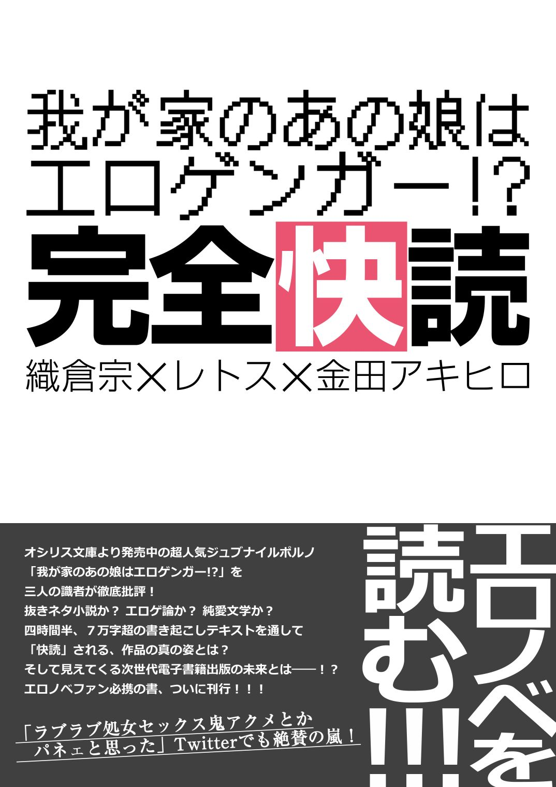

---
　

　

　

　

　

>「でも、好きですし」
>
>「その、エロ絵が？」
>
>「エロ絵が、です」

*（午後１２時の男　『我が家のあの娘はエロゲンガー！？』より）*

　

　

　

　

　
---
　

　

　――２０１５年８月某日。夏コミ開催日も差し迫ったある夜、Skypeのチャットルームに三人の男が集まった。何のために？　そう、エロノベを語るために。どうして？　そう、エロノベが好きだから。そしてその三人は静かに語り始める。熱く己の思いをぶつけ合うために――

これは、そんな感じですげぇ頭悪い感じにエロノベ脳をこじらしちゃった三人が、途方も無くしょうもない話を四時間半もしちゃったっていう、そういう記録です。ゆっくり楽しんでいってね！

　

　

　

**■座談会、開幕！**

　

**金田**　さて始まりました、座談会企画：『「我が家のあの娘はエロゲンガー!?」完全快読』。ということで、本日はお集まりいただきありがとうございます。あと、お仕事お疲れ様です（笑）。

**織倉＆レトス**　おつかれさまでーす（笑）。

**金田**　では、まずは軽く自己紹介からお願いします。

**織倉**　織倉 宗です。漢字で書かれちゃったんで読めない人がいるかもしれないんですけど「おりくら　はじめ」です。よろしくお願いします。

**レトス**　もともとは普通のラノベ読みだったんですが、なぜかエロラノベ買いまくってるレトスです。よろしくお願いします。

**織倉**　エロラノベ読まれるんですか？

**レトス**　エロラノベ月10冊はいかないですけど、５～６冊は読んでますね。

**織倉**　５～６冊だと、オシリス文庫が３～４冊占めると思うんでそのほかだと１～２冊くらい？

**レトス**　３～４くらいですね、それプラス。月当たりで。あと家に人からもらった美少女文庫が１００冊くらいあるという。

**織倉＆金田**　（笑）。

**金田**　すごい友人関係ですね。

**織倉**　あまり普通の友人関係じゃないなそれ。

**レトス**　新興エロラノベレーベルが出たらとりあえず買ってます

**金田**　強者ぞろいだな……。ええと、先に回答いただいたアンケート結果（※注：事前に座談会各テーマについての質問を参加者に配布していた）を見ると、お二人ともオシリス文庫は全巻そろえてらっしゃるということで。

**織倉**　世の中に何人居るんだろうなそれ。

**レトス**　この世に２人とかじゃないかなと。

**織倉**　ペガサスの時代を知ってる人がまず少ないんじゃないかなぁ。（※オシリス文庫は２０１４年４月に、旧名のペガサス文庫からレーベル名を変更している。）

**金田**　えー、続いて私の自己紹介ですが。金田アキヒロと申します。今回企画主催させていただいた首謀者です。評論本は初めてなんですけど、作品愛だけでぶちきらせていただきたいと思います。至らないところはあるかと思いますがお付き合いください。

　

**■読者の皆様へ**

　

**金田**　では、改めまして今回の企画の趣旨から。オシリス文庫より２０１５年５月２２日刊行の『我が家のあの娘はエロゲンガー!?（以下、『エロゲンガー』）』著者：午後12時の男、イラスト：どどめ色マヨネーズ、このエロラノベを三人で語りつくそう、という企画でございます。この作品にとどまらず、作者商業作品既刊６冊、プラス同人作品１作についても語りますし、ネタバレも大量に含みますので、未読の方はご注意ください。できたら先に作品を読んでね。面白さ倍増です。

　

**■最初の質問　「この本、何点？」**

　

**金田**　というわけで早速最初のお題に入りたいと思います。この作品を読んだ大まかな感想と、10点満点で点数をつけていただきたいと思います。ではレトスさん、どうぞ。

**レトス**　まず、エロゲー論、クリエイター論が上手く取り込まれていたのでスゲェな、と思いました。あと最初はヒロインと微妙な距離感だったくせに最後はメッチャいちゃいちゃし始めて、この関係の変化が上手いなぁと思いました。点数は、これは個人的に抜けなかったのでマイナス１で９点です。

**織倉＆金田**　あー、なるほど。

**織倉**　日向さん（ヒロイン）がとても面白い人でしたね。この本基本的に「日向さんが面白い」っていうことが言えれば今回満足なので、大体そんな感じですね。点数は、散々悩んだ挙句、フィーリングで８点。あまり８点という点数に根拠は無いです。評価は低くは無い、という意味。

>『我が家のあの娘はエロゲンガー！？』  
>  
>イラスト：どどめ色マヨネーズ　2015年5月22日オシリス文庫より刊行

**金田**　私の感想ですが、全体の印象は、話の展開が流れるように滑らかに進む、非常に読ませる力を感じました。そこが良くて10点満点で９点。この減点１は日向さんの動機みたいなものが描き切れていない、というのと、あと誤字脱字。

**レトス＆織倉**　あー。

**レトス**　誤字脱字は「編集仕事しろ」って思いますけど（笑）。

**織倉**　『ツンあま☆さっきゅばす！　～おねだりミルクは蜜の味～（以下、『さっきゅばす！』）』は３回差し戻してアレ、ってどっかに書いてありましたね。

　

**■この作品を知ったきっかけ、買った理由は？**

　

**金田**　では次の質問ですが……。

**織倉**　これ、参考にならないんじゃないの？　金田さんオンステージにしかならない（笑）。僕ら言っちゃいますけど全作買ってるんで。

**レトス**　オシリス文庫全巻買ってます。それを生業としてるような……。

**織倉**　僕も全部買ったら入ってました、という状態なので。僕らは選んでないわけで、なぜ選んだかというのは僕らも知りたい。

**金田**　同人仲間のえーぱーくさんという方がTwitterで紹介されていて、それを見て、ですね。「え、義理の妹で、エロゲンガーで？　オタバレでしょ？　最終的にエッチしてください？　それはいくらなんでもやりすぎでしょ？」とまずそこで引き込まれましたね。で、Amazonの試し読み読んだんですけど、なかなかエッチに進まなくて。「こんな紹介文だったら開いて３ページで即セックス、みたいなそんなノリじゃないかな」と思ったんですけど……。

**織倉**　それが意外に丁寧だったんだ。

**金田**　そう、それで読んでて「この先どうなるんだろう？」って気になっちゃって。それで買っちゃったんですよね。

**織倉**　あー、なるほど。試し読みを読んで買ったんですね。

**レトス**　僕ら試し読みを読む習慣が無いですもんね（笑）。

**織倉**　自動的に買っているので、そもそもサイトの紹介文を読む必要が無い！

**金田**　オートマチックなんですね。

**レトス**　だからこの辺、僕ら全く参考にならない（笑）。

**織倉**　まさかこんなのが二人居るとは思わなかった（笑）。ナンダコリャ（笑）。

　

**■えっ、作品紹介文読んでないの？**

　

**金田**　じゃあ、次のお題の「作品紹介文をどう思ったか」っていうのも私だけがしゃべることになるんですか？（笑）

**織倉**　だって今回作品紹介読んでなくて、アンケートを書くにあたって初めて読みましたから。

**レトス**　同じく。

**織倉**　あ、すげぇ中身書いてあるな、とは思った。

**金田**　そうなんですよね、中身ほぼ書いちゃってるんですよ。

**織倉**　だって、エロラノベであらすじ書いて、その後セックスしないわけが無いんで。そりゃここまで書いたらヤってるだろ、っていう。

**レトス**　ある意味想定の範囲内ですよね中身は。

**金田**　まあ、タイトル見てそういう話なんだろうな、って感じるのは確かにそうなんでしょうけど……。ああ、そうか僕はエロラノベそんなに読んでなかったし、「ストーリーが気になって……」っていう入り方をしているから、作品紹介読んで「ストーリーはこうなのか」「でもこれ全部書いちゃってるじゃん」って思っちゃったのか。なんか「すでにネタバレしちゃってる映画を見る」みたいな感じで読み始めたんで、最初のインパクトが紹介文を読んでなかったらもっとあったのかな、という感想ですね。ファーストインパクトをもっと体験したかったな、と。

**レトス**　そうかー。

**織倉**　それ自体が無かったからなぁ、僕らは。

**レトス**　どっちかっていうとこの作者だからどんな作品になるかな、みたいな読み方をする。

**織倉**　「最後は止まるよね」みたいな（笑）。

**レトス**　あんな感じでくるんだろうな、みたいな。

**金田**　実は私もこの企画始めるにあたって、作者の既刊全作読んだんですよ。で、最後のフィニッシュの前に寸止めするとか、お互いの気持ちを確かめ合うシーンが必ず入るとか、本気汁の説明とか、先走りの精子の話とか、定番ネタみたいなのは確かにあるんですけど、それ以外のところは結構読ませてくれるんで、全作どこも引っかかるところが無く読めましたね。それは良かったかな。

　

**■導入部についての感想**

　

**金田**　では「冒頭主人公が部屋の中に入ってからヒロインに捕まるまで」の感想なんですが……このシーンけっこう重要だと思うんですけど。

**織倉**　ここ、何度か読み返して納得いかないのが、「２年間同居してる相手の部屋に一度も入ったことがない」って相当めずらしいというか……。一生懸命避けようとしてました、ってことは書いてあるけど、避けようとして避けられるの？　っていうのがわかんないな、って思ってる。そこはエロラノベだから流した、ってのはあるかもしれないけど。

**金田**　その点についてなんですけど……私、実の妹が居るんですけど、部屋には入らないし、入れないですよ？

**織倉**　いや、日向さんのようなすごい汚部屋であれば、何となくわかるでしょ？　でも錬一くん（主人公）は全く知らないわけでしょ。隣の家に住んでいるならアリなんですけど、両親が結婚してて、同じ家に住んでて、その部屋の様子を完全に知らないってのは、その避けようで家族が運営できるんだろうか？　っていうバランスの悪さを感じるんです。

**レトス＆金田**　あー、なるほど。

**織倉**　ただまあ、本筋エロラノベなので、あんま関係ないからそこまで考えなくてもいいんじゃないかな、って。

**金田**　この作品実はよく考えられて作られていると思うんです。普通のラノベだったらもっと登場人物増やして膨らませて12巻くらいのシリーズにしちゃうんじゃないかな？　って思うくらい。だから、もっとこういうバックボーンを掘り下げていけば、もっと話長くできると思うんですよ。

**織倉**　パワーかけてるところとかけてないところが極端なんですよね。この点はあきらかにかけてないところなんです。代わりに、序盤で書かれている「エロゲンガーとは？」とか、「仕事としてのエロゲンガーとは何？」とかが、明らかにパワーをかけているところ。なので、そういうムラみたいなものはあるのかな、という感じですね。

**金田**　割り切りはありますよね、いい意味で。

**レトス**　僕ぜんぜんそこ気にしなかったんですよ。むしろ「家が違うんだろう」くらいに思ってました。

**金田**　なるほど（笑）。

**レトス**　これ完全に誤読してます。

**金田**　確かにこれ、同居だとおかしいかもしれないですね。

**織倉**　距離感はあっても、２年間知らなかったってのは……。

**レトス**　錬一くんが「オタクだったからあえて近づかなかった」みたいな性質だった、で納得できなくはないかな？

**織倉**　「後からわかってみれば」ですけど、「日向さんもオタクだったから、彼女からも近づこうとしなかった」みたいな。外から見たら磁石のＮ極とＮ極だった、みたいなことだと思うんですよ。でもそれ、所詮は磁石程度の、手でガッてやったら負けちゃうくらいの反発力じゃん！

**金田**　ちょっと見かけちゃうくらいのことはあるだろう、と……。たぶん、ですけど、日向さんの部屋の様子からするにAmazonからダンボールが大量に届く系の購買行動してそうですよね。

**織倉**　だから、日向さんがどっちの連れ子なのか、ってのはわからないですけど、例えばお母さんの連れ子だったとして、お母さんと「こんな荷物がとどくのよ～」みたいな話してないのかな、って。

**レトス＆金田**　なるほど。

**織倉**　居れば何がしかあるだろう、というのがありますね。まあ、パワーをかけてないところなので言っても仕方ないかな。僕も最初読んだときは、隣り合ってる家にそれぞれ住んでると思ってましたからね。

**レトス**　同じ家の一部屋で、入るのに５分かかる部屋ってないっすよ、っていう（笑）。これが違う一軒家だったらまあギリわかるかな、くらいの。

**織倉**　そこはたぶん体感時間なんじゃないかと思うんですけどね。

**金田**　この作品って一本道で進むじゃないですか。日向さんと錬一くんの距離が近づいて、セックスして、さらにどんどん近づいていく。で、最初の導入部って「５分かかって部屋に入る」。つまり時間的、精神的な距離が５分かかります、ってところがスタート地点になるんですよ。だけど日向さんは５秒で詰めてくる、っていうそこがフックになってると思うんです。

**織倉＆レトス**　なるほど。

**金田**　いわゆる「自分との距離がすごく遠かったはずの女の子と、こういう状況に巻き込まれてしまったために急に近づいてしまった」という導入部だったんじゃないかなと、見てて思うんです。

**織倉**　逆に、５分の距離を５秒で縮められたらむしろ怖いんじゃないかと思うんですけど。

**レトス**　そうっすね（笑）。

**織倉**　ここで日向さんが直接行為に行っちゃうのに対して、錬一くんは（耐えたので）結構えらかったな、というか。ここで話を「怖い」に倒しちゃうとこの話無かったと思うんで。

**織倉**　「遠巻きに遠ざけて見てたんだけど意識してた」みたいな、すごい複雑な生活をしてたじゃないですか。「５分を５秒で詰められた」っていうところに「あれ、ひょっとしてラッキー？」ってのを、もしかしたら、錬一くんは想像したのかな？　５分と５秒の差みたいなものについて錬一くんが何を考えたのか、みたいなことには興味ありますね。起きたことは金田さんがおっしゃったようなことだと思うんですけど、実際自分が目の当たりにしたら怖いだろうな、と思います。

**金田**　ま、そうですね（笑）。

　

**■前半に関しての評価、感想**

　

**金田**　では次に進みます。おさらいですけど、この本の前半は、延々とエロゲー論、オタバレやらが連鎖反応を起こして爆発し続けていくんですけど、最終的には日向さんが「自分の創作のためにエッチをしてほしい」と言い出す。だけど「それだけじゃいやだ」ということで錬一くんが「付き合ってほしい」と言って、日向さんがオッケーする、という流れです。

**金田**　実はさっき全体の長さをカウントしたんですけど、kindleだと最後の絶頂シーンまで94ページあるんですけど、この前半部分が43ページあるんですよ。

**レトス**　半分だな（笑）。

**金田**　とにかくここが長いんで、みんなここに印象が残ると思うんですけど。どうですかね？

**レトス**　総論として、このエロゲー論＆クリエイター論、作者の思い全部ぶちまけただけじゃないか？（笑）

**織倉**　そりゃそうだ（笑）。

**レトス**　日向さんが「シナリオ自分が書きました」という話があったときに、「おまんこの動きが見たい」みたいな話があったじゃないですか。これ「この作者の作風そのままじゃないか」みたいな。

**織倉**　そうね、そう言われるとそうね（笑）。

**レトス**　これ日向さんに代弁させてるなと。

**織倉**　これずっと作者が自分の本のヒロインにしてることだ！

**レトス**　あと途中でもみお（主人公の別名義）が「抜きましたー！」って報告してるから、作者もどんどん自分に抜けたか抜けなかったかを教えてほしいのかな、って。

**織倉**　あー、教えてほしいんだろうなぁ。

**レトス**　そこらへん、読んでて後ろに作者の顔が浮かぶ。

**金田**　モアイの顔が（笑）。　（※注：この当時作者のTwitterアカウントアイコンはモアイの画像だった）

**レトス＆織倉**　（笑）。

**金田**　私、この『エロゲンガー』が最初に読んだ作品なので、話の展開に沿ってそのあたりのことが明らかになっていく感じがして。確かにこれ喘ぎ声少ないし、妙に膣の蠕動運動の描写出てくるし、途中で覚醒してどんどんエロくなってくし、「確かにそうですね」と。「日向さんがおっしゃる通りですね」という感じだったんです。こういうことからも、この作者すごくエロゲが好きなんだなということは感じましたね。

　

**■作者について**

　

**金田**　Pixivの作者のページを見るとですね、プロフィールに「31歳の技術系」って書いてあるんですよ。

**レトス＆織倉**　（笑）。

**織倉**　はい、ＳＥの人は手を挙げる～！

**一同**　「「「はーい！」」」

**織倉**　なにこの偏り（笑）。

**金田**　で、作者がどんな職業をされているのか興味のあるところなんですけど、そういう「造詣」深いですよね。『さっきゅばす！』の中で水道局の話が突然出てくるじゃないですか。

**織倉**　はいはい、ありましたね。

**金田**　インフラの重要性を語っちゃうあたりが、技術系の視点持ってるな、って感じて。作者は面白いバックボーン持ってるな、と思ったんです。

**織倉**　魔法がある世界なのに魔法でなんとかならねえんだー、みたいな。あそこらへんのインフラの描写不思議なので、おそらく後でも話すことになると思うんですけど、普通のラノベ書いてほしいな、と思うんですよね。

**金田**　黒部ダム的なものを魔法で建築するとか。魔法土木建築モノ、みたいな。

**織倉＆レトス**　（笑）。

**金田**　あと年齢が31歳なので、エロゲ全盛期ド直撃な世代だと思うんですよ。

**レトス**　あー、確かに。

**金田**　エロゲ論の中で曲芸商法的なことをやって資金を運営している会社があるとか、今はビッグタイトル持ってるところしかちゃんとしたエロゲが作れないとか、エロゲ業界を俯瞰したようなことを書いてるので、エロゲ好きなんだけど今のエロゲ業界には寂しいものを感じているのかな、と思います。

**金田**　……あと余談ですけど、作中で出てくる『ゆりーなふたごと、みんなでえっち！』、あれ『はじるす』と『はじいしゃ』ですよね？

**織倉＆レトス**　…………（笑）。

**織倉**　うーん、僕それはね、やったことないんで、タイトルとざっくりこんな感じ、みたいな内容しか知らないんですけど。たぶんそうだろうな、って感じはする。

**レトス**　あの辺のシリーズかな、とは。

**金田**　私が、たしか人生３本目にやったエロゲが『はじいしゃ』なんですよ。友人から学校でパッケージ見せられて、「なんじゃこりゃ!?」って。

**織倉＆レトス**　（笑）。

**金田**　それまでロリ属性あんま無かったんですけど、それやって開発されてしまった、っていう過去があって、すごい思い入れあるんですよ。

**織倉**　開発されたんだ（笑）。

**レトス**　思い入れで言うと、僕初めて買ったエロゲが『はじめてのおるすばん』なんですけど。

**金田**　おおっと!?

**レトス**　これオフレコにしたいな（笑）。

**レトス**　でもこれ『ゆりーなふたご』はロリって書いてあったかな？　って。双子で抜きゲーって言ったら確かにそうかぁ、って気づく感じですけど。

**織倉**　（本文確認して）双子だってことしか書いてないなぁ。僕らはこの、特にロリとか何にも書いてないこの描写を見て、どうして『はじるす』とか『はじいしゃ』を思い浮かべたんだろう。むしろ、どうして僕らの思考はそっちに行ったんだろう、っていうことが気になる。……いやでも、僕もそう思ったんだよなぁ……。ああいうやつだと思ったんだよな。……たぶんですけど、タイトルが全部ひらがなだから、だと思う。

**金田**　あー、それだ。わかった！

**織倉**　なんとなく、「ひらがなじゃなくてもいいところを全部ひらがなにした」ってところで、年齢が低いという発想に行ったんじゃないかな。今そう思って描写を見てみると、ロリうんぬんって書いてないですもん。

**レトス**　ロリ、じゃないですね。

**織倉**　「ふたご」だ、って書いてあるだけですね。

**レトス**　「ゆりー」なふたごですもんね。これ「ろりー」だったら確実ですね。

**金田**　あー、でもその辺、年齢制限厳しいみたいじゃないですか、エロノベって。だから最初は「ろりーなふたご」だったのかもしれないけど、「ゆりーなふたご」にあえて変えた、みたいな。

**金田**　……でもこう、作者の意図みたいなものを感じたんですよね、私は。奈々、美奈、っていう名前とか、双子の感じ方が違うとか、もうなんかそれ『はじめて』シリーズじゃん、って。直撃だったんで。

**レトス**　よくよく考えると「恋する義妹にせつなくなってお義兄ちゃんに欲情してほしい」とかあったんで、この人のエロゲの時代が若干古いな、って（笑）。

**織倉＆金田**　（笑）。

**金田**　でもそうすると、「その辺を知ってる人には伝わる」っていう形になっちゃってるんですかね。

**織倉**　それどころかうっかり曲解すらしてるわけでしょ、僕ら（笑）。

**レトス**　明言されていないものを（笑）。

**織倉**　すごいな見事だな、伝わってるな。ていうか伝わりすぎてんな（笑）。

　

**■小説におけるオタクネタ**

　

**金田**　こういうオタクモノのラノベって、オタバレから始まる何か、っていう展開多いと思うんですけど。

**レトス**　多いです。

**金田**　そういうのフックに使ってるなぁ、と最初は思ったんですけど、でもこれって一応恋愛小説でもあるわけじゃないですか。

**織倉＆レトス**　はいはい。

**金田**　最初は、５分かかるような精神的距離を持っていた。同居してるみたいなんで、近くにはいるんだけれども、お互い避け合っていたし、お互いが「相手が何考えてるかよくわかんない」ってことで、精神的な距離はすっごい遠かったわけです。

**金田**　でもオタバレをしていく中で一気に距離が詰まっていって、しかも「お互いのこと実は知ってた」。日向さんはもみおのことよく知ってたし、錬一くんはゆゆ式先生のこと知ってたし、もちろんさー太先生に対してはめっちゃ絡んでたし。で、それが分かって「自分たちは実はお互いのことよく知ってたんじゃん」となる。オタバレすることで相互理解を一気にしちゃう、っていうのが展開としてすごく面白いな、と思ったんですよね。

**金田**　恋愛漫画とかだったら徐々にお互いを理解していくところを、エロノベだから尺の都合もあるのでしょうけど、強引な方法で、でも「それを逆手に取って詰めてきた感」を読んでてすごく感じたんです。

**織倉**　５分を５秒で詰めるくらいの娘なので、「錬一さんがもみおだった」ということを、日向さんは知れば知るほど嬉しいわけですが。逆にもみおだった錬一くんは知れば知るほど引いていく、っていう……（笑）。

**織倉**　だから錬一くん偉かったなと思うのは、そこで逃げなかったところ。５分を５秒で詰めてくるサメみたいなヤツが目の前にいるわけですよ？

**レトス**　そうそう（笑）。未知の生物なわけですね完全に。

**織倉**　それに逃げずに最後までちゃんと立ってたんだねこの子は、偉いなー、っていう感じはちょっとする。

**金田**　そう、話の展開的にはこれって「巻き込まれ系」だと思うんですよ。ひたすらラノベの主人公が状況に巻き込まれ続けていく、みたいな。ハーレムものでもそうだし。

**レトス**　「突然女の子にほげほげされる」シリーズみたいな。

**金田**　そうそうそう。能力モノでも突如として力に目覚めちゃったりとか。そういうのっぴきならない状況っていうのが、コレだったのかなぁ、って。で、どんどん日向さんのペースに巻き込まれていって、精神的ダメージを受け続けるんですけど。逃げることもできず、ズルズルと。そうやって巻き込まれ続けるスパイラルがプロットとしても面白かったなぁ。

　

**■錬一くんいい奴だね**

　

**金田**　たぶん、錬一くんがずっと巻き込まれてって、最後エッチに入ってもずっとダレずに面白かったのは、……これは錬一くんに対する僕の印象でもあるんですけど……、錬一くんに結構感情移入できて、しかも「こいついい奴だな」って思えたからだと考えてるんですよ。

**レトス**　ですね。錬一くんすんごいいい奴。っていうかわかりやすいオタク、ってイメージでもありますね。

**金田**　でも、ちゃんとね、シメるとこはシメてるんですよこいつ。巻き込まれ続けるんだけど、告白は自分からしてるし。重要なところで引かずに決断をするんですよね。そういうところに、バトルものとか巻き込まれ系で「主人公が最後の最後で強くなってラスボス倒しちゃう」みたいな、カタルシスのようなものがある。古い考え方かもしれないけど、貞操観念としても、男がちゃんとリードしてエッチする、みたいなのも受け入れられやすいのかな、って思いますね。

**織倉**　日向さんと錬一くん、っていうのは日向さんから見ると「作家とお客さん」じゃないですか。

**レトス＆金田**　はい。

**織倉**　錬一くんから見ると、義理の妹＝家族＝日向さんじゃないですか。だから相手が人間だと思ってたのは錬一くんだけなんですよ。

**レトス**　あー、そうっすねこれ。

**織倉**　これ日向さんから見ると錬一くんは「作家である日向さんのお客さん」っていうか「ファン」だから。そして最後の最後までその関係って、日向さんに関しては、特に崩れてないのかなってのがこの話のすごいところで。だから、日向さんに「ちゃんと『人間の女の子』としての関係をつくってからじゃないと、そんな無責任なことできないよ」っていう、いっぱしの人間としてまともなことを言っているのが錬一くんだけ。

**レトス＆金田**　はいはい（笑）。

**織倉**　それに対して、いいこと言ってくれるお客さんを手放したくない作家、っていう日向さん。

**レトス＆金田**　あー。

**織倉**　相手が人間だと思って接してたのって、少なくとも最初の方は錬一くんだけだよね。そういう特殊さはあるな、って思ってました。だから、（日向さんにとって二人の関係はあくまで）作家とファンなのよね、っていう。

**金田**　要するにそれは、日向さんにとって「女の子である自分」と、「ゆゆ式先生やさー太先生という作家」は、違う存在ってことなんですかね。

**織倉**　むしろ逆に、作家で無い自分がどこにもいないんじゃないすかね、この人。

**金田**　あ、それは感じました。

**織倉**　百パー作家だから、自分が一人の女の子として、あるいは人間として、「恋愛をしてどーちゃらこーちゃら」っていう観念の方が無い。根っからの作家でしかないっていうか、この人から作家を取ったら灰しか残らない、っていうか。

**レトス**　（笑）。

**金田**　つらいなーそれ（笑）。

**織倉**　たぶんこの娘はそういう風に転んじゃった娘なんですよ。で、その転んじゃった感が面白いな、っていうか。実はすごくこの人のことが気になっているのは、僕はそういうところが好きだからなんです。

**金田**　私は「そこでギャップが生まれてる」ってのが面白かったですね。ひたすら自分の創作のために、ってことでエッチしたい。これは動機なんですけど、でもそのあと告白されてアタフタするとか、自分をちゃんと一人の女の子として見てくれて嬉しい、と、そういうことを言っちゃえる。それってのは逆に「クリエイターオンリーな人格でありながら、素の女の子の面が垣間見える」っていうギャップ萌えみたいなものに繋がってて、カワイイなと。

**レトス**　それ確かにありますね。垣間見える女の子らしさと、それを度外視した、軸にある「クリエイターであること」。

**織倉**　あんまり軸が強固なのでこれくらいでは揺るがなかった。だから最後までそんなこと言ってるじゃないですか、「自分が描いたエロい絵で勃起した錬一さんとセックスする」って。錬一くんも「なんだそれ」って思ったけど、読んでるこっちも「なんだそれ」っていう（笑）。

**織倉**　最後まで日向さんの軸足はそこからブレてない。だけどおっしゃる通り、自分が女の子であったことを思い出しつつはある。

**金田**　そうそう。

**織倉**　だからむしろこの先の方が知りたいですよね、この話は。この後この娘どうなるんだろう。

**金田**　それはこの最後のテンションの高さからしても、当面はこの関係が続くと思うんです。でも、個人的にはアフターストーリー等でどんどん女の子の部分が目覚めていって、錬一くんと仲良くなっていってほしいですね。

**レトス**　……という話になるか、もしくはクリエイターとして成長してそっちがどんどん伸びちゃう、っていう話の展開もある。

**織倉**　ありえる（笑）。

**金田**　それはキビシイなー（笑）。

**織倉**　ほんと、どっち行くかわかんない（笑）。

**レトス**　結局これ話の軸が「クリエイターとしてどんどん知識を付けたい」だから。中盤過ぎまでは。

**金田**　……錬一くん偉いですよね、それに付き合うっていうのは。

**織倉**　だから、錬一くんは偉かったんです！

**レトス**　錬一くん……（笑）。

**織倉**　だから、最初から最後まで、この娘を女の子だと思って見ているのは、この話には錬一くんしかいない。本人すら忘れている女の子部分をちゃんと覚えていてくれたのは錬一くんだけだ。

**金田**　そうかぁ。途中で錬一くんが「作家と作品を分けたい」とか、「日向さんをエッチな目で見ることは、ゆゆ式先生やさー太先生をそういう目で見ることにつながるから嫌だ」とかそんなこと言ってるじゃないですか。錬一くんはそういう目線で、ちゃんと女の子の部分を見つつ、作家としての日向さんは別、って考えてたわけですね。

**織倉**　そうです。

**金田**　でも最後の方で……。

**織倉**　結局まとめて分捕ることにした、っていう。

**金田**　そうそう。それが何か、すごいいいなぁ、と思ったんですよね。すべての意味で自分だけのものにしたい、って。でもそれって裏を返すと「日向さんの女の子部分も作家部分も全部ひっくるめて自分が面倒見る、愛する」と、そういう宣言になっているので。確かに、日向さんから見るとどう見えるかはわかんないですけど……錬一くんから見るとすっごい純愛のストーリーになってるんですよね。そこが読んでてキュンキュンしますね。

**織倉**　最初の方日向さんの方から「エッチしてください」って言われちゃうもんだから、とりあえず「渡りに船だから話に乗ってみる」にあたって、「中途半端なのはまずいから責任感で切り出してはみた」。けれども、錬一くん自身「本当に欲しいのか欲しくないのか？」ってあんまりよくわかってなかったところを、最後「いや、全部持ってくことにしました」って覚悟を決めたのかな、っていう。だからあそこから先は「本当に好きなんです」っていう話なんだと思う。

**レトス＆金田**　あ～。

**織倉**　だから、錬一くんは偉かった！

**レトス**　ホントに、ずーっと日向さんを女の子扱いしつづけた錬一くん。……女の子扱いなのか義妹扱いなのか、若干そこがわかんなかったけど（笑）。

　

**■二人の年齢について**

　

**金田**　あ、そうだ年齢の描写あったじゃないですか。ハタチそこそこだって。

**織倉**　２年前、高校生のときに両親が再婚して、たぶん再婚した途端に高校卒業くらいの感じ。で、今二年後。

**レトス**　ちょうどハタチになったころだろう、と。

**織倉**　公式な立ち位置としては、両方大学生じゃないかと思うんですけど。

**レトス**　片方は、大学が休みになったって話があったんで片方は確定してます。日向さんがわかんないのかな。

**織倉**　日向さんは働いて稼げちゃうだろうから……。でも日向さんはホントに謎なので。完全に引きこもってるし、そもそも日中外に出る用事があるのかどうかとか、そういうレベルでわかんない。

**金田**　僕はいわゆる「８０１ちゃん状態」で、外面はそれなりに整えてるけど、家の中はひどい、みたいな。「うまるちゃん」とか、日向さんはああいう系かな、と思ってたんですよ。「お嬢様めいた」とか「育ちのしっかりした子」とかそういうワーディングが頻出するじゃないですか。そういうのを見て「大学生としての生活も一応やってるんだけど、長期連休のときはひきこもってエロゲンガーやってる」みたいに思ってました。

**織倉**　あれ、ジャージ着てるの見たときって、錬一くん驚いてたっけ？

**レトス**　ジャージ自体は驚いていない……？　それは他の驚きにびっくりしすぎてて書いてないだけかもしれないですけど。（本文確認して）……あ、一応大学生って書いてありますね。両方大学生なんじゃないかな。

**織倉**　大学生だろうなぁ。そうすると、この娘いつから絵描いてたんだろう、っていうのが気にはなってるんですけど。

**金田**　そうそう。私思うに、18でデビューしたってのは「（法的な）年齢的にも良かったし、丁度その時にエロゲンガーやりませんか、って話が来た」という、日向さんにとってはうまいタイミングだったのかな、と思ったんですよ。でも、そのチャンスがあるためには、高校在学中にPixivとかで活動してて、エロい絵を描いてる必要があるんですね。

**レトス**　あるある。

**織倉**　そうすると……。

**金田**　そう、ＪＫの時代に、エロ妄想しまくりのエロ絵描きまくりの女の子だったわけですよ。

**織倉**　それむしろ男の子だろう、みたいな。妄想全開の（笑）。

**金田**　だから、相当なムッツリスケベだったと思うんですよ、この人（笑）。

**織倉**　で、15とか16とかでPixivでエロ絵で令名を馳せる、みたいな……。それ素性わかってたら犯罪ジャン、みたいな危ない橋を、それでも渡ってる娘っていう。……考えてみたらすごいヤバいことしてたはず。

**金田**　でもこの娘だったらありえるかな、みたいな（笑）。

**織倉**　そう思っちゃう娘ではありますね。

**レトス**　描きたいこと描き続ける人だね。

**金田**　そうしてこの娘の人格が形成された、って考えると納得は行くかな、って。で、そんなムッツリスケベだし、途中で「エロ大好きです」みたいなことも言っちゃうくらいな人なんで。発言の前後のどこかで思考が飛んじゃっただけなのかもしれないですけど、「セックスしたい」って言うってのは話の展開としては、深読みしてくと……ちょっとありなのかな、って思ったんですよ。

**レトス＆織倉**　うーん。

**織倉**　まあでもそうですね……とはいえ、セックスするにあたって「相手は誰でもいいわけじゃないんです」って言うところはちゃんとある、っていう……。

　

**■もみおとその発言**

　

**レトス**　これ面白いなぁ～。これはTwitterのことだと思うんですけど、もみおとのＳＮＳ上の関係を取り入れるってすごいなと思って。今までオタバレ系のラノベはいくつかあっても、こうやって「ネット上の関係で実はすんげー仲良かった」ってのを取り入れたものはたぶん無かった気がする。

**織倉＆金田**　ほー。

**金田**　確かに斬新だと思いました。読んでて。

**レトス**　まあ斬新だなと思いながら、やってるやりとりがドン引きだわー、と思ってたんですけど（笑）。

**織倉＆金田**　（笑）。

**織倉**　「授乳手コキされながら」（笑）。

**レトス**　ずっとこの錬一くん良い人だな良い人だな、って思ってて……、でもやりとりしてる内容がめっちゃドン引きなんだけど、っていう（笑）。

**織倉**　心温まる「授乳手コキ」。

**レトス**　そう（笑）。

**織倉**　どーすんのこれ（笑）。

**金田**　そこ私はヒかなかったんですよ、身に覚えが有るんで（笑）。

**織倉＆レトス**　（笑）。

**金田**　私の場合そこは割とすんなり感情移入しちゃったんで……ヤバいなぁ、どうしよう？　……でもそうやってＳＮＳ、Twitterをうまく使ったってのは良いですよね。時代を反映してる。いろんなギミック、エロゲがどうとか、Twitterもそうだし。風俗小説っていうか、今の瞬間、時代を丁寧に書いてるんで。エロゲに関する細かい知識とかは抜きにしても、あと10年後とかに読み返したときに「こういう人たちがいてこういうことやってたんだな」ってのが読んでわかる気がするんですよね。割り切りって話がありましたけど、割り切りの中で抽出しても、結構細かいところは細かい、しっかりしてるな、って思いました。

**織倉**　……「ロリねーちゃんのないちちちゅーちゅーしながら」（笑）。

**レトス＆金田**　（笑）。

**金田**　「授乳手コキが一瞬でブームが流れ去った」。……そういえば流れ去ったな、って（笑）。

**織倉**　「まじすかやったー！（パンツ脱いで全裸待機）」。

**レトス**　待機。

**金田**　この時代に「全裸待機」って言葉が流行ってたんだな、ってことはわかるじゃないですかこれ。だからタイムカプセル的な要素があるんじゃないかな、って読みながら思ってたんですけど。

**レトス**　なるほど……。

**金田**　深読みしすぎかもしれないですけどね。

　

**■Twitter上の二人のその後**

　

**織倉**　でも、ネットで２年間これをやっていた相手と、同じ屋根の下にいたんだよね。……もうなんなんだこいつ（笑）。

**レトス**　この関係はオタクとしては理想なんだろうか、どうなんだろうか？

**織倉**　何言っても大丈夫っていう信頼関係は一応あると思うので、そういう意味では理想的なんじゃないかな、って気はしますけど。

**金田**　ここまでバレてれば、ね。もう何もバレることないですからね。

**織倉**　いやでも、たとえばTwitterの話だったとして、こんな絡み方しちゃっていいのは、もみおには「さー太の中の人が誰だかわからないから」じゃないですか。「もみおの中の人が誰か」っていうのも相手にはわからない筈で、だからコレやっちゃってもいいわけですよ。

**金田**　ふんふん。

**織倉**　が、バレちゃうっていう（笑）。

**レトス**　これがバレた後、Twitter上で同じ行動ができるか、っていうと実際僕はできないと思う。

**織倉**　次の日、それこそ錬一くんと日向さんが自分の部屋に別々にいて、Twitterを見てるときに、どちらかが相手の書き込みを見てしまったら、同じ絡み方にいけるかっていう（笑）。

**レトス**　たぶんこれ日向さんは同じようにエロ絵アップするんだろうな、っていう（笑）。

**金田**　（爆笑）。

**織倉**　その状況は変わらないでしょう。でも、たぶん錬一くんは同じ絡みにはいけないと思う。

**金田**　うーん、確かに。……面白いですねこの二人……ほんとこの後が見てみたいですよね。

**織倉**　それで「ネットであんまり絡んでくれなくなった」って日向さんにやきもち焼かれるんですよきっと。

**レトス＆金田**　「「わかる、わかる（笑）」」。

**織倉**　すげー複雑なことになってくんですよ。何それどうすればいいの!?　っていうくらい。なんか、めっちゃくちゃなことになってくと思いますよこの後。だって関係オープン前のやりとりがあれだもん。その相手が互いに今目の前にいるってわかって、同じ表情は無いだろうって（笑）。

**金田**　確かになぁ。厳しいですよねぇ。

**織倉**　これはすごいですよ。

**金田**　だからこそこの後の展開をですねぇ……、一般ラノベレーベルのシリーズ12巻で見たいですね。

**織倉＆レトス**　「「12巻！（笑）」」。

**金田**　そんくらいの長さで。やってほしいですね、ぜひとも。

**織倉**　うーん、それはちょっと欲しいですね。

**レトス**　欲しい。

**織倉**　このあと色々愉快なできごとがあるはずなので。

**レトス**　どうとでも広がるんですよねこれ。

**織倉**　広がりますね。

**金田**　いいですよね、良いキャラですよね、ほんと。

　

**■作者、仲人をする**

　

**金田**　あの、さっきの「日向さんはクリエイターとしての人格、それしかない」って話で、やっぱりひっかかってるところが僕にはまだあって。その、だからこそ「作者ががんばって二人の間を取り持った」っていうか、「努力した」のが見えるような気がするんですけど……。

**織倉＆レトス**　あ～。

**金田**　それを一番感じたのが、冒頭の方で錬一くんが日向さんのことを「前からちょっといいなと思ってた」って言うセリフがあるじゃないですか。さらに「同じ家の中にいて、ちっとも嫌じゃなかった」って錬一くんは言ってるんですけど、それは後で日向さんがセックスの間に言うことと同じなんですよね。で、それがすごくグっときたんですよ。そういう風に「作中で主人公が思ってたことをヒロインに言わせる」、これって小説のテクニックとしてよくあると思うんですけど、うまく差し込んできたな、って。……しかもセックスの間にですよ？

**織倉＆レトス**　（笑）。

**金田**　いまさらそこ言うの？　みたいなタイミングで、でもすんなりすっと入ってくるように配置した、っていうのがこの作者のプロット立ての上手いところだな、って思ったんですよね。逆に、そういう風に苦労して苦労して、違和感の無いようにセッティングした、っていうのが良かったなと思います。

**織倉**　それはうまかったですね。うん、よくできてるとは思うんだよな。

**金田**　そう、だから全体的にこの作者うまいんですよ。

　

**■作者の既刊について話し始める**

　

**金田**　ちょっと作者論、作家性の話になっちゃいますけど、この作者６冊書いてる中で手を変え品を変えやってるじゃないですか。

**織倉**　やってますやってます。

**金田**　最初の作品はほんと直球エロだけで書いた、って感じしますけど、そのあとはラノベ、エロ漫画的要素をバンと出した２作目書いて、３作目は二次元ドリームマガジン的なサッキュバスとイチャラブするっていう話書いて。……でもこの中でもゲームブック的な要素入れて、実験してるじゃないですか。

**レトス**　これは確かＷＥＢの何かと連携してた話ですね。

**織倉**　そうですね、あとがきに書いてありましたけど「連載をすることになっていたので一章ごとの長さが決まってた」ってやつ。

**レトス**　そうですね。

**金田**　これ何で連載されてたんですかね？

**織倉**　そうそれ、僕もわかんないんですよ。何に連載されてたのか。

**レトス**　TECH GIANとかその辺だったかなと思うんですよねきっと。

**織倉**　あ～、TECH GIANか～。

**金田**　なるほどそれは。

**織倉**　ありえるな。

**レトス**　あの辺でゲーム小説として出すとかなんとかやってた気がするだけで、確定はしてないです。

**織倉**　ほんとに、連載としてどこに載ってたのか、っていうのはさっぱりわかんなくて。あとがきに「連載だから規模がこうでこうで」っていうの見て「ああ連載なんだ」って知っただけで、連載されてる様を見たわけではないです。

**金田**　なるほど、ちょっとその辺気になったんですよ。いろいろメディアに名前を出して行ってる、売り出し中の作家なのかな？　って思ったので。そうであると、逆に嬉しいんですけど。僕にとっては。

**織倉**　でも、この人って今……「僕が知らないだけ」っていう可能性は多分にありますけど、オシリス文庫以外で書いてます？

**レトス**　書いてないんじゃないかな？

**織倉**　僕も知らない。

**レトス**　どうも「仕事しながら必死で書いてます」みたいなことをTwitterに呟いてるんで、たぶん容量的に……どうなんでしょうね。

**織倉**　でもこの人は、やったらできそうな感じするんですけどね。

**金田**　……えーと、話を戻して。そういうわけで、かなり意欲的な人だとは思うんですよ。『さっきゅばす！』でもゲームブック要素だけじゃなくて、身体検査の結果を差し込んできたじゃないですか。私あれ見て爆笑したんですけど。

**織倉＆レトス**　（笑）。

**金田**　なんじゃこりゃ、って。あの描写読んでて、オナホールのパッケージの説明書き思い出したんですよ。

**織倉＆レトス**　（笑）。

**金田**　なんかね、似てるものを感じて。オナホールのパッケージの「膣襞構造がどーのこーの」みたいなの見て「おお～、これはキそうだな」とか想像して、自分は買う時もあれば、想像するだけでまあ下半身的に満足しちゃう、みたいな時もあるんですけど。

**レトス**　はいはい（笑）。

**金田**　それをすごく濃縮して、しかもたっぷり長く読まされた感じがして。その辺が日向さんの言う「地の文」で読ませる、みたいな。手を変え品を変えやってきてることの一つじゃないかな、と思うんですよね。

**レトス**　「オナホの説明文」がすごいしっくりきました（笑）。

**織倉**　（笑）。

**金田**　あー、良かった（笑）。

**織倉**　そうね、そういうもんだねありゃ確かに（笑）。

　

**■作者の既刊についての話、再開**

　

**金田**　えー……で、４作目が『とある春の日、つたなく初夜にふれあって』でしたっけ。
>『とある春の日、つたなく初夜にふれあって』  
>  
>イラスト：さいもん　2014年10月24日オシリス文庫より刊行

**織倉**　アレの続き。

**金田**　出だしは不穏な空気をまとっているものの、途中からそれどっかいっちゃって、普通の青春小説みたいな感じになっちゃって。これはこれで、すごくさわやかで良かったんですけど、現代劇を書こうとしてがんばったのかな、と。あと「お兄ちゃん」って言わせるの好きだなこの作者、って思いました。

**織倉**　この人お兄ちゃん好きですよ。

**レトス**　お兄ちゃん大好き。

**金田**　大好きですね（笑）。あとスジマンと、パイパンと、そういうの好きですよね。あと貧乳。

**レトス**　性癖はすごくよくわかりやすい。

**金田**　逆に安心して読める、っていうことでもありますけどね。……でもこの作品の中でも１作目と世界を共有して、サプライズ的に出てくるじゃないですか、あのキャラが。

**織倉**　出てきますね。

**レトス**　出てきましたね。

**金田**　ああいうことやられるとちょっと弱いですよね。

**織倉**　あー、ちゃんと大人しく人妻になったんだ、とか。

**レトス**　そうそう。

　

**■そしてすぐ作者の話へと脱線する三人**

　

**金田**　ここも作者の「どうしても和姦にしないと後味が悪い」ていう風な価値観が透けて見えますよね。

**レトス**　和姦は、もしかしたらオシリス文庫の縛りなのかもしれないです。

**織倉**　いや、そーでもないでしょ。他にもひどいの一杯あるじゃん。

**レトス**　それはあるんですけどね（笑）。

**金田**　あー、あるんですか。

**レトス**　凌辱系は一杯あるんですけど。

**織倉**　だって触手もいっぱいいるし。まー、なんでもあるから面白いか、っていうとまあまあ、それは……まあ（笑）。でもあることはある。

**織倉**　これでオシリス文庫80何冊読んでますけど当たり外れは結構あります。

**レトス**　ありますねー。

**織倉**　で、この作者は、読んでる自分が止まることは無い、っていう意味ではうまい方です。それは確かです。たとえば読んでて挫折した本とかあるわけです。それは本当にあるんです。……それは名を挙げることは控えますが（笑）。

**レトス**　それは言ってもオフレコになります（笑）。

**織倉**　っていう話でいくと、普通にしれっとストレートに読めて、中身の感想の話ができる、っていうのは、トータルのレベル感で言うと結構上の方です。

**金田**　ふーむ。

**織倉**　まずもう、基礎体力として上の方だと思います。それは間違いないです。

**金田**　あの、初めて『エロゲンガー』読んだときに、「エロ小説のレベルってこんなに高いんだ！」って思ってしまって、それが結構衝撃だったんですよね。何でこんなに普通に面白いんだろう？　って。ただ、僕がその前にエロ小説読んだのが何年も前の話なので、その間に水準がすっごい上がってるのかな、って思ったんですけど……そうでもない……？

**織倉**　そうでもない……かなぁ。

**レトス**　少なくともこの『エロゲンガー』はオシリスの80冊出てる中ではトップ10かそれくらい、10パーくらいには入る作品です。

**織倉**　上から10は間違いないです。……そうだな、オシリスでなく、他も全部含めた中で、ってなると……オシリス勢は、おしなべてボリュームが足りない、というレーベルの特徴によって不遇なので……。単純に比べちゃうとオシリスがかわいそうかな、って思います。全然語り足りないくらいの分量しかないので。

**金田**　なるほど。

**織倉**　それは、なんていうんですか……、たとえば「キルタイムとか美少女文庫とかの一冊レベルのページをあげるから、好きにやっていいですよ」って言われたらこの人が何を書くのか？　っていうのは、すげー気になるところではあるんです。さっき「パワーがかかってるところと、かかってないところが極端だ」って話をしたじゃないですか。

**金田**　はいはい。

**織倉**　極端なまんま文庫一冊書くかもしれないし、もしかしたら、嬉々としてパワーのかかってないところにパワーをかけ始めるかもしれないし。それがどっちに転がるかよくわからないんだけど、パワーかかってないところは相変わらずかからないままだろうな、っていう想像はしてますが……。

**金田**　うーん、そっかぁ。まあでも、その辺りはこの先に期待したいところですよね。

**織倉**　オシリスだけでやってるのは惜しい人だな、って思いますね。

**金田**　それは私も思いますね。

**織倉**　オシリスはレーベルの特徴としてあれ以上の規模はもう出来無いので、なんか違うことやろうと思ったらオシリスじゃないところでやるしかないんじゃないかな、って思っています。だから別のところでも書いてほしいな、とは思うんです。

**レトス**　他の作者では、いくつかオシリス以外で書いてる人いるんで。

**織倉**　いますね。

**レトス**　そっちみたいに声かかってないのかな、みたいな。

**織倉**　いやでも、斐芝嘉和（いしば　よしかず）とかそうですけど、キルタイムで元々書いててオシリスに来たっていうケースは「他で書いててオシリスにも来た人」じゃないですか。

**レトス**　はいはい。

**織倉**　オシリスから出て行かれた人っているのかな？

**レトス**　うーん、オシリス以外で書いてて書籍化した人はいるけど……やかんさんとか……あれは違うか……。無いか。いないか。

**織倉**　要は、最初にオシリスで出てきて、別のところへ出ていく作家第一号ってこの人じゃないかなと、僕は思ってるんですよ。なんとなくそうじゃないかなと思っているんですけど、だから、この人が成功しないとそういう道が作られない。

**金田＆レトス**　うん。

**金田**　ここ止まりになっちゃうってのは確かに惜しいですよねぇ。これだけ書ける人がいたら、編集さんとしては放っておかないんじゃないかな、とは思うんですけどね。

**織倉**　だから、他のレーベルの人がどんだけオシリスを読んでるか次第、ですよね。あとは、ネットで話題になるとかいうことがあって、他の編集が読まざるを得ないシチュエーションが発生すれば、話は別になってくるでしょうけど。おそらく今、あんまり注視はされてないと思う。レーベル自体が。

**金田**　確かに、私も薦められなければ知らないままでしたからねぇ。

　

**■そして電子書籍業界の話へ**

　

**レトス**　オシリス文庫ってBOOK WALKERとかで電子書籍売ってるんですけど、あそこで毎回キャンペーンをやってるんです。２か月に１回。あそこまで押してるってことは意外に伸びてるのかな、って思ってたんですけどね。

**織倉**　でもあれBOOK WALKERでしょ。で、オシリスはエンターブレインでしょ。だからKADOKAWAの枠の中でKADOKAWAが騒いでるだけじゃん、って話でもあるので。

**レトス**　それはそうですね。

**織倉**　あれをたとえばkindleとかGoogleなんとかがフェアを始める、みたいなことがあれば違うんですけども。

**レトス**　確かに、KADOKAWAの枠は超えてない。

**金田**　でもkindleは難しいだろうしなぁ。

**織倉**　難しいでしょうね。だってエロ漫画捨てたりとかしてるし。

**金田**　そうそう。あれはちょっとひどいと思いますけどね。

**織倉**　あれは、思い切ってひどいとこ行きましたね。僕もちょっとびっくりでした。

**金田**　kindleは端末買って読んでる身としては戦々恐々ですよ。

**織倉**　まあでもkindleは自炊データのプレイヤーとして優秀なので、最悪kindleストアはだめでも自炊データは使えるじゃん、っていう風に考えてます。kindleとか、ソニーの端末とか買って、いろいろやって今んとこ普通のAndroidに落ち着いてるんですが、単一ベンダーのものしかダウンロードできない端末は怖い、ってのが今んところの回答、ではありますね。

**金田**　電子書籍一般の話になってっちゃいますけど、ＤＲＭフリー、どこでも読める、どの端末でも読める、しかもデータを手元に置いておける、っていうのが一番安心できるんで、そういう方向に流れていくといいんですけど。

**織倉**　いいんですけどね。

**レトス**　そのへんはキルタイムが強いんですよね。

**織倉**　キルタイム強いですよね。DLsite.comとか、ショップによっては大体がＤＲＭ無しのＰＤＦです。

**金田**　おお、すごいですね。

**レトス**　勝手に読めよ、っていう。あれいいですね。

**織倉**　エロ漫画の中でも、ＤＲＭ無しのＰＤＦをただ単に売ってる、っていう版元とかあります。それはあることにはあるんです。ただ、キルタイムだから大丈夫だろう、と思って買ったらＤＲＭ付きのＪＰＥＧだったりして驚いたことがあります。だからキルタイムの中でも、ちょっと揺れてるのかもしれない。

**レトス**　それは知らなかったな。僕は大体通ってるもんだとばかり思ってたけど。

**織倉**　だから僕もほとんど疑わずに買って「あ、ＰＤＦじゃなかった」って。ちょっとだまされた感じがする、とか思いながら、しょうがないからDLsiteビューワみたいなものをAndroidにダウンロードしてですね……まあ読めるからいいんだけど。だからキルタイムも全部ＰＤＦでは無いですね。

**金田**　なるほど。

**織倉**　全部ではないと言っても、僕が知ってる中では漫画２冊だけだけど。それ以外はただのＰＤＦだから、ファイルをどこに放り込んで開いても普通に読めます。

**金田**　あーでもそれいいですよね、そういう風にあってほしいですよね、やっぱり。買い手としては。

**織倉**　でも残念ながら圧倒的に少数派ですね。

**金田**　小説なんかだと、新装版が出るとそれが自動的に配信される、っていう機能がkindleにはあるらしくて。誤字脱字とかが改訂されるくらいだったらいいんですけど、例えば検閲が入ってしまうとか、Amazonのエロ漫画一斉削除の件とか……。そういうことがあるとつらいので、クラウドはちょっと危ないなと思ってますね。

**金田**　で、そういう意味で言うと、紙の本が売られるのを回収して自分で自炊してデータ持っておく、ってのが今んとこの最適解なのかなぁ。

**織倉**　そうですね。自炊する手間のことを考えなければ、ほんとはそれが一番いいですね。ただ、小説だと、拡大縮小したことによるページの流し直し、みたいなことには対応しないので、その機能的なとこをどう考えるかですね。自炊ってのはつまりページを画像として持ってるってことなので、絵が拡大縮小されるだけで、フォントのサイズが変わるわけではない。だから使いどころを考えて……漫画とかは自炊の方がいいかもしんないですけどね。

**金田**　結局ＤＲＭとかの制約ってのは、海賊版や違法アップロードを防ぐためじゃないですか。そこの解決が図れれば、もう少し買い手に優しい世界になるのかな、って思うんですよね。……ところで、ＴＰＰの著作権非親告罪化とかあるじゃないですか。

**織倉**　はいはい。

**金田**　あれ、ひょっとしたら、状況が悪くなるよりも良くなる方向に行く可能性もあるのかな、と。微妙なところですけど。

**織倉＆レトス**　あー。

**金田**　この間ＡＶのレーベルが違法アップロードしてる人を訴えて、確か勝訴して８００万くらいの賠償金確定したんです。犯人は職場にもそれがバレるしで、つまり見せしめにされたんです。でもあれで、ＡＶ関係で悪いことやってるやつはビビると思うんですよね。だから、って非親告罪化が良いか、っていうと微妙ですけど……海賊版が取り締まられる方向に行くのも良いのかな、って思いますね。

**織倉**　エロゲもやってましたよね。Twitterで割れがどうのって大騒ぎしてたやつが急にシュンとする、みたいな。一生懸命謝り始めてるんだけど、自分尺度の謝り方だから全然相手に届いてない、っていう事件。

**レトス**　あー。Twitterで「割れましたー」て発言があると、大体取り締まられてる。

**織倉**　ああいうのもっとやればいいんですけど、今のエロゲ会社にはそういう体力が無いんで、むしろよく訴えたなという気はしますけど。

**金田**　どこもお金なさそうですもんね。

**金田**　……はい、というわけでタイトル煽りの「電子書籍業界の未来を語る」というのがクリアできたのでこれで良しとします。

**レトス**　（笑）。

**織倉**　そうだったのかー（笑）。

　

**■作者の既刊について、三度目**

　

**金田**　……で、話を戻して。作者の５作目なんですけど、これ結構問題作じゃないですか。

>『白と黒の臨界～壊れた彼女の見る夢は～』  
>  
>イラスト：まくわうに　2014年12月19日オシリス文庫より刊行

**織倉**　問題作と言えば問題作ですね。

**金田**　話の構造的には、ひたすら気持ちよくない凌辱を前半繰り広げ、途中で全部赦されてしまって、主人公が絶望しちゃうっていう、救いの無い話なんですよね。

**織倉**　あれだけ主人公も嫌なことをさんざんやらされておいて「ハンパだから発狂しきれなかった」みたいなことを最後に言われるわけじゃないですか。

**レトス＆金田**　（笑）。

**織倉**　「えー、これだけやってハンパって言われても」……みたいなところが、感情移入というよりも、主人公に同情する感じ。え、これだけやってダメですか!?　これさんざんやったと思いますけどダメですか!?　みたいな。

**金田**　それはありましたね。あそこの描写で「要の子」のパワーで覚醒する、みたいな能力系な描写を入れてから正気に戻る、みたいなそんな形だったら納得するんですけど。中途半端だった、って言わせてるので、もうダメですあれは（笑）。

**織倉**　あれ、そもそも「要の子」うんぬんって設定が必要だったのかどうか、ってのが僕にはよくわからなくて。

**レトス＆金田**　はいはい（笑）。

**織倉**　「要の子」ですよ、ってことが手首の紋章でわかって、すったもんだあって監禁をする。でもそこで、例えば「監禁して、外に一歩も出さなければ絶対に紋章が完成しない、塩になって消えることがない」って理屈が何か一個ファクターとして無いと、監禁する意味が無い。

**レトス＆金田**　うん。

**織倉**　「どんなひどいことをしても僕はとにかくあなたを手放さない」っていう覚悟の元にやってるんだけど、「監禁してひどいことをする」ってことと、「あなたを手放さないこと」の関係がよくわからない。

**レトス＆金田**　うーん。

**織倉**　そうすると、ただ単にひどいことをしてるんだけどそれは何なの？　っていう話になっちゃうので。だからあの話はよくわからなかったんですよね。塩がどうとか、必要だったのこれ？　って。ちょっとわからない。

**金田**　そうかー。私は結構話の流れに翻弄されてしまってました。でも中途半端でした発言のあたりと、「耐盤」から新しい娘が出てくるっていうシーンが、ちょっと取ってつけた感があって……。

**織倉**　あー、やっぱりあれは取ってつけたなんだ。

**レトス**　やっぱり（笑）。

**金田**　ちょっと、思っちゃったんですよね。

**織倉**　ザ・取って付けた、っていう感じだったなって思ったんですけど。

**金田**　なんていうか、ちょっと食い足りないな、っていう感じがしたんです。確かにあのシーンはグっとくるものがあったし、話の流れとしてああいう風なものを作者は書きたかったし、それがあってあの話を作ったんだな、ってのはわかったんですけど。やっぱりこのレーベルの（長さの）制約が関係してくるのかなぁ。

**織倉**　……あの世界の「要の子」、っていうのは普通の人間の子供として生まれてくるんでしたっけ？　それとも捨て子なんでしたっけ？

**金田**　どうなんでしょう。捨て子なんじゃないですかねぇ。

**織倉**　耐盤から急に女の子が産まれてくる、っていうシーンを見たときにそこがわからなくなって、そういえばどうだったんだっけ？　と思いながら、ちゃんと調べてないんですけど……。要は「生まれてくる子の中から、紋章を持ってる子と持ってない子が後で選別されます」っていうことだったら、まあわかるんですけど。みんな捨て子だったとしたら、その子たちどっかに寄せとくんじゃないの？　って気がするっていうか。

**金田**　あっ！（言われて気づく）

**織倉**　捨て子の親ってどうやって決まってるの？　っていうこととか。

**レトス**　あー、たしかに。

**織倉**　だから、普通に女の子として生まれた子のうち、何パーセントかはあの紋章がありますよ、ということだったら、ああいう社会になるだろうというのは、まあわかると思うんです。でもそうすると、あの耐盤から最終的に出てきたあの女の子は何だったのかっていうのが、今言ったことにハマらない。

**金田**　なるほど、確かになぁ。ナツミねえちゃん（ヒロイン）には親がいるんだろうな、と最初思ってたんですけど……途中でかっさらって軟禁状態にしちゃった、みたいなところにも詳しい描写が無かったんで、気にはなりましたね。ただ、これもいつもの作者のスタイルに乗っかってると思うんですけど「とにかくセックスは書かなきゃいけないし、書きたい」んですけど、それを心の交流抜きにしちゃうと……凌辱とか中身の無いセックスになっちゃうじゃないですか。

**レトス＆織倉**　うん。

**金田**　この５作目っていうのは最初にその「中身の無いセックス」っていうのを描き切った話だと思うんですよね。まったく交流、意思疎通が無い。しかも壊れてしまっている。で、主人公のうっかり発言で覚醒するんですけど、そこから一気に赦されて、ある意味相互理解を経て、塩になって消えていく。……なんていうのかな、心の動きにどうしても重きを置いちゃう作家さんなのかな、と思うんですよ。

**レトス**　うんうん。

**織倉**　そうですね。

**金田**　だからそこは「凌辱描写続くんだけど、何かあるんだろう」と思って読んでしまう。文章にもそういう匂いがあるんじゃないかと思うんです。単に「凌辱で、赦されちゃって、魂の再生で、良かったね、っていうストーリーだ」と言うだけではちょっと語り切れないものがあるんですよ。だから私結構高評価なんです実はこれ。

**レトス**　あー、なるほどね。

**織倉**　うーん、僕はさっき言ったようなことがよくわからなかったんで、僕の中ではよくわからない話。

　

**■ついには同人小説の話まで**

　

**金田**　なるほど。……やっぱり世界設定は今後の課題ってところなんですかね、この作者の。そういう意味で言うと、同人小説で『窓の中のみずいろ』ってのも書いてらっしゃるんですけど。

>『窓の中のみずいろ』  
>  
>イラスト：まくわうに　2013年夏コミ初出

**レトス**　あ、それ知らないです。

**織倉**　僕も読んでないです。

**金田**　あ、じゃあ端折り気味に話しますけど。これＳＦ作品なんですよ。

**織倉＆レトス**　ほう。

**金田**　文体はですね、結構古典派のハードＳＦを意識してるんですよ。

**織倉**　ほう。

**金田**　硬質な感じでサバサバしてて、淡々と物語が進んでくような感じで。簡単なあらすじは、地球人最後の生き残りの主人公が、探査機を飛ばした先で偶然通信が繋がった異星人の女の子と交流してく、っていう話なんですけど。これが結構純愛っていうか、恋愛小説のイロハはちゃんとそろってて。途中で主人公が、自分を犠牲にしてその少女を助ける、最後は割とバッドエンド寄りなんだけど、きれいに終わってくって言う話ですね。

**金田**　これ読んで、作者は器用な人だな、って思ったんですよ。ＳＦから『さっきゅばす！』まで、一応書けちゃう、っていうのがよくわかったんで、これはこれで読んで収穫だったんですけど。

**金田**　でも、やっぱり短かったし、もうちょっとこう、しっかり考証して書けば、ショートＳＦ作品として成立するんじゃないかな、って思ったんです。だから、いろんな方向性がある原石、じゃないですけど、そういう作家さんなんじゃないかと期待してるんですよ。

　

**■オシリス文庫のカラー**

　

**金田**　オシリス文庫も相当ユルユルというか、許してる感じですよね。私の印象ですけど、オシリス文庫って「核実験場」みたいだな、って思ってるんですよ。

**織倉＆レトス**　（笑）。

**金田**　なんか、めちゃくちゃやってんな、っていう（笑）。

**織倉**　まあ、めちゃくちゃですね。

**レトス**　作者いわく、縛りはキビシイとは言ってるんですけどね。

**織倉**　どうなんだろ。最初に「こういうのやります」って言ったのと全然違うものが出てきちゃうことに厳しい、ってだけで、エロいもののバリエーションとして「こういうのやっちゃだめ」みたいなのは無い気がするんですけど。別にそういう風に厳しくは無いというか……ひどいことも……だって、ラバーで拘束するだけ、みたいな話もありますよ（笑）。

**レトス**　（笑）。

**金田**　え、な？

**織倉**　拘束してほったらかしとくだけ、みたいな話。

**金田**　はぁ!?（笑）

**織倉**　縛るのいっぱいあるよ。

**レトス**　オシリス文庫大体縛るかケツ狙うかどっちかしかない。

**金田**　（爆笑）。

**織倉**　そういう意味ではわりかしやり放題だと、外から見てると思うんですけどね。

**レトス**　凌辱系もあるし放置系もあるし。なんでもあるよ、っていう。

**織倉**　ラブラブなのも死ぬほどあるし、別に制約によって何かがない、という印象は無い。だから、レパートリーは揃ってるというか……。制約として何かこれをやってはいけない、というのは無いと思うけど、違うんだ……。

**レトス**　あからさまな18歳以下は出てないけど、それは当然エロラノベなので。

**織倉**　それはまあコンプライアンス上の問題なので致し方ない。

**金田**　（笑）。

**織倉**　どんなにロリくても18歳ですと言い張らざるをえない。

**金田**　そうですね、エロゲの定番でもありますけど。

**織倉**　高校が舞台なのに成人しかいません、って言い張る例のアレみたいな感じなんで。とうとう高校と言わなくなって「学園と呼んでください」ってなんだその教育組織！　それ現代日本じゃないの？　みたいなツッコミどころありますけど、まあそれは言ってもしょうがない。

**金田**　……今唐突に思いついたんですけど、旧制中学って結構年齢高かったですよね確か。

**レトス**　それは（笑）。

**金田**　旧制中学とかなんか……なんだろう、ダメなのかなぁ。旧制ってしたら実は18歳以上なんでＪＣ大丈夫です、みたいな。

**レトス＆織倉**　あ～。

**金田**　でもそういう、レーベルとしての縛り、っていうのが本文の長さ以外にどれだけあって、どういうこと言われているのか、っていうのは知りたかったんですよね。それで、作者が微妙なムーブメントをかましてきていたので呼ぶのもありかな、と思ったんですけど……でもそれ全部オフレコになっちゃいそうだなぁ……。

**織倉**　（ググって）今、旧制中学校を調べたんですけど、中学と高校１年２年をまとめたものですね。

**金田**　あ、惜しい。

**レトス**　あ～。

**織倉**　ありていに言うと12歳から16歳です。旧制中学じゃだめですね。

**織倉**　あれ？　でも16って結婚できるよね？

**レトス**　結婚はできるんですけど性交はできないんです（笑）。

**織倉＆金田**　（笑）。

**金田**　その空白の二年間が（笑）。

**織倉**　そーなんだ！　僕それ知りませんでした。結婚できるんだからいいだろうと思ってました。

**レトス**　合意の上なら、なのかな。

**織倉**　その空白の二年間ほどむなしいものは無いよね。どう考えても誰も守ってないよね、そんなもの。そのルール意味あんの、って感じなんだけど（笑）。

**レトス**　18歳になっても高校３年生はアウトだし。

**織倉**　「学生は馬券買っちゃいけない」みたいなやつね。萩本欣一さんは、大学入り直したから馬券買っちゃいけないわけですよ。

**金田**　え、そーなんだ。

**レトス**　学生一律アウト。

**織倉**　誰も守ってないですけどね。「俺大学生だから馬券買わないんだけどさ」って言ってるやつ一人も見たことない。

**金田**　私も「俺高校生だからエロ漫画買ってないんだけどさ」って言ってなかったですね。

**織倉＆レトス**　（笑）。

**金田**　何食わぬ顔をして。当時はエロ雑誌はダメだったんですけど、なぜかエロ漫画はスルーだったんですよ。

**織倉**　そーだったんだ。

**金田**　だからスルーしてたんです。

**レトス**　僕らの周りでは「エロゲーは18歳で卒業するもんだよね」みたいに言われてましたけどね（笑）。

**金田**　（笑）。

**レトス**　大体高校２年生くらいでハマって大学生になったら卒業していくもんだみたいに言われて（笑）。

**金田**　そう言われちゃうとちょっと寂しいけど……。

　

**■処女性うんぬん**

　

**金田**　再び『エロゲンガー』の話に戻すんですけど、この作品のエロシーンの中で「これ結構面白いな」と思ったのがあって。日向さんが「処女なのに痛くない、でも痛かった方が良かった」って話。

**織倉**　あー、言ってた言ってた。

**金田**　あれ、実はかなり高難易度のひねり技だと思ってて。処女って、基本痛いわけじゃないですか。だけどオタクとしては処女とセックスをしたいし、初めてのセックスでイキまくって欲しいんで、気持ちよくなってほしいんですよ。でも一旦破瓜の痛みで「痛い！」ってなると、果たしてそのあと本当に痛くなくなって、しかも気持ちよく絶頂までしてくれるのか？　っていう疑問がどうしても付きまとうんですよね。

**織倉＆レトス**　うんうん。

**金田**　でもそれを、ちゃんと血は流れてるんだけど痛くないし、かつ、本当に痛くないのを「痛い方が良かった」って言わせることで完璧にクリアするっていう。それがグっときたし面白いなと思ったんです。

**織倉**　そうですね、あんまり無いパターンではありますよね。大体なんか、最初のうちは痛いんだけど、っていうところから始まるよね。

**金田**　そうそう。だから他にクリアしているやつって、エロ漫画とかだとよくあるんですけど「あれ、私初めてだけど痛くない」みたいな描写。それ以外になると「気持ちよくなるおくすりを注射する」とか。

**織倉＆レトス**　はいはい。

**金田**　サッキュバスなんで大丈夫、とか。

**織倉＆レトス**　（笑）。

**金田**　魔法でうんぬんしちゃう、とか。

**織倉**　外側にもう一個理由を用意しちゃうタイプ。

**金田**　そうそう。例えば、ストライクウィッチーズのエロ絵描いてるある人がすごくて。あの、ストライカーユニットの脚突っ込むところって、異世界に通じてるらしくて、突っ込んだ先でぷらんぷらん脚が浮いてるらしいんですよ。

**織倉＆レトス**　お、おお（笑）。

**金田**　そういう四次元ポケット技術があるらしくて。で、二次エロ漫画でそれを応用して、オナホールとウィッチの膣内を連結させて、処女膜を破らずにセックスする、っていうすごい話があって。私はそれを見て頭が痛くなりましたよ（笑）。でも、そういう離れ技もある。

**織倉**　何にでも言い訳の方法ってあるんだな。すげーな、思いつくやつ偉いな（笑）。

**レトス**　ストライクウィッチーズは、わざわざあそこを論理的に解釈したんだ（笑）。

**金田**　そう、ウィッチは処女膜、処女性を失ってしまうと飛べなくなってしまうんで。

**織倉**　あ、そういう設定なんだ。

**金田**　そうなんです。だから子宮のパワーっていうかが、成人して弱ってきちゃうと退役するみたいな。そういう仕組みらしいんですよ。

**レトス**　大人になったら飛べないってのは知ってましたけど。

**金田**　どうやらそういうのが影響してるらしいです。

**織倉**　だからオナホを繋ぐんだ（笑）。

**金田**　そう。

**レトス**　破らないようにだけ。

**金田**　そうそう。

**織倉**　（爆笑）

**金田**　頭悪いですよねー。

**織倉**　それ感心するわ。よく思いついたなそれ。

**レトス**　二次創作なんだからいいだろそれ破れよ、っていう。

**金田**　いやでもね、その人はそこを守るんですよちゃんと。しかもすっごいエロエロなんで困るんですよね。

**織倉＆レトス**　（笑）。

**金田**　そう、ほんとに。錬一くんの言葉を借りると「めちゃシコ」なんですよ。

**織倉＆レトス**　（笑）。

**織倉**　めちゃシコじゃしょうがねぇよなぁ。

**金田**　……これは『エロゲンガー』をTwitterでお薦めして読んでくれた人が言ってたんですけど「処女セックスで鬼アクメってパネぇな」って。ここまでイクもんなのかな？　って疑問はあるんですけど……。でも、処女でありながら痛くも無く、気持ちよくなり、ちゃんと絶頂までイク、っていう描写を綺麗にキメてきてるな、っていう印象がありましたね。

**織倉**　ああ、まあフィクションだからね、っていうところもあると思うんですけどね。

　

**■日向さんのオナニーライフ**

　

**レトス**　……日向さんがオナニーで自分をどんだけ開発していたのか、みたいな話をすればいいのか？

**織倉＆金田**　おー（笑）。

**織倉**　それはありえる。確かになぁ。

**レトス**　エロ大好きだからしてただろ、むしろよく処女膜残ってたな、って思ったんです。

**金田**　あーっ（笑）。

**織倉**　それは思う。

**レトス**　自分でエロこんだけ描いてて、バイブかなんかでブスっとやっててもおかしくないのでは？　と思っちゃう。自分が女の子であるっていう感情を忘れていた関係で、クリエイターとしてエロ描いてるんだから自分で見ればいいじゃん、っていう思考に行っててもおかしくない。

**織倉**　やってそうですね。

**金田**　ありそう。

**レトス**　むしろ処女が残っててびっくりした（笑）。

**金田**　まあちゃんと血が出てるんで、そこは処女膜残ってたってことなんですよ。すごく微量だったとしても。

**織倉＆レトス**　うん。

**織倉**　そうですねー。自分で破いちゃってる方が自然だわな、ここは。

**レトス**　自分の貞操をそこまで大事にしてるキャラでもなさそうだから。ただ単に思いつかなかっただけなのかな？

**織倉**　どうなんだろう？　それはそれで怖かったのかなぁ。別に王子様願望とか無いじゃないですかあの人。

**レトス**　全然無い。

**織倉**　来るべきナントカのために、みたいなことはおそらくカケラも考えてないので、それは理由ではないから。別に、やらなかったことに関しては他に理由があればあるんだろうし、無ければ単に思いつかなかったんだろうし……。あの人はちょっと計りかねないところがあるので、計りかねますが……。

**金田**　うーん……計りかねないですね！　何かあるかな、と思って考えたんですけど何も思いつかなかったですわ。

**織倉**　ちょっと難しい。難しいっていうか、今ぱっと何か言ったとしたら、もうそういう気がしてくると思うんですよ。

**レトス＆金田**　うん。

**織倉**　で、全然別のことを言ったら、それはそれでそういう気がすると思うんですよ。

**レトス＆金田**　うん。

**織倉**　あんまりこれは「これだ」っていう解が出てこない気がする。

**金田**　あーまあそれはそうかもしれないですね。だからこそ作者に続きを書いてキャラを掘り下げてほしい、って思うのかもしれないですね。カワイイですもんね単純に。この娘。

**織倉**　面白いですもんね。僕この人すごい好きなんですけど。

**レトス**　僕もこのカップルすごく続き見たいんですよね。日向さんだけでも錬一くんだけでもなく、二人が。

**織倉＆金田**　おー（同意）。

**織倉**　どんどんしっちゃかめっちゃかになってって欲しいですね。

**金田**　面白そうだなぁ。

　

**■日向さんが目の前にいたら？**

　

**金田**　でも実際この娘が現実にいて、錬一くんと同じようなシチュエーションに陥ったら、どうします？

**織倉＆レトス**　（沈黙）。

**織倉**　どうする？

**レトス**　どうすんだろ。

**織倉**　まず僕は、逃げない自信がない、ってすげー思うんですけど。

**レトス**　謝って逃げる（笑）。

**織倉**　だって５分を５秒で詰める娘だよ？　ちょっと、なんていうの、草食獣の前に現れた肉食獣みたいな構図じゃん。もう目の前にいるサメじゃん、っていう。

**金田**　（笑）。

**織倉**　錬一くんは偉かった。

**金田**　たしかにどっかのタイミングですごく引いて、ゴメンナサイ、って言って家を飛び出すとか、そういう行動も取れたかもしれないですよね。で、その後そそくさと下宿先を探して家を出るとか。

**織倉**　まあそこでそういう風にはじけちゃってればこの話成り立たないし、ラノベにならないので。錬一くんはそこで頑張って踏みとどまったのでラノベになる、……っていうところが錬一くん偉かった。

**金田**　オタバレの苦痛にも耐え。

**織倉＆レトス**　耐え（笑）。

**織倉**　オタバレすればするほど前のめりになる相手を目の前にして、どんどんドン引きしていく自分が耐えてがんばる、っていう。どんな苦行だよ、っていうところをちゃんと耐えて。

　

**■日向さんの作家としての行動**

　

**金田**　でも、オッシャーって叫ぶ日向さんがですね、結構明確なイメージ浮かびません？

**織倉**　自分がＳＳとか書いてる人なので、あそこで泣きながら相手の手を握ってぶんぶん振り回す心情とか、わかるこたあわかるんですよ。

**金田**　はいはい。

**織倉**　そういう風には、わかるというか。まあ、作家って突き詰めるとこうなるよね、っていうのはすげーわかるんですけど。翻って言うと、別に錬一くんは作家ではないので、多分、説明されないと「日向さんがどういう理由であれをやったか」っていうのがわからないと思うんですね。

**レトス＆金田**　あー。

**織倉**　完全ノー説明で、いきなり泣きながら手をぶんぶんやったじゃん。よく逃げなかったな、とは思います。で、その後に説明されるわけでしょ。

**金田**　なるほどねぇ。

**織倉**　説明されれば納得するだけの下地はあるわけですよ。要するに、錬一くんは自分が作家ではないけれど、作家が何してるかは知ってるから。だけど、あくまで自分が作家ではないので、そこに共感するっていうセンスが無いときに、急にあれをやられたら怖いと思う。だからいろんな意味で日向さんはとても怖い。

**レトス＆金田**　うん。

**織倉**　普通の人の考えの中にない突拍子もないことをすげー普通にやる人なので、多分、相当怖いんですが。

**金田**　なるほど、確かにそうですね。僕はあの辺違和感無く読んじゃったんですけど、考えてみればその辺りの日向さんの心情の説明って結構欠けてて、その後錬一くんが心の中で補足しつつ話が展開する、っていう構造ですよね。

**織倉**　だから錬一くんは後から納得するじゃないですか。

**金田**　はいはい。

**織倉**　後から納得するってことは、なんだかわからない状態であれに直面するってことなので。たまたま僕は僕自身の経験値としてあれが何だかわからなくは無いので、ああ、こういうことなのね、と補完しながら読みましたけど、本の中には錬一くんしかいないので。錬一くん怖かったと思う。

**レトス＆金田**　なるほどなー。

　

**■対象読者はどのあたり？**

　

**金田**　レトスさんはどう思いますかこの辺り。

**レトス**　僕は日向さんは完全にクリエイター脳の怖い人だな、ってこの前半でもう予測できたんで。この奇行はクリエイターとして感極まったんだな、って普通に読み取っちゃいましたね。

**金田**　ちなみにレトスさんは創作活動は？

**レトス**　してないです。完全に、読んで「あー面白かった」っていうのをレビューで残すだけです。

**金田**　でも、やっぱりわかるもんなんですよね、一応。そういうキャラクターだってわかってさえいれば。

**レトス**　はい。

**金田**　だから、どうなんですかね？　ラノベ読んでる人でエロゲもやってて、創作論みたいなのにも興味があって、っていう人にしか刺さらない話なのか、それとももう少し一般性があるのか。

**織倉**　どうなんだろうなー。それに対しては、そもそもエロゲを今まで遊んだことない人がこの文章どう読むんだろう、ってちょっと気になってる。今現在エロゲの業界がこうで、とか原画がこうで、みたいなことを一生懸命書いてますけど、これエロゲやってない人に僕らが理解するように伝わるんだろうか、って思いますね。入口で人を選んでる気はする。タイトルに「エロゲンガー」って書いてあることに反応しない人は買わないでいいです、っていう見切りでやってるんだったら、それはそれで当たりですけど。

**金田**　うんうん。

**織倉**　でもそれで良かったのか、っていうこととか……。

**レトス**　オシリス文庫自体が、ある程度ラノベっていう立ち位置は残してるんすかね、やっぱ。官能小説っていう方面には、ヒットしないですもんねこれは。リアルドリームの方向が好きな人には少なくともヒットしないですね。

**織倉**　しないですね。リアルドリーム方向は無いですね。

**レトス**　オタク知識が一切ない人がこれ読めるかって言ったら読めないだろうな。

**金田**　あ、それはそうですね。

**レトス**　でもオタク知識が無い人が読むことも無いだろうな、って（笑）。

**金田**　（笑）。

**織倉**　オタク知識が無い人はそもそもこのレーベルに触れる機会が無い。

**金田**　なんだろな。じゃあもう少し浅いところからじわじわ話を進めていかないと、一般向けにはならない、ってことなんですかね。

**織倉**　まあ、この本は最初にモチーフをコレ、って決めちゃった時点で見切っちゃってる可能性が高いので、もうその時点で一般性は求めてないだろうな、って思うんですけどね。

**金田**　ま、そうすね。

**レトス**　エロノベル全般その特定の属性持ちの人にヒットすればいいやー、的な感じで書いてるんじゃないでしょうかね。

**織倉**　そうですよね。最初から属性にひっかけにいく感じなので。

**金田**　でも、やっぱり薦めたくなりません？　これ。

**レトス**　これは意識こじらしたエロゲーマーには薦めたいですね。

**金田**　（笑）。

**レトス**　あのシナリオが良かった、とか言ってるエロゲーマーには大体読ませてみたい。

**金田**　あとやっぱ創作やってる人間、二次創作でもいいんですけど、そういう人は日向さんと同じように読者からのメッセージに飢えてるはずなんで、そういうとこではすごく共感できると思うんですよね。

**織倉**　泣きながら手握っちゃう感じ、すげぇわかるので。

**金田**　わかりますわかります。

**織倉**　だから、そこに共感できちゃう人はもうそれだけでアドバンテージ一個ある、っていう感じがしますね。

**金田**　即売会に一回でも参加したことがあれば、これはもう対象読者って考えていいんじゃないかな。

　

**■『エロゲンガー』後半について**

　

**金田**　では、続いて後半の流れについてなんですが、……織倉さんから感想いただいてもよろしいですか？

**織倉**　あの……（笑）。

**レトス**　なになに（笑）。

**織倉**　後半の辺りが可愛くて僕はすごく好きなんですが……要はその、さんざんエロゲやりこんでるとか、ＡＶは見てますとか、いろんな知識で一生懸命頭でっかちにはなってたんだけど、実戦になったら両方何の役にも立たなかった、っていうところが妙に可愛くてよかったな、ってのと……。

**レトス**　（爆笑）

**織倉**　あと下着が上下揃ってない、ってのは可愛いですね。

**レトス**　あー。

**金田**　うん、かわいいですね。

**織倉**　準備してませんでした、っていうことの描写としてというか、「下着上下揃ってないです、揃ってないんですけどどうしましょう、ってのを気にする」というのを錬一くんがつらつら考える一下り、あるじゃないですか。あそこのところすげーうまいというか、あ、その視点面白いな、ってのはちょっと思いました。

**レトス＆金田**　あー。

**織倉**　揃ってないのは、確かにそれは、可愛い。というか、ポイントとしてあり得るな、という感じはします。

**レトス**　揃ってないのをわざわざピックアップしてるのがすごいですね。

**金田**　（笑）。

**織倉**　普通の人にとっては全然普通なので。所詮脱がすもんじゃん、みたいな話もあるし……。あそこは僕は割と気に入ってます。なんつっても可愛かったんで良し、っていう。

**レトス＆金田**　うんうん。

**金田**　……ちょっと突っ込ませてもらうと、ブラジャーがピンクで、ぱんつが白、っていうのは……良いですよね……。

**織倉＆レトス**　（笑）。

**レトス**　あ、やっぱぱんつは白なんだ。

**金田**　そう、ぱんつは白。

**織倉**　ぱんつ白なんだ（笑）。

**金田**　そうそう。ブラジャーが他の色でも無く、ピンクってとこが乙女チックで、なんかいいんですよね。美少女が、髪の毛ボサボサで、ジャージで、下着上下揃ってなくて、でもなんかちょっと、ピンクのブラジャーで、白いぱんつ、っていう。この……なんかこう、何？　油断してる感じ？　が魅力の一つですよね。

**織倉**　そう、油断してる感じ、ってのが一つのポイントですよね。「別に見せること考えてませんでした」ってのが露呈しちゃう、っていう。そこは面白かったですね。

**金田**　面白かったですね。……で、レトスさんはこの辺りどう思いました？

**レトス**　オタクの処女と、童貞が、初めて「ヤるぞ！」っていうこの生々しさ（笑）。これが何だろ、可愛いというよりも「がんばれ、がんばれ」って応援したくなるっていう（笑）。

**金田**　それはある！

**レトス**　エロゲ役に立たないぞ、っていうこの（笑）。知識がエロゲーとかエロ本とか、多分そっちしか無い人たちが、徐々に「エロゲーとかの知識通りだ～」って思ったり、「違ったんだ～」ってのを実感してく感じがすごい好きですね。

**レトス**　二次と三次の違いを徐々に学習していく。

**織倉**　（笑）。

**金田**　最初の、きっかけが掴めなくて固まっちゃう、とか。なんとなくおっかなびっくり触り始めるとか。キスをすることでちょっとずつほぐれていく、みたいな。いいですよね……（笑）。あとこの話、セックスの時何回もキスするじゃないですか。何かこの、キスの回数の多さが……初々しいんですよ……多分。

**織倉**　あ、覚えたんだね、っていう感じ。

**金田**　そうそう。

**織倉**　とりあえずそれは出来るようになりました、っていう。

**レトス**　キスを学習した。

**織倉**　そう、学習したので、ちょっと嬉しいので繰り返してみる、っていう。

**金田**　あー、でもそうだな、初々しさ、っていうか、このあたりの描写の日向さんのリアリティっていうか……。「おちんちんカッコイイ」とか。

**織倉＆レトス**　あー（笑）。

**金田**　「おちんちん触ってて安心する、リラックスする」とか。射精したザーメンをこねくり回して「達成感がある」とか。

**織倉**　（笑）。

**金田**　なんかもうこの辺読んでて「うわぁ」ってなったんですけど。

**レトス**　なんかあの辺は、若干クリエイター脳が出てたんだと思ってます。

**織倉**　アレなんか技術者ですよね。

**金田**　そうきますか！（笑）

**織倉**　要は「関数に何を与えると何が返ってきますか」って感じなんですよ。

**レトス＆金田**　（爆笑）。

**金田**　いやいやいやいや（笑）。それはちょっと、あの、言い過ぎだと思いますよ（笑）。

**レトス**　ちんこに刺激を与えると何が返ってくるか。

**金田**　うわー、そうかー。

**織倉**　目線は何か分析してるな、って感じがしましたね。

**レトス**　創作にどう活かせるか、みたいな。自分の知識との違いを吸収してる感じなんですよね。

**織倉**　だから、錬一くんあっさり見抜いてましたけど「これ絶対モデルにされてる」って。まあそりゃそうだよね間違い無いよね（笑）。

**金田**　いやー、僕はそこ完全に読み違えてたのかもしれないですね。なんかピュアだな、って思っちゃってたんで。何事も初めてだから新鮮で、見るのも触るのもなんか楽しい、みたいな。

**織倉**　……って言いながら分析目線は捨ててない、っていう風に僕は取ってましたね多分。

**レトス**　そうですね。

**金田**　なるほど。やっぱり腐ってもエロゲンガーですね。

**織倉**　エロゲンガー。

**レトス**　エロゲンガー。

　

**■「おにいちゃん」というカード**

　

**金田**　では次、１回目の射精の後からラストのおにいちゃん発言までなんですけど、また織倉さんから頂いてもよろしいですか？

**織倉**　あの……（笑）。だから、この本はここまで「おにいちゃん」を取っておいたんですね、っていう（笑）。

**金田**　そうですねぇ。

**レトス**　あー（笑）。

**織倉**　割と他の本は最初から「お兄ちゃん」だったり、途中もうちょっと早い段階で急に「お兄ちゃん」挟んで来たりするんですけど。同い年で再婚して連れ子なので、長男と長女だから「おにいちゃん」です、で事実として何も間違ってないんだけど、ここまで「おにいちゃん」の「お」の字も無かったのは、ここに挟むためだったのか！　って（笑）。

**レトス＆金田**　（笑）。

**織倉**　なんか、最後にここに落とすために、最初の関係を作ったんじゃないかな、ってすげぇ勘ぐる感じの「おにいちゃん」だった。

**レトス＆金田**　あー。

**織倉**　これは上手かったなぁ……この「おにいちゃん」は上手かった！

**金田**　たぶんね、作者我慢してたと思うんですよねこれ。

**レトス**　一番「おにいちゃん」が入るタイミングはここだ！　って。

**織倉**　「最後までとっておくんだ」っていう作為の元に、最後まで「おにいちゃん」使わなかったんだ、っていう。これが最後のカードだった、って感じはちょっとしますね。

**金田**　でもほんと一番効きましたねこれが。

**織倉**　ねー。……一番最初の本の、何の脈絡もない「お兄ちゃん」ってのも面白かったんですけど。

>『とある雨の日、小悪魔ビッチにせまられて』  
>  
>イラスト：山田の性活が第一　2013年12月20日オシリス文庫より刊行

**レトス**　（笑）。

**金田**　そうですね（笑）。

**織倉**　完全に何の脈絡も無く、「私がロリ体型だから『お兄ちゃん』って言っとけば大丈夫」っていう「お兄ちゃん」みたいなとこが。

**レトス＆金田**　（笑）。

**織倉**　あれはあれで、あの娘の必殺技として面白かったんですけど。『エロゲンガー』はまた「おにいちゃん」って、平仮名で書いたら同じ６文字ですけど、全然意味合いの違う「おにいちゃん」を持ってきたってところが……この人たぶん「お兄ちゃん」っていうシチュエーション好きなんだろうな、っていう感じがすごいする。なんか「お兄ちゃん」って言うことのバリエーションが妙にある。

**レトス＆金田**　（笑）。

**織倉**　この「おにいちゃん」は良かったです。ちょっと驚いた。

**金田**　……「脈絡の無いお兄ちゃん」でしょ？　「従兄妹のお兄ちゃん」でしょ？

**織倉**　「従兄妹のお兄ちゃん」（笑）。

**金田**　で、この「再婚した義理の妹で同い年のおにいちゃん」。

**織倉**　家族の関係から言うと「おにいちゃん」で間違ってはいないんだけど、この２年間の間「お兄ちゃん」とか「妹」とかいうことを何にも意識しないで暮らしてきたのに、今急に「おにいちゃん」。

**一同**　（笑）。

**レトス**　最後に「結ばれたー！　よし、『おにいちゃん』」。

**織倉**　てか、結ばれたので「おにいちゃん」って逆だろ順番！　みたいな（笑）。

**織倉**　この「おにいちゃん」すげー面白かったので僕は好きですコレ。

**金田**　……あの、全体俯瞰してみてこの話「三題噺」だな、って思ったんですよ。

**織倉**　うん。

**金田**　「義理の妹」で「エロゲンガー」で……あとなんだろ、「オタバレ」になるのかなぁ。その３つを上手く組み合わせていくとこの話になって。で、最後のカードとして三題目の「おにいちゃん」をスパっと切った、そういう印象があって。してやられたな、って思いました（笑）。

**レトス**　これタイトルが「あの娘」なんですよ。これ、「妹」ここに入れなかったんだな、って思いました。

**金田**　あー、なるほど。

**織倉**　だから、タイトルはわりかし「他人」ですよね。

**レトス**　そう。

**織倉**　「我が家のあの娘」ですよね。『うちの義妹はエロゲンガー!?』ではないわけ。

**レトス**　そうそう。ここに妹を入れてこなかった。

**織倉**　だから「我が家のあの娘」ってあくまでも他人っていうか、「うちの人じゃない」っていうイントネーションから、「義妹」に持ってきて、「おにいちゃん」で落とす、っていう。まあ、タイトル込みで上手かったですね。

**金田**　あと序盤の方に、「恋する義妹はせつなくて」ネタ入れたりとかして、延々こう「日向さんはそういうんじゃないから」ってのを防衛線というか予防線というか、張りまくるじゃないですか。張りまくった後の、最後に読者が忘れきったところで「おにいちゃん」持ってくるんで、やっぱりそれが「罠」ですよねこれは。

**レトス**　罠ですね。

**織倉**　罠です。これ上手かったですよね。

　

**■作者の文章テクニック**

　

**金田**　……というわけで、ここ語り出すとほんとにずーっと話し続ける気がするんで（笑）。次行きます。レトスさんの感想はどうですかね。

**レトス**　この本の全体４分の３までずっと日向さんの主軸がクリエイターなんですよ。で、ここでようやくセックスに溺れ始める。

**織倉＆金田**　うーん（唸る）。

**レトス**　ようやくなんか、クリエイターっていうか「オタク」から「女」になったー、みたいな。描写に力が入り出して、ここで女性としてのエロさをどんどん出してくる。

**金田**　たしかにこの辺から可愛さからどんどんこう、なんですかね、小悪魔的というか。

**織倉**　急に反応が変わったりしますね。

**金田**　そうそう。

**レトス**　この辺から急に「作者これ好きなんだろうなー」みたいなネチっこさが出てくるんですよね。

**金田**　ああ～、定番の（笑）。子宮口も好きですよね、この人。「くぱくぱ」。くぱくぱする（笑）。

**織倉＆レトス**　（笑）。

**レトス**　締め上げてくるとかねっとりとか。

**金田**　でも、読むとやっぱこう、やられちゃいますよね。

**レトス**　この文体他に無いんですよね、あんまり。

**金田**　やっぱり独特というか。でもひっかからずにいつも毎回読まされちゃうんですけど、そんな感じしません？

**レトス**　しますね。

**織倉**　割とめずらしい文章ではあると思うんですよ。その、擬音一個でマル付けて文章にしちゃう、みたいなブツ切りの仕方するじゃないですか。あれあんまやらないよな、っていうか、他の人があれやってるのあんまり見たことない。

**レトス**　ああー。

**金田**　それって粘液の音とか？

**織倉**　そうそう擬音。擬音周りはだいたいそうですよね。割とその、短いセンテンスでばしばしばしって文章をぶった切っちゃう感じ。なんていうのかな、使ってほしいのかもしんないんだけど。

**レトス**　あー。

**織倉**　ユーザ・インターフェースとして（笑）。

**レトス**　エロゲで光り始めますよ、みたいな（笑）。

**織倉**　右手が忙しいところで長い文章読ませるのもナンじゃん、みたいな。それをインターフェースとして意識しているのかもしれない。そういう風に盛り上がってくると、この作者はどんどんセンテンスが短くなる。

**レトス**　フィニッシュほど短くなってる感じ（笑）。

**織倉**　そうそう（笑）。だから、ぱっと一瞬で読み切れて、集中力が拡散しない方向を、もしかしたら狙ってるのかも、と。それを技術でやってるんだったらすげーと思う。

**レトス＆金田**　あ～。

**金田**　ひょっとしたらこれ、やっぱり「作者がエロゲーやってるから」ってことはありません？

**織倉**　そうかもしれないです。

**金田**　エロゲのテキストも結構そうじゃないですか。良いシーンになってくるとパッパッとこう飛ばしながら読む、みたいな。

**レトス**　喘ぎ声しか無くなってくる？

**金田**　そうそう（笑）。

**レトス**　あー、そう考えて読むとしっくりくる。

**金田**　あとね、センテンスって話で今「あーっ」と思ったんですけど、この人の文章、ワンセンテンスの長さ、っていうのがすごくちょうど良いんですよ。昔大学受験の勉強してた時、小論文の講義で「ワンセンテンス40文字にしろ」って言われたんですよ。それが日本語として収まりの良い長さらしいんですよね。で、この人の文章って長すぎもしないし、短すぎもしないじゃないですか。その辺が読みやすさっていうか、リズムにつながってるのかな、って思うんですよね。

**織倉＆レトス**　うんうん。

**金田**　だから、文章の地力の良さ、っていうのは、これは人から教えられたのか自分で獲得したものなのかはわからないですけど、技術系の文章テクニックとして持ってて。それでちゃんと伝えるための文章を書いてきた人なんじゃないかな、って思うんですよね。

**織倉**　あー、なるほどね。

**金田**　小説だけじゃなくて。

**織倉**　ありえるありえる。そうか、40文字なんですね。なんとなく、長すぎたり短すぎたりはしないよね、っていうのは印象としてはありました。そうですね、そうやって伝わらなきゃいけないものを書いてた人、っていうのは確かにある。

**金田**　で、途中で日向さんのエロゲ論とか、錬一くんの脳内解説とかがブワって続くじゃないですか。それが独特の緩急になって、この作品って読みやすいしバーって読めちゃうし、っていうのはそこが大きいんじゃないかなって。

**織倉＆レトス**　うんうん。

**金田**　しっかり普通のテンポで読ませるところと、グワっとドライブしていく感じと、それが交互に来るんで、読んでて心地いいっていうか。

**レトス**　あーなるほど。

**織倉**　それはそうですね。なるほどね。

**レトス**　あのエロゲ論とかでガッと来るのは、語り出すと止まらないオタクをすんげー描写してたんですよ。

**織倉**　だから、日向さんの長回しがあるじゃないですか。ものすごい勢いで語ってるところとか、遠慮なく長いじゃないですか。あれが「遠慮なく長い」ってのは「他が長くない」から際立つよね、ってことを考えると、「確かにそこいら辺は緩急上手くつけてるね」って感じはしますね。何でも長かったら際立たないので、長回しにならなくなっちゃうっていうか。「そこだけ長い」から長回しって意味があるので。

**織倉**　……考えるとそうだなー、そこ意識的にやってるのかなぁ。

**金田**　これ意識的ですよ多分。

**織倉**　そう、そういう意味では上手いですよね。

**レトス**　やっぱ文章上手いっすよこれ。

**織倉**　うん、上手いです上手いです。

**金田**　……では、やっぱりこの作者上手いんだ、という結論で。

**織倉＆レトス**　（笑）。

　

**■主人公、錬一くんについて**

　

**金田**　では次のお題。錬一くんの性格や言動について……ってこれ結構話された気がするんですけどどうですか？

**織倉**　えっと、僕座談会始まる前、アンケートに回答書いてる時って、この人は割と普通の主人公だな、って思ってたんです。いわゆるこういう話のこういう主人公としては、何の変哲もない主人公だな、と思ってたんです。

**織倉**　でも、さっき話してて気づいたんですけど、この人「逃げなかったな」ってのがあると思うんです。実は意外と度胸があるというか、ちゃんと人のことを思いやれる子であったりとか。……なんていうのかな、ただのそこいらへんの何の変哲もない人だと思ってたけど……この人は優しいな。

**レトス＆金田**　うんうん。

**織倉**　っていうことに、さっき話してて気づきました（笑）。「どうということはない」とか、そのくらいのことしかアンケートには書いてないんです。書いてないんだけど、ずーっと喋ってる中で、「この子意外と、僕が思っていたより偉い子だったんじゃないか」っていうことに、ちょっと気づかされました。

**金田**　サメを目の前にして逃げなかったっていう（笑）。

**織倉**　そうそう（笑）。

**金田**　ＴＨＥ・シャークを。

**織倉**　とうとうサメ扱い（笑）。

**レトス＆金田**　（笑）。

**金田**　そうですねぇ……僕はやっぱり錬一くんの「責任取ろうとするところ」が共感呼ぶのかな、ってことですね。同じような作品で、っていう括りで言うと、『俺の妹がこんなに可愛いわけがない』の中で京介っていう主人公が出てくるんですけど、そいつすごいいい奴なんですよね。理不尽な妹の要求に対しても「仕方ないなぁ。でも俺の妹だしなぁ」みたいな感じで協力しちゃうんですよ。そういう咄嗟の、妹がピンチになった時に「あ、助けなきゃ！」って言う人の良さ、っていうのがあって、僕はすごいそいつが好きなんですよ、京介が。てかヒロイン含め他の誰よりも京介が好き（笑）。

**レトス**　（笑）。

**織倉**　あー。

**金田**　『デレマス』における武内Ｐが大好きみたいな、そういうレベルで好きなんですよ（笑）。

**織倉＆レトス**　（笑）。

**金田**　で、この話の錬一くんにもそれに近いものを感じてますね。下心無しに「この人は助けなきゃ」みたいなことを言うじゃないですか。

**織倉**　はいはい。

**金田**　あの描写が結構好きで。やっぱそこにこの錬一くんの、性格というか、人格というか、そういうものが表れてるなぁ、と思いました。

**金田**　ただ、口調がオタク口調で、今回の話ではそういう作風で押し切った、ってのはわかるんですけど、ちょっとウザったいところはあったな、って思います。途中もっと普通の口調に戻してビシっとシメるところが欲しかったな、という気はしました。

**織倉**　まあでも、彼に関してはあれがおそらく普通なので。

**金田**　（笑）。

**織倉**　ウザいこと含めてあれはああいう地なので、もうしょうがないんじゃないかな、っていう感じ（笑）。

**レトス**　僕はこの人２年間義妹に近づけなかった、って点で「大分優柔不断じゃねーの」って思ってたんですけど。でも、ここの部分だけ切り取ったらすごく優柔不断なんですが、結局決めなきゃいけないことは全部決めてたわけで。優柔不断でもなかった……のか？　っていう。

**織倉**　きっかけ待ちだった、ってことですね。

**レトス**　一歩が踏み出せなかった、っていうだけ……。

**織倉**　要は踏み出しちゃえばその後ダッシュはできるんだけど、踏み出して良いのか良くないのかわからないのでダッシュもしようがありません、っていう。

**レトス**　それに、良識ある社会人オタクっぽいな、って。

**金田**　なんだろ、本番に強いタイプ？

**織倉**　本番……本番には強いんだろうなぁ。

**レトス**　締切近づかないとやらないタイプ（笑）。

**金田**　（笑）。

**織倉**　締切だったんだ（笑）。

**レトス**　修羅場が来ないとやらないタイプな感じ。

**織倉**　「進捗どうですか？」って胸に大きく書いてある、Ｔシャツ姿の日向さんが目の前に現れたので頑張ります（笑）。

**金田**　あー、なるほど（笑）。

**織倉**　最悪の事態だ（笑）。

**金田**　……えー、つまり、錬一くんはクソ度胸のあるいい奴だと、いう感じですかね。

**レトス**　うん、いい奴です。

**織倉**　このカップルには幸せになって欲しいですね。

　

**■日向さんは漫画が描けない？**

　

**金田**　日向さんについてはかなり語り倒したと思うんですけども、もし何か言いたいことがあればもう一言、二言……どうですかね。

**織倉**　えっとね、「恋愛の機微を描いたような普通のエロゲっぽいエロゲって作れるんだろうか」って僕のアンケートに書いてある。抜きゲは作ってるけど。

**レトス**　あー。

**織倉**　あと、漫画描けなさそう。一点もののイラストに必要な要素を詰め込む、っていうのは得意なんだけど、枠の外側に時間経過があるってことを描くことが出来ないんじゃないか、って。

**レトス**　あー。

**織倉**　あとは「なんか男が作ったような女の子だが、たぶん男が作ってるからこれで良いのだろう」ってメモには書いてある（笑）。まあ大体この通りだったかな、って感じですね。得意なもの、苦手なものも含めて……この娘、一枚絵を作りこむことは上手いんだけど、たぶんコマを繋げることができない子。

**金田**　それでもいいんじゃないかな、って若干思いますけどね。エロゲンガーとしては。

**織倉**　まあ、それはできないとダメ、ってことではなくて、単に得意不得意って話なので、全然それはいいんです。要は、得意なことだけやっていけるようにすればいいので。それはそれだけのことだから、悪いことではない。特徴として、この娘きっと漫画が描けないんじゃないかな、っていうことを、僕はこのメモを書きながら思ってる。

**レトス**　けどこの人シナリオ書いてるんですよね、一本。しかも抜ける。

**金田**　あ、そっか。

**織倉**　いや、時間軸が限定されてるじゃないですか。

**レトス＆金田**　ああ。

**織倉**　エロいことをやってる描写の間って、時間がほぼ経ってない。例えば「エロいことをやってない４コマ漫画」と「最初から最後までエロいことやってる４コマ漫画」では時間の進み方が全然違うんです。

**レトス**　あ～、はい。

**織倉**　で、エロくない方描けないんじゃないの、っていうのが、メモ書きながら思ってたことです。

**金田**　なるほどなー。その辺は織倉さん独特の、小説書きとしての観点かもしれないですね。

**織倉**　だって……特殊なんだもんメンタルが（笑）。

**金田**　まあねぇ。

**レトス**　ですねぇ。

**織倉**　だって散々ああいう目に遭って色々あって、彼氏と彼女になりました、「じゃ、これからは『おにいちゃん』」まで言っといて。で、その彼氏、「おにいちゃん」に何で興奮してほしいかって聞かれると……。

**レトス**　うん。

**織倉**　「自分の絵」ですよ。

**一同**　（苦笑）。

**織倉**　さっき、ようやくクリエイターから女の方に傾き始めたけど、一番最後はちゃんとクリエイターに戻ってるところがすごい。

**金田**　まあ、ある意味徹底してますよね。

**織倉**　徹底してますねこれ。この娘は面白かった！

　

**■日向さんの話、まだ続きます**

　

**金田**　レトスさんはどうですか？　日向さんについて。

**レトス**　作者は「クリエイター、イコール頭おかしい人」ってのをめっちゃ出したかったんだろうな、っていうのと、あとこれ絶対作者でしょ、っていう（笑）。

**織倉**　（爆笑）。

**レトス**　「意味の分からないクリエイターを作ろうと思って、『わかんない！』『じゃ、自分を投影しよう』」って書いた（笑）。

**金田**　なるほど（笑）。

**レトス**　それがエロ小説じゃなくて、エロゲンガーに置き換えたのが限界だったんじゃないかな、と。あと、普通の女の子として出てくる面としては、作者がいつも書いてるエロラノベのスパイスが混ざっている。それが僕の思った感想ですね。

**金田**　確かになんていうか、妄想の世界に生きてる、って感じはするんですよね、この娘。創作やる人間ってみんなそうかもしれないんですけど、頭の中にイメージがあると、それを考えてる方が現実エンジョイするよりも楽しい、ってなっちゃう。だからちょっと抜けたところがあったりとか、自分のことをあんまり気にしてなかったりとか。そんなとこかなぁ。

**織倉**　ちょっと突き抜けてますよね、クリエイターとしても。その、妄想の世界に生きてる方面にちょっと突き抜けすぎてる。

**金田**　ま、でもこれくらい元気で明るい娘だったら、別に全然オッケーだと思いますね。

**織倉**　まああの、錬一くんがいるので何とかなる、ってことでいいんで。彼がなんとかしてくれるんで。

**金田**　二人三脚でね。

**織倉**　最終的に、自分が描いたエロい絵で勃起した錬一くんに嫉妬するわけですよ。自分の絵に嫉妬する自分、みたいなことになるわけですよこの娘。そのうち（笑）。

**金田**　業が深いなぁ（笑）。

**織倉**　でもそういうめっちゃくちゃなところが、ちょっと見たい。

**レトス**　……ふと、この娘はどっかで人生間違えてたらいわゆる「オタサーの姫」になれてたんだろうか、って思った。

**金田**　ああっ。

**織倉**　いやぁ、なれなかったんじゃないかなぁ。

**レトス**　なんかなれてるイメージが全然浮かばないんですけど。

**織倉**　無いですね。

**金田**　（笑）。

**織倉**　ていうか、オタサーの姫になるのはすごく頭使うことだと思うんですよ。そこにリソースを割きたいと思う娘には思えない。

**レトス**　感覚派なんですよね完全に。

**金田**　ひょっとしたら、漫研とかで、その気は無いのにその気にさせちゃった後輩、とかがいるかもしれない。……って感じですかね。

**織倉**　そうですね、本人がそうなりたいんじゃなくても、周りがそうしちゃう、って可能性はあるので。運よくそっちに転ばなかった娘なんでしょうねきっと。

**金田**　でも、確実に「そういう状況になっても楽しめない娘」ですよね。

**織倉**　楽しいとはきっと思えないなこの娘。ちやほやされてる理由がわからないので気持ち悪いんじゃないかな。

**金田**　ああ。それよりも普通に感想くれよ、っていう。

**レトス**　自分の作ったものを褒めてほしいが、自分は褒めてほしくない、みたいな。

**織倉**　「私とかいいから、この原稿どう？」みたいな。「いいから！　私とか！」って。

**金田**　私は、日向さんは「オンラインの人格とオフラインの人格は一緒です」って言いきっちゃうあたり、境目が逆に無いのかな、っていう気がしてて。たぶん日向さんの中では、どの自分も自分で、かつ自分の生み出したものすらも自分で、その中で一番見てほしいものは何か、って言ったら作品だから、結局それが一番前面に出ちゃう、みたいな。

**金田**　で、常に作品と一緒に自分も動いてるし、くっついてるから、それでオッケー。そういうメンタリティーなのかなぁ。

**織倉**　だから、もう生粋の作家ですよね。

**レトス＆金田**　うんうん。

**織倉**　ここまで偏った作家ってあんまりいないと思う。これは明らかに偏ってる。

**レトス＆金田**　（笑）。

**織倉**　で、偏ってるので面白い、っていう。……いやぁ、だからそこは割と度胆抜かれたんですよ。最後の最後になってまで「私の絵で勃起した錬一さんとエッチする」って。

**レトス**　この発想が出てくるってすごいですよね（笑）。

**織倉**　もう、最後までそれ路線ですか！　と。一回壊れたじゃんそれ途中で！　……と思ったら壊れてなかったという……なんか見事ですね、この透徹した日向さん観が。ものすごい。

**金田**　それについては、やっぱり作者は残したかった、ってことなんですよね、きっと。ギャグとして残したかったのか……。

**織倉**　いや、人間像として、日向さんにはこれしかなかったんじゃないかと思う。キャラクターとしてこういう人が必要だと。いや、作者がどういう順番でどういう切っ掛けでキャラクター作ってるかはわかんないですけど、たまたま出来上がった日向さん自身がこういう人だったので、この態度しか無かったんだと思う。

**金田**　うーん。

**織倉**　「キャラクターが勝手に転がっていく方向」ってあるじゃないですか。日向さんは多分、自分で自分をこうしているような気がする。だから、作者が最後にこの描写を放り込むことを本当に考えてやったかは、むしろちょっとわからなくて。これは「日向さん」がこれを言いたかったんじゃないの、って気がしてる。

**金田**　なるほど……深いっすね……。

**織倉**　だから妙に日向さんが「生きてる」感じするんですよこの話は。この本何が気にいってるってそこが一番気に入ってるんですけど。

**金田**　そうかー。……作者はどういう風にこの娘を扱ってるんですかね。今も「生きてる」んですかね？

**織倉**　どうなんでしょうね……。「生きてて」くれたら嬉しいな、と思うんですけどね。というか、「生きてて」くれたら、この娘には続きがあると思うんだけど。

**レトス＆金田**　うんうん。

**織倉**　すごい魅力的な娘ですね。この人は面白い。

　

**■プロット、そして作者の作劇方法について**

　

**金田**　ではここで「この作品のプロット、作劇方法、作者がどのように話を展開させていったか」ということを解読していきたいんですが……まずレトスさんお願いします。

**レトス**　今回何度も、ていうかずっと言ってることになっちゃうんですけど……。オタバレして、「オタクとは、クリエイターとは？」みたいな話をずっとして。で、日向さんがクリエイターとして成長したいので性交しまーす、みたいな。で、日向さんは最後に快楽堕ちしてフィニッシュしながら……でも折れなかった。

**レトス**　オタクがヤって、オタクの話して、最終的にまたオタクに戻った、っていう……この分量でやったらこれくらい、で丁度シンプルにまとめたな、という感じですね。

**金田**　ああ。

**レトス**　この最後に「おにいちゃん」を入れてくるあたりも、これここまで残すかー、完全にプロットの勝利だな、って（笑）。

**金田**　でもこれ、どうやって考えたかですよね。

**レトス**　あとがきで作者が「バカ話してできたシチュエーション」とか書いてましたが、その辺のことは知らないです。

**織倉**　ふーむ。

**金田**　……あの、話変わりますけど。ここ、私が一番読んでてひっかかった箇所なんですけど、日向さんが「私とセックスしてください」って言うシーン。クリエイターとして成長したいという思いがあったりだとか、錬一さんとそういう関係になれたらいいな、とか色々動機はあるんですけど、この瞬間になぜ思い切ったのか、というのが気になってしまって。

**金田**　『さっきゅばす！』だと主人公とヒロインの視点が交互に入れ替わるじゃないですか。あれって結構面白いし、ヒロインの心情がわかって読者に納得感を与える書き方だと思うんですよ。この『エロゲンガー』でそれをやれ、とは言わないですけど、そこまで書いてくれたら僕は多分納得したかな、って思うんですよ。

**織倉＆レトス**　うんうん。

**金田**　私実は直前まで再読して、ノートに時系列で線引いて、話の展開をざくっと書き出してみたんですけど……よくできてますね。

**織倉**　（本文を確認しつつ）ああ、やっぱりもみおさん関係はわかってからか。

**金田**　全部、お互いの素性が完全にわかった上で、「セックスしてください」って言うんですよね。

**織倉＆レトス**　うん。

**金田**　セックスする動機は……相手がもみおだからとか、「ちょっといいな」と思ってたからだとか、もちろん「セックスをすることで原画家としてレベルアップする」だとか……大体その３つなのかな？

**織倉**　「もみおさんの一番になりたい」という動機については語られてるので、そこなのかなぁ。

**金田**　あ、そか。それがさっき僕の言った「完全に人格を切り分けてない」ってことにあたるのかな。錬一くんに対しても「もみおさん」だってわかったら、もう「もみおさん」なんですよ。

**織倉**　そう、だから「もみおさんの一番になりたい」ので「錬一さんセックスしてください」は話が繋がってるわけですよね。要するに一つのもの、であるわけ。

　

**■ロジカルか、女心か**

　

**金田**　この作家を語る上で外せないポイントだと思うんですけど、完全にお互いの意思、気持ちの了解を取ろうとするんですねこの人。結局、もみおだからセックスするんじゃなくて、自分＝錬一としても見てほしいから、それでセックスしてほしい、っていうのを何度も錬一くんの方から言って、日向さんに「ＹＥＳ」って言わせてるんですね。そこがやっぱりこの人のパターンなのかな。

**織倉**　でも、エロ絵が上手くなるために、なんだ。

**レトス＆金田**　（笑）。

**織倉**　なんていうのかな、目的がいっぱいあるタイプなのかなぁ。

**金田**　女心はよくわからないですね。

**織倉**　女心なのかどうかがわからないよねぇ。

**レトス＆金田**　（笑）。

**織倉**　妙にロジカルだよね。女の子ってもっとワケワカンナイよね、っていう気がしてるので。

**金田**　あー、そうかもしれない。

**織倉**　ここに本当に女心を持ってきたら、この話はこんなにシンプルじゃない気がする。だから、それがさっきチラっと言った「男が作った女の子」だな、っていう感じ。

**金田**　そうかぁ……。気持ちが先走ってるんじゃなくて、理屈が先走ってるんですねこの娘。

**織倉**　組立てがやたらとキレイというか。例えば「私とエッチしてもらえないですか」を積むことによってその後がどうなるか、みたいなことを日向さんはちゃんと積んでる。「もみおさんの一番になりたい」が達成されるであるとか、「エロ絵がうまくなる」だとか。セックスはそのための手段だよね。「エッチすること自体は目的ではないです」っていう。まあ目的にしてた人は結局誰もいなかったんだけど……。

**織倉**　錬一くんもそこで終わりじゃないから「恋人になりませんか」って言うわけなので。まあ、みんなまじめな人だったんだな、って感じはしますが……。「やっぱり『男が考えた女の子だよな』って感じ」、って僕自分で言ってますけど……「男が考えた女の子」っていう感じがどういうものか、今までちゃんとわかってなかったんだけど……。

**金田**　はい。

**織倉**　こういうのだ！

**レトス**　感情だけで動いてるところが無いんですよね。

**織倉**　なんかね……そうですね……。そうか、こういうのなのか。……なんか今日自分が言ったことについて後から考え込むことがすげぇ多い。ってなんだろうこの準備してない感じ（笑）。

**金田**　いや、いいじゃないですか、それこそこの企画の狙いですよ。

**織倉**　おかしいな、こんなはずではなかったんだが……。

**金田**　僕もいろいろ聞いてて発見があるんで、やって良かったなと思ってるんですが……って、まだこういう終わりめいた話は止めましょう（笑）。

　

**■相互理解**

　

**金田**　しかしどうなんだろうなー……。この作者ってエロが好きでエロ書いてる、っていうことをどっかで言ってたと思うんですけど……やっぱり「エロが好きでエロシーン書きたい人」だとは思うんですよ。

**織倉**　ですね。それは間違いないですね。

**金田**　そう。でも、今までの作品を並べて読んでみると、エロを成立させるために状況を整えてセックスさせればいい、っていうそういう割り切りがどうしてもできない人だと思うんですね。

**織倉**　そうね。理由を求めるところはあると思います。何の意味も無くエロエロしいことには多分耐えられない。

**レトス＆金田**　そうそう。

**織倉**　これからエロいことが始まりますよ、ってことに対して、エロくても大丈夫なんですっていう、一個エクスキューズが欲しい人。

**金田**　うーん、というかね、私はむしろそれより踏み込んで、「それ」こそが作者は書きたいんじゃないかな、と思うんですよね。

**織倉**　あーなるほどね、その「エクスキューズ」の部分を。

**金田**　だからほんとは、さっきの日向さんじゃないですけど、作者にとってもエロっていうのは「手段」で。エロに至るためにはお互いの「相互理解」ってのが必要なんですけど、むしろそこをこそ書きたいんじゃないかな、って思うんですよ実は。だから、そこをどうしても飛ばせない人なんですよね。１作目も行きずりセックスですけど、途中で体の相性がすごく良くて、しかも「優しいからあなたのことが好きです」っていうようなそぶりをヒロインが見せるわけじゃないですか。

**織倉**　見せますね。

**金田**　そこは、やっぱりヒロインからのメッセージなんですよね。で、主人公からももちろん「この人良い人だな」って思っちゃってるわけだし、そういう男視点からの「女性からの了解」というか、メッセージっていうか……。理解してほしいし、理解されたいし、理解をお互いがしたい、それを話の中心に持ってきてる気がするんです。３作目でやった「テレパシーで考えてることが通じちゃう」、あれってもうその極致だと思うんですよ。

**織倉**　うーん。

**金田**　全部言わせちゃってるんで。主人公にとって手に取るようにわかるし、さらにその上で、好きだ、ってことを相手に伝えてるんですね。

**織倉**　あれもすごかったっすね。

**金田**　すごかったっすね。

**レトス**　あれは（笑）。

　

**■ここで『さっきゅばす！』の話が……**

　

**織倉**　ちょっとこの本の話とは関係なくなっちゃいますけど、僕はあの本大好きで。Ａルートの「ヒロインがツンデレなので口では反発的なことを言ってるんだけど、裏側で何を思ってるかも全部筒抜けです」っていう（笑）。ゆえに、筒抜けなのでこっちにエロいこと言わせておけば女の子はツンデレのままでいいです、みたいな。

>『ツンあま☆さっきゅばす！　～おねだりミルクは蜜の味～』  
>  
>イラスト：オスマントル子　2014年8月22日オシリス文庫より刊行

**レトス＆金田**　あ～。

**織倉**　これはうまい手を見つけたな、ってすごく感心したのを覚えてますね。あと、Ｂルートのオチですけど、主人公が増えてくっていう（笑）。

**レトス＆金田**　（笑）。

**織倉**　あれもう、とりあえず絵として斬新で、かつ大変エロいというか。（主人公とヒロインが）何日かかって解決したのかよくわかんないんだけど。これよく思いついたなというか、あれはホント感心したというかですね……。

**レトス＆金田**　（笑）。

**織倉**　実は、使った、使ってないの話だと『エロゲンガー』は実は使ってないです。……無いですが、『さっきゅばす！』と１作目はだいぶ使いました（笑）。

**金田**　……ええと、ここでですね、挙手を取りたいと思うんですけど。『エロゲンガー』で抜いたことある、人手挙げて～。

**一同**　（沈黙）。

**織倉**　……一回抜いた。

**金田**　えっ、一回抜いた？

**織倉**　うん。

**レトス**　僕抜いてないです。

**金田**　僕も抜いてないです。

**織倉**　どっちかっていうと、使えるのかなー、と思って試してみた。

**金田**　で、どうだったんですか？

**織倉**　使えることはわかった。

**金田**　ああ、使える。

**織倉**　優先順位をすごく上げたいと思えるようなものでもなかった。なぜなら、『さっきゅばす！』とかいるから。

**レトス**　あー、はいはい。

**織倉**　使う使わないの話で言うと、あっちがあるからいいです、の方に僕の中では倒れちゃった。

**レトス**　わかるなー。１作目、３作目の方が「抜ける」っていう方に絶対いる。

**織倉**　１作目で僕は初めてこの人の文章に触れているし。

**レトス**　あ、同じです。

**織倉**　この人の作るキャラクターに触れているので。その時の、あのヒロインが出てきたときのインパクトの方が強かったし。だってもう『さっきゅばす！』はもうあの……はい……（笑）。

**金田**　（笑）。

**レトス**　抜かせに来てる感じだった（笑）。

**織倉**　あれはあの、すごかったです。

**金田**　あの、分身のＢルートの話させていただくと、３人くらいに増えるのってエロ漫画だと結構あるんですよ。前のお口と、下のお口と、お尻の穴、みたいな。それは定番なんですけど、ああやって増え続けていく上に、Ａルートでひたすら中出しするじゃないですか、あれと対比させてひたすらぶっかけ続ける。あのＡルートとＢルートをきっちり分けてしかも対比させてくる、そのギミックに分身を使う。なんかもう、ほんとにエロいし、してやられた、って（笑）。

**織倉**　「俺のものになれ」っていうセリフが一回決まったところで、一人消えてるのが好きなんですよ。

**金田**　（笑）。

**織倉**　でも３人増えてるので、その時点でのエロシーンにはトータル８人でしょ。で、気絶して気が付いたらトータル20人でしょ。

**一同**　（笑）。

**織倉**　僕あの展開大好き。もう、何を置いてもまずエロいし。よく考えたと思う。で、すげぇ斬新じゃないですか、絵面が。３人くらいに増えるってのは、まあときどき見るものだったとしても、８人で中断して20人って見たことあるかって。

**金田**　（笑い転げている）。

**織倉**　それが、８人とか20人ってのが別々の男だったらただの輪姦ですけど、本人なんだよ、全部。

**レトス**　20人いても全部純愛なんですね。

**織倉**　全部純愛！　で、全部自分っていう。こんな絵面見たことないわ！

**金田**　しかもセックスの間に自分同士で話してますからねこいつら。

**織倉**　そうそうそうそう（笑）。

**金田**　いやでも今、織倉さん「絵面」って言ったじゃないですか。あの部屋に20人って言ったら、主人公がすし詰めになってるっていうことに（笑）。

**レトス**　（笑）。

**織倉**　だから「ギュウギュウ詰めの主人公と、私」。絶望的だな、ってその状況をあの女の子は言ってるんですけど、まあ相当絶望的だったんだろうな、って気はするんです。ただ、絶望的だから悲しいか嬉しいか、っていう話は、そもそも悲しい嬉しいと絶望的かどうかは関係ない。だから、あれは基本的に嬉しい話なので、そこのところが担保されてるっていう点で安心して読めるっていうところもある。

**織倉**　あれ、すごい好きなんです。

**金田**　面白いと思いましたアレは（笑）。

**織倉**　本当に、アレはめちゃくちゃっていうか……オシリス文庫を読んでて良かった、って思ったのはアレですね。

**金田**　あれ、Ａルートでちゃんと結婚して子供をつくって、純愛ルートを描き切ってるじゃないですか。トゥルーエンド？　っていうか。で、Ｂルートで終わりの無いセックスっていうので性欲に堕ちたエンド、っていうのを書いた。

**織倉**　でもあれ、最後まで書かれてないだけで、Ｂルートも何日か経つと同じようなオチに陥るんだと思いますよ、多分。

**金田**　ああ、それはそうですけどね。でもやっぱり「快楽地獄がこのまま続くんだ」ってヒロインが蕩けて終わる、っていうのが……やっぱグっとくるじゃないですか（笑）。

**レトス**　（笑）。

**織倉**　ちょっと度胆を抜かれましたな、あの展開は。８人終わりのところでも相当やりすぎだと思ったんですけど、目が覚めたら20人（笑）。

**レトス**　やっぱ数の暴力はすごいですね（笑）。

**織倉**　すごいなこれ、っていう。

　

**■再び個々の作品論**

　

**金田**　えー、ここで話を既刊解読に強引に戻しますけど……。えっとまず、４作目が「従兄妹同士で結婚」じゃないですか。あれの場合は最初に状況だけがあって、状況に流されてセックスしちゃうんだけど、お互いの気持ちを確かめ合ってないことに悩んで、その後確かめ合ってちゃんと良いセックスする、って話ですよね。あれを、悩まずに「新婚ホヤホヤラッキー！」で書けると思うんですよ、あの作者の力なら。

**織倉**　うん。

**金田**　最初の、あの凝った、のっぴきならない状況による結婚みたいなのを作らなくても。でも、そこを嫌ってというか、ああいう話に仕立てちゃった、っていうのは……。

**織倉**　（作者の傾向として）必ず一山ある感じですよね。

**金田**　そうそう。そこが良いな、と思っちゃうんですよね、あそこが。

**織倉**　そうですね。

**金田**　紆余曲折っていうか、心が離れたり近づいたり、そういう描写をすることでセックスを盛り上げるし、逆にセックスがそういう描写を引き立てている、ということになるかな。

**金田**　続いて５作目。これも心を壊しあって、でも赦しあって、みたいな話なので。これもそうですし。……まあでも、そもそもあれ抜けないじゃないですか。

**織倉＆レトス**　（笑）。

**レトス**　あれは抜かないです。

**織倉**　まあ……、まあ難しいですね。あれで抜く趣味は無かったですね、少なくとも僕には。いるんだろうなとは思うけど、世の中には……。

**金田**　作者に聞いてみたいんですけど。あれ「本人は抜けるんですか？」って。

**織倉**　……どうなんだろうなぁ。

**レトス**　あれは……。

**金田**　まあ、多分、抜ける人は少ないですよね、ということで。

**織倉**　難しいですよね、読んでるこっちが安心できないって感じがあるじゃないですか。常に世界の成り立ちというか、描写自体が不安を煽る感じなので、読んでるこっちが安心してエロいことに集中できない。使うの難しそうな気はしますね。

**金田**　どっちかっていうと、世界の絶望的な状況と、今目の前で進行してる絶望的な状況と、それが一体どうやってこの先続くのか、終わるのか、そういうところに目が行っちゃいますよね。それはそれですごく「実は面白い作品」ではあると思うんですけど、オシリス文庫で出す意味はあったのだろうか？　というのと、「抜けないエロゲに意味はあるのでしょうか」っていう名句が思い出されるところですね。

**織倉**　そうっすね、あれは何か難しいポジションでしたね。

**レトス**　挑戦してみたけど、結局エロノベじゃないな、っていう。エロがあるだけじゃエロノベじゃなかった。

**織倉＆金田**　（笑）。

**織倉**　なんていうのかな、行動としてエロいことをしています、っていうことを逐次書き写していくことがエロいものではない、っていうこと。そのことに自分で（小説を）書いてて気づくんですけど……つまり、僕が書いたものってエロくないんです。どうするとエロいのか？　っていうことがよくわからないんです。実は、意識的にエロラノベを読むようになったのは……前々からそういうことに気づいてはいたんですけど……それを何とかしてみたくなったから読んでいた。つまり、エロいってどういうことなんだ!?　っていう疑問。大枠でとらえるとそういうこと。

**織倉**　で、４作目の『白と黒の臨界』は、記号として、描写として、事実としてエロいことは書いてあるんだけど、受け取るこっちの感情としてエロいかっていうと、そこはそうではない。

**レトス＆金田**　うん。

**織倉**　で、同じ作者が書いたサッキュバスがいたり、同じ作者が書いた別のヒロインがいたりするわけで、その差は何なんだろう？　みたいなことはちょっと考えますね、あれを読んでると。すげぇ難しいです。

**織倉**　ワードとしてエロいことを書いたからエロいわけではない。だから、「ワードとしてエロいことがエロい」という事実のファクターと、エロくするための努力のファクターがどうやらある……。でも努力のファクターで何をするとエロくなるのか、っていうのを多分僕は知らない。そこの問題なんじゃないかな、っていうのが今んとこの切り分けなんですけど……、まだ全然わかんないです。

**金田**　……私の性癖なんですけど、できるだけ女の子が喜んでくれてればいいな、っていうのがあるんですよ。

**織倉**　はい、はい。

**金田**　エロ漫画を読んでてもそこが判断のポイントになるんですよね。だから……「自分が気持ちいい」だけだと、女の子が気持ちよがってても何かウソっぽいっていうか。やっぱり事実の羅列だけだと相手が本当に気持ちよくなってるかわからないからウソっぽくなっちゃう。ＡＶとかでアンアン喘いでるのを見て「これ演技なんじゃないか？」って思っちゃうと抜けなくなる、みたいな。そういうものなんじゃないですかね。

**織倉＆レトス**　うう～ん。

**織倉**　だから、ちゃんと分かり合ってる、ってことに一個ハードルを設けるというか。故に「分かり合っているので大丈夫です」という描写をちゃんと見せてからエロいことを始めるからこの作者の作品はエロい、っていうのが、今までの（作者の）パターンとしてはあるじゃないですか。だから、金田さんはそういうところが好きなんですよね。

**金田**　うんうん。そうですね。

**織倉**　そうかぁ……難しいですね……。

**金田**　まあでも、子宮口がくぽくぽ言ってりゃ、そりゃエロいと思いますよ。

**織倉**　（笑）。

**レトス**　ピンポイントがエロいんですよね。だから（エロくない作品は）ヌードデッサンしてるような感じなんですかねある意味。

**織倉**　あ～。

**レトス**　裸は出してるけど、そこに性欲はわかない。

**織倉**　そうよね、別にヌードデッサンはエロくないよね、ヌードだけどね。

**レトス**　要素だけはエロいんだけど。

**織倉**　何かね、そういうところが難しいなと思っているんです。思っているから、意識的にエロラノベを読むようにしていて、実はオシリス文庫を最初に買ったのはそこいら辺の兼ね合いがあって……。で、途中から惰性ですけど。

**一同**　（笑）。

**織倉**　止め時を逸するっていうよくあるパターン。

**金田**　「やめどきがつかめない」。

**レトス**　つかめない。

**織倉**　つかめてないんですよ。

**レトス**　分量が少ないから読めちゃうんですよね。

**織倉**　そう、読めちゃうんですよね。

　

**■感想を聞いてみたい気持ち**

　

**織倉**　この企画いいなぁ、って思ったのは、どれが気に入ってる？　って話がすげーできるから。

**レトス**　……自分は全作読んで全作Twitterに感想ぶん投げてるんで。

**金田**　おおっと、すごいですねそれは。

**レトス**　で、自分しか見れないところでTogetterにまとめてあるんで自分はいつでも見れるんですけど。

**織倉＆金田**　（笑）。

**金田**　それ公開したらオシリス文庫さんに猛烈にアタックされますよ（笑）。

**織倉**　あのね、一番最初、僕もそれを目論まないことも無かったんですよ。無かったんですけど、いきなり一番最初の三、四冊の中に投げた奴があって……。

**レトス**　あ、ありました（笑）。

**織倉**　で、いきなり網羅性が担保できなくなったので、そこでもう投げちゃったんです。その目論見を。

**金田**　なるほど（笑）。

**織倉**　考えてみれば止め時はそこだった。

**レトス**　そうですね、スタートで（笑）。

**織倉**　スタートで蹴躓いてるんですよ。そこで止めときゃそれだけだったのに、なんでお前は80何冊も買ってるんだ、っていう（笑）。

**金田**　でも、ちゃんと良い作品には巡り合えてるから、投資対効果は……。

**織倉**　そう、気に入るものには会ってるので、それでいいかな、という感じはある。だから、そう、全部書くのは難しいんですよ。全部書くことを目論んでたんだけど「投げたーっ」ていう履歴とかがあるんで。

**金田**　出すに出せないと（笑）。

**織倉**　だって「投げました」って書けないじゃん（笑）。

**金田**　申し訳ないですもんねぇ。

**織倉**　全部読んでません、って書けないじゃん。

　

**■『窓の中のみずいろ』の解読**

　

**金田**　どうしても言いたいことがあるんで、時間ください……。

**織倉**　どうぞどうぞ。

**金田**　ええと、さっき言った同人のＳＦ作品なんですけど、これもすごい「相互理解」っていうかメッセージをやりとりすることに重きを置かれていて。主人公とヒロインの状況を簡単に説明すると、音声と映像はお互い見れる、ディスプレイだけで繋がっているんですけど、相手の女の子が人魚で、歌うことはできても言葉として音声を発することができない、っていう制約がかかってるんです。

**織倉**　初音ミクみたいだ。

**金田**　で、意思の疎通を図るために、主人公が文字を書くことを教えるんです。それで数か月経って文字で意思の疎通が、会話ができるようになる。で、もう少し設定が続くんですけど、実はその男は地球人最後の生き残りだし、人魚の娘は娘で、群れからはぐれてしまっていてすごく寂しい、っていう状況なんですよね。そこで孤独な者同士の二人が言葉をやり取りすることで慰め合う。さらに主人公は非常に厳しい状況なのもあって少女に恋をしてしまうんです。

**金田**　あと、この世界のもう一つの設定として、地球人類が滅亡する理由ってのが、地球外生命体が攻撃しきているからなんですけど、その攻撃っていうのが「情報を破壊する」攻撃なんです。言葉、言語、プログラムとか、意味のある情報を破壊していく、概念的なんですけど、そういうものらしいんです。それによって男はどんどん言葉を失って記憶を無くしていくし、人魚の女の子にすらも攻撃が波及しちゃっているらしくて、教えていた文字をだんだん忘れているっぽい、というのが展開としてわかっていく。

**織倉＆レトス**　ふんふん。

**金田**　最終的に男はどうもこの攻撃の波及っていうのが、自分が通信していることによって発生していることに気づく。で、この通信を止めさえすれば彼女は助かる、っていう結論に行きつくんです。それがわかった後、通信機器を破壊して男は少女の前から去るんですけど、その後も男はどんどん言葉を忘れていって、最後は生きるだけの存在になっていくんですけども。	

**織倉＆レトス**　うん。

**金田**　そこで言葉の代わりに、女の子が歌っていた「歌言語」のようなものを繰り返し流しているうちに、それによって思考が再生していく、彼女の歌がわかるようになる、っていう描写があるんですよ。

**織倉＆レトス**　ほう。

**金田**　言葉を使って、相手と意思の疎通をする、っていうこと。それが失われていくこと。さらに失われたところからその娘との意思の疎通、記録からその娘の言っていたことが理解できるようになる、っていう。そこからも、やっぱりこの作家が書きたがっていることっていうのが見える気がするんですよ。

**織倉**　ふ～ん～。

**金田**　やっぱり、「通じ合いたい」っていうこと。

**織倉**　だから、「分かりたい」ってことなんですよね。

**金田**　そうそう。

**織倉**　相手も自分のことを分かりたい、って思っててほしいし、自分も相手のことを分かりたい、っていう。そういうところの波長がちゃんと合ってるよ、っていうところが一個の描写として欲しい、と。

**金田**　そう、そうなんです。その人魚姫の話でも、主人公は女の子のことを、すがりたい気持ちもありつつ、好きなんだけども「相手の娘も同じように思ってくれているかわかんない」。でも、最後に歌によって「相手も自分のことをすごく大切に思ってくれていたんだ」ってのがわかる。承認っていうか、心を許してくれていたんだ、ってことがわかる、っていう構造なんで。やっぱりなんかこう、同じなんですよね。

**織倉**　ふんふんふん、なるほどねー。

**金田**　でもやっぱりそれって、すごく根源的な話なので、ワンパターンにはならないと思うんですよ。ワンパターンにはならないんで、この先どうやって深めていってくれるのか、ってことが一番気になっています。

**織倉**　まあでも、だから、要するに……大体みんなそういう話ですよね。

**金田**　うん。

**織倉**　そこにまとめるとそういう話だな、確かに。そうか……相互理解か……。

**レトス**　根本的に純愛しか書けない人ですよね。

**金田**　（笑）。

　

**■作者の挑戦、『白と黒の臨界』**

　

**織倉**　うーん、まあそうですね。無意味にひどいこととか書けないタイプですよね、多分。

**レトス**　ひどいことしたらどっかでフォローしないとできない。

**織倉**　そうそう。どっかに救いが無いとひどいことが書けない人。なんていうのかな……僕がそうなのでその気持ちはすげぇわかるんだけど、本当は脈絡無くひどいこととか、意味も無くむごいこととか、できたら書けたほうがいいんだろうな、とは思ってる。思ってるんだけど、心情的に僕にはできないだろうな、とも思ってる。そういうところが、僕は作家として足腰全然弱い。

**金田**　うーん。

**織倉**　僕が抱えてるような病気を、作者も同じように抱えてるかもしんない。

**金田**　そういう意味では５作目の凌辱とか、沈鬱としたムードってのは、作者にとっては挑戦だったのかもしんないですね。

**織倉**　で、あれを挑戦としてやるなら、一番最後が余計だよねって話になっちゃうじゃないですか。

**レトス＆金田**　（笑）。

**織倉**　最後には救われますよ、っていうことを担保しながらのひどいことでは、そこって実はあんまり意味が無い。あ、「意味をどこに置くか」ってのは人それぞれなんで、僕が思ってることに対しては意味は無いですけど、作者的にはあれで挑戦として意味があった可能性はあるから、それは何がしたかったか次第、というところなんですけど……。それはね……ちょっとさじ加減が難しいところです。

**織倉**　……難しいよなぁ……あれはちょっと成立させるのが難しいっていうか。うん……５作目のあれに関しては、ちょっとオシリス文庫だと水槽が狭いよね。

**金田**　そう、確かにそうなんですよねぇ。いきなり壊れた描写から入るんじゃなくて、だんだん壊れていく、っていう描写が欲しかったりとか。

**織倉**　前と後ろを書かないと、あの話はなんだかわかんないよね。真ん中しか書いてない感じになっちゃってるじゃないですか。

**レトス＆金田**　はいはい。

**織倉**　だから前と後ろが要るよなぁ、ってことはあの話に関しては感じました。だから、ちょっとオシリス文庫だと水槽が狭い。

**金田**　……うーん、これどうなのかな、作者に対してのメッセージってことになっちゃうのかなぁ。私、『マインドコントロール』っていう本を最近読んだんですけど。

**織倉**　ほう。

**金田**　その本、ほんとにマインドコントロールのことが書いてあるんですよ。古くは催眠療法から、現代のカルトとか、タリバーンが自爆テロやらかしたりとかの、そういうマインドコントロールにかかった人たちっていうのが、どうやってかかるか、どういう気持ちになっちゃうか、とかそういうことが事細かに書かれてて非常に興味深かったんですけど。『白と黒の臨界』の、監禁して心を壊す、っていうのがマインドコントロールの手法に近くて。

**織倉**　ふむふむ。

**金田**　また、マインドコントロールから脱する、脱洗脳の手法についてもその本には書かれているんですけど。そういった知識があると、そもそも軟禁状態でなんとなく監禁、なのに果たしてそこまで壊せるのかどうか、とか。脱洗脳、急に正気に返ってしまうきっかけが主人公の何気ない一言だったりとか、果たしてそれが説得力があるのかどうか。私は本を読んで知識があったからかもしれないですけど、感じちゃったんですよね。

**金田**　だからもっと長い話で、長い準備期間と長い調査をした上で書いたら、あれをもっと良いものに出来たかもしれないですね。尺を長くするだけじゃなくて……、たぶんそういったことが出来るはずなんですよ。これだけ小賢しいというか（笑）、頭いい文章が書ける人なんで。

　

**■ヒサツ・ワザ「一言セリフ」**

　

**織倉**　あの本に関しては、さっきも言った通り、あんまり評価は高くない。事実として高くはないです。が、「壊れることができなかったじゃない」っていうことをヒロインが言い出した時にはすげぇドキっとしたんです。

**レトス＆金田**　ほー。

**織倉**　それは、「そういう風に感情が動くところはあった」というか。だから全部ダメだとは思ってなくて、あの人はそういう「刺せる」ことはやるんですよね。そこに上手さはあるので、あの本に関してはその上手さのさらなる活かしどころをもうちょっとこう……、っていう感じ。だから、あの本僕は好きではないし、僕の中でそんなに評価高くはないけど、あれは刺さりました。

**レトス＆金田**　うんうん。

**織倉**　「あ、そこなんだ」っていう。そういう風にドキっとした本ではあります。

**金田**　えーと、確かアンケートの回答にも書いてありますけど、「一言セリフ」みたいなものがすごい強い人ですよね。

**レトス**　ここ一番のセリフ使いはすんごい上手いです。

**織倉**　そう、さっきの「おにいちゃん」といい、上手いです。そういうなんていうの、もう、明瞭な、確固たる武器はある人。

**金田**　また使い方が上手くて刺さる上に、上滑りしたセリフってのが見当たらないんですよね。

**織倉**　無いですね。そこも上手いですね。

**金田**　そう、失敗してないんですよそこに関しては。

**織倉**　そうですね、殺しに来たセリフで殺せなかったことが無いねそういえば。

**レトス**　うまい。

**金田**　そう、そうなんですよ。だからもう、舌を巻くしかないんですよ、読んでて。

**織倉**　なるほど。致死率が高い。……わかった、ニンジャだったんだ！

**一同**　（笑）。

**金田**　ニンジャかー。ニンジャじゃしょうがないっすね。

**織倉**　ニンジャじゃしょうがないなあもう。

**金田**　モータルとしては殺られるしかないっすね。

**織倉**　もう、アイエエエ！　って言いながら消えていくしかないわ、それは。

**金田**　いやぁ、そっかぁ。

**織倉**　やっぱりあれですね、一言セリフで殺しに来る感じ、ってのはみんな思ってたんだ。この人、なんか上手いのはそこだよな、っていう感じは、僕はしてたんですけど、やっぱみんなそこなんですね。まあ、全体的に話の作り方が上手いっていうところがあって、最後に乗っかってるのがこれだから、っていうのはもちろんあるんですけど……その、全部の構造としては。……でも、一言セリフ上手いですよね。

**レトス＆金田**　うんうん。

**金田**　なんだろう、一般文芸誌の純愛小説とかで、淡々とした恋愛描写して、バシっと一言セリフで刺しこんでくるような、そんなのがあったら受けるんじゃないかな、ってちょっと妄想しちゃいますね。

　

**■似てる本：『エロゲ絵師、異世界で春画を描く』**

　

**織倉**　あの、エロゲ原画家の話っていうのが、オシリス文庫の中にはもう一個あって。

**レトス**　ああ、ありますね。

**織倉**　まあ、最初と最後だけなんですけど。エロゲ原画師をやっているのは。『エロゲ絵師、異世界で春画を描く』っていう話があって。これも一応エロゲの原画師の話なんですよ。だけど、途中で急にタイムスリップして全然違うところへ行っちゃう話なので、トータルするとエロゲあんま関係ないんです。で帰ってきて、エロゲ絵師として成功する、ってのが大枠のあらすじなんで……。

**金田**　えっ、帰ってきてからですか？

**織倉**　帰ってくるんです。

**レトス**　タイムスリップして、そっちの世界から嫁を連れて戻ってきて、エロゲンガーとして成功、みたいな話。

**金田**　意味わかんねーな、それ（笑）。

**織倉**　エロゲ原画師がまずいます。

**金田**　はい。

**織倉**　で、この人は江戸時代かなんかにタイムスリップをするんです。

**金田**　はい。

**織倉**　タイムスリップ先でやっぱり画業をやっています。

**金田**　はいはいはい。

**織倉**　画業のライバルとして女の子がいます。女の子を連れて江戸時代から現代に帰ってきます。

**金田**　ふんふん。

**織倉**　女の子もエロゲンガーを始めます。

**金田**　ちょっ（笑）。

**織倉**　それによってその会社は儲かります。

**金田**　はー。

**織倉**　これがまず、『エロゲ絵師、異世界で春画を描く』っていう本の話です。

**金田**　ほうほうほう。

**織倉**　で、その後ろに『エロ漫画家、異世界で寝取られ独り勃つ』っていう話があって。その江戸時代に行って帰ってきた原画師と、江戸時代から連れてこられた女の子原画師が結婚するんですけど、これはその子供の話。で、こいつもタイムスリップするんですけど、こいつは帰ってこない。

**金田**　はー。

**織倉**　で、子供の方に関してはエロゲ関係無いです。こいつは同人漫画家なんで。

**金田**　そいつは行った先で成功するんですか？

**織倉**　成功します。大成功するんですけど、別に帰ってはこない。

**金田**　うーん。

**織倉**　っていうのがある。だけど、エロゲっていうワードに対して想像するものに近いのは『エロゲンガー』です。『エロゲンガー』の方が全然近いです。要はエロゲ絵師うんぬんってだけで。

**レトス**　絵を描く能力がある人が欲しかっただけ、って設定ですねこっちは。

**織倉**　設定からの要請として、エロ絵が描けるってことが必要だったからエロゲ原画師だ、ってだけで。別に親の方もエロ漫画家でも全然成立しちゃうので。

**織倉**　ただ、「エロゲの話だから」って理由によって『エロゲンガー』を買った人はこっちも読むのかな、とちょっと気にはなってたんです。僕はレトスさんの素性を知らなかったから、そういう風な引っかかり方をしてたんだとしたら、こっち（『エロゲ絵師～』）って読みました？　っていうことを聞こうと思ってたら、なんと全部持ってるって話だったから……。

**レトス**　はい（笑）。

**織倉**　何の足しにもならないわけよ（笑）。だから、この取り合わせは難しかったな、って。

**レトス**　何か、まともに選んだ人がいなかったね（笑）。

**織倉**　選んで買ってる人が、この３人の中では金田さんしかいないわけですよ。

**金田**　えー？　私もピンポイントで『エロゲンガー』買っただけですからね……。

**レトス**　同じ作者には行ったとしても、同じレーベルの他の作者には行ってないですもんね。

**金田**　ちょっと怖くて手が出せないですよね。

**織倉＆レトス**　（笑）。

**金田**　まず試し読みするくらいかなぁ。まずはそこからですね。

　

**■似てる本：『冴えない彼女の育てかた』**

　

**レトス**　僕はずーっと『エロゲンガー』はクリエイターの本だって認識で読んでたので、似てる本、っていうと一般ラノベでこの間アニメ化した『冴えない彼女の育てかた』がすんごい近いんですよね。

**織倉**　あー、なるほどね～。あれ、一応全部買ってはあるんですけど、丸戸史明作品って最初すごい逆境から始まるじゃないですか。

**レトス**　始まりますね。

**織倉**　あの逆境に心が折られる、ってパターンがすげぇ多くて。

**レトス**　はい。

**織倉**　『冴えない彼女～』も一応買ってはあるんだけど、ちょっと怖くて読めない。

**レトス**　（笑）。

**金田**　積読状態（笑）。

**織倉**　積読、超積読です。全部買ってあるけど一つも読んでないです。

**レトス**　ネタバレがしづらくなったなぁ（笑）。

**金田**　あれ、アニメやってましたよね。

**レトス**　やってました。

**金田**　たしか３話くらいまでは見て、その後見てないんですけど、普通にハーレム物っぽい感じでイチャラブイチャラブする……。

**レトス**　いや、してたんですけど、最新刊あたりで原画してたヒロインが他の所に引き抜かれて。

**織倉**　ほう。

**レトス**　主人公とクリエイターとしての成長、どっち取るの？　みたいな話が出てくる。

**金田**　それは（笑）。

**織倉**　あー、丸戸史明やりそう（笑）。

**レトス**　で、ここで「クリエイターとは男を取らないもんだ」みたいな話が出てきて。

**金田**　はー。

**織倉**　えげつねぇなぁ。

**レトス**　クリエイターの生き様みたいなのは最新の３冊くらいずっと書かれてるんで。

**織倉**　ますます読む気ないな……。

**レトス＆金田**　（笑）。

**レトス**　エロゲ論というか、普通に『冴えない彼女～』を最新まで読んでる人にもこの『エロゲンガー』はヒットするな、と。

**織倉＆金田**　おー。

**織倉**　ていうことは、僕は『冴えない彼女～』を読んだら面白い可能性が高いのか。

**レトス**　最新まで読めればいける（笑）。

**織倉＆金田**　（笑）。

**金田**　最新刊まで何巻くらいまで出てるんですか？

**織倉**　ええとね、本編８の短編集２。あとは漫画かな。……すごい物量ですね、これ全部積読なんだけどどうしよう……。

**レトス**　６巻、７巻くらいでその「クリエイター論」が出てくる。

　

**■似てる本：『天冥の標』**

　

**金田**　私が今回ずっと話してるテーマが「相互理解」ってことで、似てる本もそれになっちゃうんですけど。『天冥の標』っていうＳＦ作品が現在刊行中なんですけど、８巻まで出てて、これが１巻ごとにすごい毛色の違う話を扱うんですよ。スペースオペラあり、宇宙農耕開拓あり。色々あるんですけど、４巻でセックスの話をまるまる１冊するんですよ。

**織倉＆レトス**　ほう。

**金田**　詳しい話は端折りますけど、ある少年と少女がボーイミーツガールするんですけど、いきなりセックスするんですよ。

**織倉**　ほう。

**金田**　すっげー気持ち良いセックスをするんですけど、でもそれではダメだ、っていう「命題」が与えられて。「最高に気持ち良いセックス、二人が完全に１つになるセックスを目指せ」っていう偉い人からの指令みたいなものが二人に課されるんですね。二人はがんばって、何回も何回もすっごくいろんなプレイをしまくって何とかしてそこに到達しようとするんですけど中々到達できなくて。で、その過程で「お互いが気持ちよくしあえるセックスじゃないとダメだよね」って言って、最初は身体だけの関係だったのが、だんだん心を通わせていく、っていう話なんですよ。

**織倉**　ほうほう。

**金田**　そういう話なんで、『エロゲンガー』と作者の作品全般読みながら「あー、やっぱこの人も似たような話書くな」ってちょっと思いましたね。

**織倉＆レトス**　ふんふん。

**金田**　あ、でも『天冥の標』はめっちゃオススメなんで。普通に、読んだら面白いと思います。

**織倉**　（Amazonを確認しながら）すごいいっぱいある……。

**金田**　これkindleで出てるんで買いやすいんですけど。もう「寝るのも惜しんで」系ですね。読み始めたらもう止まらない。

**織倉**　今12冊出てます？

**金田**　そうですね。

**織倉**　一応BOOK WALKERにも全部ある。

**金田**　今８巻のパート２が出てて、次９巻なんですけどそろそろ出るかな？　と思ったら作者が別の本を出しやがったのでもうちょっとかかるかな？　ってとこですね。あと、全10巻で終わるそうなんで、９巻と10巻が何冊ずつ出るのかわかんないですけど、たぶんここ２年くらいの間には終わる、って感じですね。

**織倉**　なるほどね、１巻って言ってるものが本１冊を指してないから……。

**金田**　そうなんですよ２冊あるんですよ１巻が。まず。

**織倉**　おし、チェックはしとこう。

**金田**　１巻は海洋ファンタジー系の話もあり、政治、「領主を斃すんだー！」みたいな革命的な話もありで。２巻は世界的に疫病が大流行、パンデミックして大騒ぎ、とか。そう思ってたら３巻は突然スペースオペラが始まりーの。

**織倉＆レトス**　（笑）。

**金田**　宇宙海賊を強襲戦艦が退治して回る、とか。太陽系を股にかけて……。で、４巻がセックスなんですけど。

**織倉＆レトス**　（笑）。

**金田**　わけがわからないんですけど（笑）。ま、でも全部繋がっていくっていうのが素晴らしいんですね。

**織倉**　なるほど。

**金田**　怒涛のように８００年駆け抜けるんで面白いです。

**織倉**　８００年か～。

**金田**　またこれ登場人物が入れ替わり立ち代りするんですけど、誰かがだれかの子供だったりとか、祖先だったりとか。

**織倉＆レトス**　ほー。

**金田**　８００年を越えたこれが……！　みたいな、そういう話があるんで。人と人との繋がりがいきなりここで邂逅するかー！　みたいな話が好きな人はハマると思います。

**織倉**　それはちょっと考えちゃうなぁ。

**金田**　まあでも、セックスですね、４巻は。

**レトス**　セックスする（笑）。

**金田**　４巻はセックスする（笑）。ほんっとに４巻はセックスです。徹頭徹尾セックスしかしないです。面白いですよ。毎回処女セックスとかね。

**織倉＆レトス**　（笑）。

**金田**　処女膜の再生する都合の良い娘なんで。それでＳＦだってんだからすごいですよね。ぶっ飛んでますよ。

**織倉**　（Amazonを見ながら）……なんだこりゃ？

**レトス**　僕はWikipedia見てます（笑）。

**織倉**　「純潔と遵法が唱和する」って書いてあるところが不穏だよね……。で、セックスの話なんでしょ？　なにそれ？　すごいこれ。

**金田**　ほんとに作者の引き出しが多いっていうか……。多分日本ＳＦ大賞とか星雲賞とか、完結したら取れるはずなんで。ちょっと今立ち会っておくと良い話です。それから、人類が何回も滅亡しかける話なんで、読んでて面白いですね。「あ、また滅亡しちゃう！」って（笑）。

　

**■えっ、アニメになるとしたら？**

　

**金田**　「アニメになるとしたら？」っていうお題は、本当に思いつきで書いたんですけど、自分で振っといて困ったんですよねこれ。

**織倉＆レトス**　（笑）。

**金田**　私むらかみてるあき監督大好きなんですけど、好きだけど……あの監督は無理だし。

**織倉＆レトス**　（笑）。

**金田**　えげつなさすぎるんで。描写が。かといって、他のレーベルとかから出てるようないわゆるふっつーの「カピカピ」した作画のエロアニメって似合わないと思うんですよね。だからまあ、尺を12話のＴＶサイズに合わせてですね、エロ要素を抜いて、まったりしたラブコメにしたらいいかなぁ……みたいなそういう感じ（笑）。

**織倉**　金田センセイって12って単位好きよね。

**一同**　（笑）。

**金田**　いややっぱその辺が区切りが良い気がするんですよね。

**織倉**　ワンクールぐらい？

**金田**　そうそう。大体12冊も続くとダレてくるじゃないですか、ラノベでも。

**レトス**　ラノベは10冊が限界です（笑）。

**金田**　キレイに〆たとして、長くてそんくらいかなー、みたいな。でも大体、３巻から５巻のあたりでダレますよね、ラノベって。まあそれも含めての12話、12巻ですね。

**レトス**　僕ここちょっと何とも言えなかったんで「無回答」って書いてあります（笑）。

**金田**　……すいません答えにくい質問を（笑）。

**レトス**　エロアニメ見ないんす。

**織倉**　考えたことは考えたんですけど……、この作者、最後に止まるじゃん１回、みたいなことがあって。

**金田**　（笑）。

**織倉**　エロアニメとしてどうなんだろう？　みたいなことを考えたときには、そもそもアニメにするのが良いのかどうか、ってとこから考え直しだなぁ、と僕は思ってて。オーディオドラマどうだろう？　ってことを思うわけ。ほら、セリフが強いタイプの作者だし、場面転換とかないので。

**金田**　はい。

**織倉**　一生懸命転換しなきゃ、みたいなことを考えなくて良いので、やったらできるんじゃないかなと思うんですけど。で……、うーん、アニメなぁ……。

**レトス**　催眠音声とかそっちの方がぴったりいくなぁ。

**織倉＆金田**　（笑）。

**金田**　あー、書いてほしいなぁ。別にこれは『エロゲンガー』に限らず、ですよね。

**レトス**　そうですねぇ。ボイスで聞きたいのは確かにわかる。映像は思い浮かばないんだけど、音声は……。

**金田**　でもそうなると作者の嫌がってる「地の文じゃなくてセリフで状況を語らせ」なきゃいけなくなるわけですよね。

**織倉**　そうそう、そうなるとそれはまた難しいので、どうだろう？　っていうのはあるんですよね。だからこれ結構難しいですね。

**金田**　（笑）。

**レトス**　小説媒体が一番適してるっちゃ適してる。

**織倉**　全部制御できるからね。

**金田**　……まずはこれを広めるってとこからですね（メディア展開は）。

**織倉**　一旦この話が騒ぎにならないと、っていう。

**金田**　起こしたいですね、ムーブメントを。

**織倉**　騒ぎになるには……このお話で抜いたひとがいっぱいいなきゃいけないので、そこが厳しいかな。っていうか、だって、いないじゃん。

**一同**　（笑）。

**レトス**　みんな抜かなかったね。

**織倉**　すごく高い評価を与えつつも、別に抜いてはいないじゃんってところが、この話に関しては苦しかったかな。結果論としてはそう思います。面白いんだけどね。絶対面白いんだけど、「これは何ですか？」って言われたらエロラノベなので。

**レトス**　エロの部分は及第点か、……うーん落第してるかなぁ。エロかったんだけど！　抜かせる感じはなかったんですよ。

**織倉**　そうそう。抜かせて云々っていうよりも、人が面白かったのでそっちに興味が行った。だから小説としてはむしろ成功してるのかもしれない。

**金田**　そうすね。

**レトス**　はい。

**織倉**　小説として成功したがゆえに「エロラノベとしてはどうなの？」って言われると厳しいところへ行っちゃう、っていう……難しいなぁ。エロラノベ難しいっすね。

**レトス＆金田**　難しいですね。

**レトス**　「なんで抜けなかったのか？」って言ったら多分本編が面白かったからですよ。

**金田**　そうそう。「面白かったから抜けない」。

**織倉**　単純に読み物としては面白かったので、抜く抜かないの話じゃなくなっちゃった、っていうところがある（笑）。……難しいっすね。

**金田**　うーん。

**織倉**　……アニメ難しいっすね。

**金田**　じゃあ、アニメ化企画はポシャったということで。

**一同**　（笑）。

　

**■作者に期待すること**

　

**金田**　じゃ次、「作者の将来や次回作に期待することは？」ってこれももうだいぶ出てますけど……。

**織倉**　相当言ったよね、っていう感じ。

**金田**　相当言いましたねぇ。

**織倉**　まあ、簡単にまとめると「オシリス文庫以外のところでも書いてみない？」っていう。

**レトス**　上限が無いところですね。

**織倉**　そうそうそう。ちょっとオシリス文庫は水槽が狭い。

**金田**　うん、それはそうですね。

**織倉**　で、オシリス文庫のサイズでも、バシっと嵌っちゃうものは嵌っちゃうので、それはそれで絶対に武器だから。（読者として）嬉しいので、何だったらそれはそれで続けてもらって、違うとこ考えてみませんか？　っていう。

**金田**　そうですね。正直言って、この『エロゲンガー』をプロット改稿してエロ抜きでやりたいです、って言ってどっかの編集部に持って行ったら通ると思うんですけど。

**織倉**　うーん。

**レトス**　作者がエロ以外やりたくないんじゃないか？　ってのはあるんですよね。

**金田**　たしかになぁ（笑）。そこが問題ですね。でも、このままオシリス文庫でエロ書いてるんだったら、バリエーションはやっぱり色々見てみたいですね。

**織倉＆レトス**　うん。

**金田**　例えば『さっきゅばす！』みたいな、ズブズブのよくある展開というかステレオタイプなやつをどう料理するのか、っていうのも見てみたいかなぁ、と思ってて。「女騎士がオークに捕まって『くっ、殺せ』」みたいなのあるじゃないですか。

**織倉＆レトス**　はいはい（笑）。

**金田**　あのベタベタの話をもしあの作者が書くとしたら、どうなるのかなぁ、とかそういう妄想をしちゃいますね。

**レトス**　オシリスの枠で書いてほしいとしたら、か……。何かあるかな……。

**織倉**　何だろうな、僕の中では『さっきゅばす！』がすごい成功体験なので。だから分身しろ、って言ってるわけじゃなくて、「ああいう突拍子も無さ」はアリなんじゃないの、って思う。それに全然通用する武器持ってるので。遠慮しながら書くの向いてないので、好き放題やっちゃった方が良いと思うなこの人（笑）。すげぇ好き放題やったと思うのはあの『さっきゅばす！』。

**レトス＆金田**　うんうん。

　

**■『風紀委員長・相沢彩のヤリすぎ恋愛指導』って……**

　

**織倉**　あとね……今までに散々言われてきたことですけど、「関係性」とか「あなたのことが分かりたいです」っていうことを軸にしてるから、っていうのがあると思うんですが……。何冊目でしたっけ、『風紀委員長・相沢彩のヤリすぎ恋愛指導（以下、『風紀委員長』）』って。

>『風紀委員長・相沢彩のヤリすぎ恋愛指導』  
>  
>イラスト：どどめ色マヨネーズ　2014年5月23日オシリス文庫より刊行

**レトス**　２冊目ですかね。

**織倉**　これが全然ピンと来なかったんですよね。

**レトス**　これは正直……。

**金田**　う～ん（笑）。

**織倉**　最終的には１対１にはなるんだけど、なるまでの間にノイズが三人いるじゃん、っていう。

**金田**　ノイズですよね（笑）。

**織倉**　「ノイズが三人いるじゃん！」扱いになっちゃうじゃん、あの話。

**レトス**　結局ノイズで何かよくわからないまま終わった。

**金田**　そうそう。

**織倉**　要するに賑やかしだったよね、ってところに落ちちゃうのもったいないので。何だったら女の子が複数いるっていうのはもっと掘ってもいいんじゃないの、って気はする。で、女の子は複数いながらも、「分かりあいたい」みたいなところを捨てないためにはどうすればいいのか、というのはチャレンジだと思う。

**金田**　難しいテーマですねぇ。

**織倉**　すげー難しいですけどね。それこそオシリス文庫ではちょっと水槽が狭いかもしれないんですけど。あれピンと来なかったんで、逆に「だから掘ってみたら面白いんじゃないの」って今はちょっと思います。

**金田**　あ～。でも作者がエロゲ好きなら、ハーレム物とか、いろんなキャラのルートがある物とか、よく分かってらっしゃると思うので、そういう経験というかテクニックを活かして何か見せてほしいですね。……２作目は言い方悪いかもしれないですけどちょっと残念でしたよね。

**織倉**　うん。

**レトス**　うん。

**織倉**　何かあれピンと来なかった。

**金田**　表紙がそもそも正ヒロイン出てこないじゃないですか。

**織倉＆レトス**　（笑）。

**金田**　あれが……ちょっとマズかったかな、と思うんですよね。正ヒロインのイメージが全然無いんですよ。残ってない。

**織倉**　そうだよね。本を開くと、表紙のどこにもいなかった人と主人公から始まる、っていう（笑）。

**金田**　これ、誰？　みたいな（笑）。

**織倉**　「え、あのあの、今そのヒロインのような顔して立ってる大人しそうな方が、表紙の真ん中に立ってるあの偉そうな人ですか？」みたいな。

**金田**　かなり混乱しましたね、確かに。

**レトス**　これは、ちょっと編集が失敗したんじゃないかという、ね……。

**織倉**　コンビとしてはこの人なんですよね。この人が『エロゲンガー』の時に表紙を描いてる、どどめ色マヨネーズさんっていう人。コンビとしては２本目なんだ。

**金田**　あ、えっとね、コンビっていう意味で言うと、例の全年齢向け同人ＳＦ小説の表紙絵を描いているのが「まくわうに」さんって人で、５作目の挿絵描いてた人なんですね。

**織倉＆レトス**　はい。

**金田**　この人も、この作者さんと足並みそろえて描いてる、って気はしますね。

**金田**　……でもそうか、唯一失敗したと言えるのは２作目なのか。なんかあれ、「お姉ちゃんとのエロを書きたかったです」ってあとがきで書いてて、すげー疑問だったんです。あ、そうだったんだ？　って。寝取り寝取られみたいな感じとか、相沢先輩が入ってくる展開自体を書きたかったのかな、と思ったんですけど……そうでもないのかな？　と。プロットとか技巧的なところで「相沢先輩っていうキャラ」を投入しなきゃいけない、って判断して、そこから書いたような気がする。

**織倉**　うん。

**レトス**　はいはい。

**織倉**　なんか、散漫な話になっちゃったというか。お姉ちゃんとエロいことをするんだったら、この人の場合はお姉ちゃんとエロいことだけやった方が良かった。

**レトス**　何か邪魔っていうか。

**織倉**　そうそう。だからノイズとか言われちゃう。

**金田**　もしくはもう、相沢先輩がここまでエロいことをせずに、キスくらいで終わっとく、みたいな。

**織倉**　焚き付けるのが目的ならそこまでやらなくても別に良いので。うまいところで引けばいいんだけど、割と深入りし過ぎちゃったね、っていうところはありますね。

**金田**　それを踏まえて『さっきゅばす！』を考えると、主人公とヒロインがくっついたり離れたりを繰り返し描くことで最後に落ちる、みたいな。あれは上手いと思いますけどね。

**織倉**　同じように焚き付ける役として先生が気を揉んでるってのはあるけど、あの先生はバランスをわきまえてる。ちゃんと「私は他人です」ってところからは踏み込んでは来ない。部屋は用意するけど。

**金田**　そう、部屋は。落とすけど。

**織倉**　部屋には落とすけど、みたいな「なんだそれ」なやり方はするけど、「私がなんかする」ってことはしないじゃん。だから、なんていうのかな、それくらいのバランスで良かったんじゃないかな、と思うんですけどね。

**レトス＆金田**　うん。

**織倉**　やり過ぎちゃったな、この風紀委員長は。

**レトス**　主人公とヒロイン以外の第三者を動かすのは、若干苦手なのかな。そういうの。

**織倉**　うーん。だから、やりたい話の本筋と関係ないところに、重要なキャラクターを造っちゃった、っていうところが……。

**レトス**　あー、はいはい。

**織倉**　「どこが大事ですよ」ってのをちゃんと意識しながらじゃないと展開させていくのが難しい人なんじゃないかな、って思いますね。「ここが大事」っていう軸足がブレてる感じ。だけど、『白と黒の臨界』はそこはブレてないわけですよ。

**レトス**　うん。

**金田**　全然ブレてないですね。

**織倉**　あれは、だからああいう物として読めちゃう。……そっか、やっぱりあの本（『風紀委員長』）はみんな微妙だったんだ……。

**金田**　（笑）。

**レトス**　この段階まで話題に一切出なかったですからね。

**織倉**　うん、不自然なまでに一度もタイトルが挙がらない。何ら言及されない（笑）。

**レトス**　同じイラストレーターだったはずなのに（笑）。

**織倉**　「ちょっとハズし気味」とか『白と黒の臨界』にはあれだけ言葉があったのに。なぜか全く言及されない（笑）。

**金田**　作者も模索している中で、ステップアップしていった、ってことで……まあ……。

**織倉**　まあ、そういうことですね。

**金田**　だから今後は、「尺を長くしたものが見たい」ってことと、「多人数のキャラが織りなす人間模様を見たい」。この二つですね。

**織倉＆レトス**　そうですね。

　

**■ここオススメ、というポイント**

　

**金田**　次のお題は「オススメポイント」なんですけど……。これももうほぼ話しましたけど、私からちょっと一個だけ。セックスしてるときの日向さんのノリの良さ。「いろんなプレイに応えますよ、私もこういうプレイしたいから」っていうのが、すげーこう、エロいっていうか……。なんか、楽しいセックスたくさんできそう、って。

**織倉＆レトス**　（笑）。

**金田**　まあ錬一くんも言ってましたけど。そういう彼女いいなぁ、って単純に思いましたね。

**織倉**　全体的に女の子が前のめりですよね。で、男はなんか戸惑いながらついていく、っていうタイプ。

**金田**　それは６作品全部？

**織倉**　全部……でもないか。『白と黒の臨界』があるから。

**レトス**　『白と黒の臨界』は違います。

**織倉**　やつは特殊だな、やっぱり。……なんか傾向としてはそういうのかな。大体女の子がノリノリで。

**レトス**　主導が女の子で、最終的には追いつく。

**織倉**　そうすると、ああいう人が彼女だと楽しそうだな、ってのは確かに。

**レトス＆金田**　確かに。

**織倉**　もう「確かに！」としか言いようがないくらい「確かに！」。

**金田**　妹プレイどころかね、先生プレイとか、先輩プレイとか、お姉ちゃんとか、それこそ「授乳手コキ」ですよ。

**織倉＆レトス**　（笑）。

**金田**　もうありとあらゆるキャラを演じ分けてくれるんじゃないかと思うんですよね。あれすさまじい、めちゃくちゃ羨ましいですよ。

**織倉**　授乳手コキやりそうだよね（笑）。

**レトス**　もう絶対やる！　ただ、自分たちのやったセックスのシーンを絵にされるんですよね。

**織倉**　絵にされるね。絶対される、間違いない。

**金田**　その逆に日向さんが「こういうエロシーンを考えたんだけど一緒にやらないか」みたいなね（笑）。

**レトス**　このシチュエーションでやろうぜ、って（笑）。

**織倉**　すげえ、自宅内にイメクラがある感じ（笑）。

**金田**　錬一くん大変だなぁ……。

**織倉**　（笑）。

**金田**　ある意味、『さっきゅばす！』よりタチ悪いかもしれないですね。

**織倉**　しれないですね（笑）。

**レトス**　しれないしれない。

**織倉**　『さっきゅばす！』よりタチ悪いのはすごいなぁ（笑）。『さっきゅばす！』相当だぞアレ。

**金田**　いやでもあれは魔法の補助があるからまだ何とかなってるじゃないですか。

**織倉**　ああ、そうね、錬一くん別に魔法の補助とか無いからね。

**金田**　生身で、何の武器も持たず、あのシャークに立ち向かわなきゃいけないんですよ。

**レトス**　シャーク（笑）。

**織倉**　シャーク定着（笑）。

**金田**　ショットガンも無ければ、消火器も無く。

**レトス**　あるのは一つのマグナムだけ。

**織倉**　「なんとかマグナム」が一丁ありますが……、っていう。

**織倉**　そう、だから「なんとかマグナム的な印象で考えていたので、もっと怖いと思っていました」って、エロゲの人としてはすげぇ分かりやすい表現だな、って。だからあの表現ちょっと好きなんですけど。「もっと怖いと思ってました」って（笑）。

**レトス＆金田**　（笑）。

**織倉**　その理由が「なんとかマグナムー！」みたいな描かれ方をしているものだから（笑）。キミんちの知識ではそりゃそうだわな、っていう。

　

**■ここでなぜか突然アニメ『監獄戦艦』の話が始まる**

　

**金田**　……マグナム（笑）。……あの、むらかみてるあき監督が『監獄戦艦』ってエロゲをアニメ化してて。セックスシーンで男が射精する瞬間にＳＥで拳銃の発射音が鳴るんです。

**織倉＆レトス**　（笑）。

**金田**　「バキュゥウン！」って。で、その瞬間真っ赤に背景がフラッシュアウトして。おお、これはなんだ……っていう。

**織倉**　ひどい（笑）。

**金田**　ノリノリで見てたのにその瞬間もうどうでもよくなっちゃって。完全になんかもう、ぶっ飛んじゃってましたね。

**織倉**　どういう気持ちでその後を見ればいいのかわからなくない？（笑）

**金田**　いやもうなんかどうにもできなくて、「ただひたすら最後まで再生するモード」でしたね。

**織倉**　ゲームはやったんだけど、ゲームはそんなんだったかなぁ。

**金田**　いや、相当違うと思いますよ。

**織倉**　確かゲームは、そんな銃の音がするみたいな描写は無かったなぁ。それはアニメだけなのか、じゃあ。

**金田**　むらかみ監督はかなりいろいろやらかす人なので。

**織倉**　やらかすんだ（笑）。

**金田**　あれも完全アニメオリジナルでしょうね。入れなくても良かったアニメオリジナル。

**織倉**　『監獄戦艦』は１だけ気が向いて買ったんですよ。だからゲームはやったんですけど、そんな描写無かったような気がするなー。もっと話自体が陰惨なので、そっちの方にばかり気を取られていて。もしかしたらそういう描写があったのかもしれないけど覚えてない。

**金田**　いやいやいや無い無い無い。

**織倉**　たぶん、無いよね。……なんかちょっと自信無くなってきたわ。

**レトス＆金田**　（笑）。

**レトス**　やってないからなにもわからない（笑）。

**金田**　そういう変なエロアニメが見たかったら『監獄戦艦』はオススメです。

**織倉＆レトス**　（笑）。

　

**■オススメのエロ小説は？**

　

**金田**　では次。「他の参加者に聞いてみたいこと」ですけど……。これ、私はほぼ聞いてしまっているんですけど、「オシリス文庫って大体こんな感じなんですか？」ってことと、「この作者レベル高いですよね？」っていう確認と、「他にオススメのエロ小説ってありますか？」ってことですね。

**織倉**　レベルが高いか低いかで言うと、オシリス文庫の中では間違いなく高いです。

**レトス**　間違いなく上位です。

**織倉**　それは間違いないです。

**金田**　はい。

**織倉**　オシリス文庫の中でお薦めか……それこそ一番好きなものって『さっきゅばす！』じゃないかと思うんで……。

**金田**　あっ、別にオシリス文庫縛りは無くて。

**織倉**　であれば、キルタイムの愛枝直って人の『クラスメイトが生真面目すぎて淫語性癖をこじらせてた件』っていうやつと、『マゾこい』っていうやつがある。まあ『マゾこい』の方がオススメ、かなぁ。「Ｓってなに？　Ｍってなに？」みたいな話。

**レトス**　（蔵書に）『マゾこい』あるんじゃないかなぁ……（笑）。

**織倉**　この人は全体的にそうですけど、「承認」の話ですね。「あなたはそれでいいんです」って話。

**金田**　あー、自己承認。

**織倉**　そうそう。『淫語性癖』とかそこいら辺が結構クローズアップされているというか、話の構成としては割と好きな話でした。

　

**■そしてどんどん出てくる変なタイトル**

　

**織倉**　エロラノベでオススメはここいら辺とか、あと上田ながのの……何だったっけ……（蔵書を調べ始める）。

**織倉**　タイトルが珍しいな、って思って買うと上田ながの、っていうケースが多い。僕割とタイトルで買うので。

**金田**　ふーん。

**レトス**　僕は割とレーベルで買いますね。

**織倉**　……えーと、これだ。『僕のパーティーが修羅場すぎて世界が救えない』。

**金田**　（笑）。

**レトス**　あー、はいはい。

**織倉**　これ２まで出てるんです。で、これ書いた人も２が出るって全然想定してなかったらしいんだけど、２の引きが明らかに３が出るっていう引きなので「早く３を出せ」と思ってるんだけど、ホントに出るかどうかは全然わからない。これがめっちゃくちゃなんですよ。

**レトス**　これめちゃくちゃでしたね（笑）。

**織倉**　めっちゃくちゃなんですよこれ！　まず、男の子一人に女の子いっぱい、っていうパーティーがいるわけ。

**金田**　はぁ。

**織倉**　で、一生懸命女の子たちが男の子の争奪戦をするんですが、争奪戦がえげつないの。「フタナリにして脱落させる」とか、「そのフタナリに寝取らせる」とか。

**金田**　（笑）。

**レトス**　フタナリにして快楽責めしたからお前は他に行っとけ、っていう。フタナリ脱落。

**織倉**　このレベルのえげつない罠を仕掛け合って、ひっどいことになる。最終的に２巻のケツになると、フタナリに寝取られた女の子が「セックス的にはこっちの方が気持ちいいし、あなたじゃ満足できないのでもう主人公いいです」とか言い出す。

**金田**　（笑）。

**レトス**　はい。そうだ、そんな話だった（笑）。

**織倉**　「もう主人公いいです」って言われたので、居場所が無くなった主人公がそのパーティーから呪文で逃げ出してお城に戻ると、お姫様が待ってるわけ。そこで、「逃げ出させる」ってことも含めて、全部その腹黒お姫様の策略だった、ってことが明らかになるっていう……めっちゃくちゃなんですよ！

**金田**　（笑）。

**織倉**　これ、すごいので。これはオススメかもしんない。

**レトス**　えげつなさを追求すればそりゃ、確かに（笑）。

**金田**　じゃあ、ちょっと読んでみます。

**レトス**　……僕、「あとみっく文庫」もほぼ全部読んでるんです。

**織倉＆金田**　まじか（笑）。

**レトス**　最新３冊読めてないだけなんで、あと全部読んでます。

**織倉**　全部は読んでねー（笑）。

**金田**　すげー（笑）。

**織倉**　ここいら辺はもうなんていうの、タイトルが珍しいのをつまみ食いしてる感じなので。『お嬢様官能小説家　渡戸笑』とか。「わたしドМ」が名前っていう、お前いい加減にしろ、って名前なんだけど。『ネトゲの嫁が生徒会長だった件について』『モンスター娘が恋人になりたそうにこちらを見ている！』『勇者よ、宿屋の店主になってしまうとは情けない』とかこういうやつ。

**レトス**　勇者のやつは面白かったですよ。『勇者よ、宿屋～』は結構オススメです。

**金田**　……タイトルを聞いているといまいちエロ小説って感じしないですけど。

**織倉**　あと『勇者よ、カジノ王になってしまうとは情けない』。めちゃくちゃなのいっぱいありますよ。僕タイトルがめちゃくちゃな順に買ってるみたいなところがあるんで。

**レトス＆金田**　（笑）。

**金田**　面白そうだなぁ。たぶん全部は読み切れないとは思うんですけど。

**織倉**　『僕のパーティーが戦闘中に誘惑してくるので世界が救えない』。

**レトス**　はいはい。

**金田**　「はいはい」って言ってしまうところがすごい（笑）。

**織倉**　『僕のパーティーが修羅場～』は結構オススメです。あれは大体誰に見せてもとりあえず笑ってもらえるんじゃないかな、って感じ。

**レトス**　僕は趣味的にライトノベル寄りな作品が大好きなんですよ。今回の『エロゲンガー』も結局、ほぼ前半ラノベだったし。その辺で……『思春期なアダム』とか大好きなんですよね。

**織倉**　あー、はいはいはいはい。

**レトス**　これ７冊も出てる、ほんとにシリーズ物のラノベなんです。

**金田**　それエロノベなんですか？

**レトス**　エロラノベなのに７冊も出てる。

**金田**　へぇー。それはちゃんと買ってる人がいるってことなんですよね？

**レトス**　そうなのかなぁ。

**金田**　でもそれ、良いことですよねぇ。

**織倉**　どの程度繋がってるのかわかんないけど、竹内けんの『ハーレムなんちゃら』って死ぬほどあるじゃないですか。で、それは僕一つも読んだこと無くて。

**レトス**　（調べ中）……あ、僕も読んでないかもしんないですね。

**織倉**　『エロくてニューゲーム！』ってのをこないだ買って読んだんですけど。まあ、この人は無いな……、っていうことに僕の中ではなったので。

**金田**　（笑）。（ググった）……あ、なんかいっぱいある『ハーレムなんとか』。

**織倉**　キルタイムにこれよりいっぱい続いてるシリーズは無い。

**レトス**　これどれも読んでないです。……いやでもこれ（本棚を）探せば絶対ある。これだけあったら有りそうなんですけどね。

**織倉**　あるんだ（笑）。

**金田**　ん？　３月23日に刊行されてる『ハーレムガーデン』はどどめ色マヨネーズさんが絵描いてますね。

**織倉**　どっかで聞いたような名前ですね。

**レトス**　さっきまで話してた作品のイラストレーターに似た名前（笑）。

**金田**　業界なんですかね、こういう……業界が形成されている。（Amazonのリストを見ながら）……いやでもハーレム……ハーレムって……ハーレムって付いてるものをとりあえず列挙しました、みたいな（笑）。

**織倉**　『ハーレムなんちゃらかんちゃら』ってのが一大シリーズとしてあるわけですよ。

　

**■まだまだ続くよエロラノベの話**

　

**レトス**　オシリス文庫の中だと雨乃アリアさん大好きなんですよ。

**織倉**　あー、なるほどね。

**レトス**　この人もザ・ライトノベルっぽいエロラノベを書いてる人で。

**金田**　チェックします。

**レトス**　オススメのエロラノベとか言うと幅広すぎて（笑）。

**金田**　この『完全快読』誰が読むかわからないんで、まあ、一般受けするところでお願いします（笑）。

**レトス**　「よく抜いた」って話だったらまた別なんですけど。

**織倉＆金田**　（笑）。

**織倉**　あー、雨乃アリアこれかぁ（ググったらしい）。

**レトス**　なんか……、一番読みやすい人、な気はするんですよ。

**織倉**　ふんふん。

**金田**　『ぴゅあ⇔びっち！　恋するあの娘はふたりでひとり』。あー、なんかこう……表紙もなんかラノベっぽい。

**織倉**　『マネージャーのＭはドＭのＭ！』。

**レトス**　『Ｓデレな後輩女子が俺を調教しようとしてきます』が大好き。これすんごい大好きですよ。

**織倉**　なるほど……後で読み返してみよう。

**金田**　この人は買ってるわけで（笑）。

**レトス**　全部ある（笑）。

**織倉**　ダウンロードされてないから端末の中に無いだけで、使用権は全作持ってるので。ダウンロードすれば全部ある、っていう。……あとあれだ、『バイブ狂いの勇者があらわれた！』とかも相当ブチ切れてて好き。

**レトス**　ブチ切れてましたね（笑）。

**織倉**　なんていうの、僕はこういう突拍子もないもの大好きなので。

**レトス**　『オナホール』とか良かったですか？

**織倉**　あ、『オナホール』も割と突拍子も無かったですね。お前いい加減にしろよ！　って感じでしたね。

**金田**　『オナホール』ってのはタイトルなんすか？

**織倉**　『月をも砕くオナホール　|史上最大のテクノブレイク|』っていう、TENGAバージョンとそうでない奴があるやつ。

**レトス**　僕は実はオシリス全部読んでない、っていうかあえて言うと「ここの差分は買ってない、ってだけ」ですね。

**金田**　（笑）。

**織倉**　やっぱりそこは買ってない？

**レトス**　買ってないです。

**織倉**　あれ、やっぱり買ったのはTENGAの方？

**レトス**　TENGAの方。

**織倉**　やっぱりそうだよねー。

**レトス**　さすがにもう一個は買わなかったな。

**織倉**　僕もTENGAじゃない方は買ってないです。だってTENGAじゃない方って、要するにＳＳが一本少ないだけでしょ？

**レトス**　そういうことですよね。

**織倉**　それはだって、多い方持ってたら買わないよね少ない方、っていう。すげー現実的な話だと思います（笑）。

**レトス**　（笑）。

**織倉**　ま、そこいらかなぁ。

**金田**　ふーん。……（タイトル再確認して）頭わりー（笑）。

**織倉**　うん、すげー頭わりーです。

**レトス**　頭の悪さは……。

**織倉**　ちょっと群を抜く頭の悪さです。

**レトス**　オシリス文庫で一番頭悪いの誰だ？　って言ったら多分このかっぷさんってことになるんですよね。『バイブ狂い～』もそうですから。

**金田**　（笑）。

**織倉**　そうね。この人はすっ飛んでますね。多分、なんていうの？　頭のネジが何本か足りない人です。ちょっとすっ飛んでます……いや、僕割とこういうノリ好きなんで（笑）。

**レトス**　や、これは大好きですよ（笑）。

**織倉**　（笑）。

**金田**　まあねぇ、エロノベって言ったら、ねぇ……（笑）。

**織倉**　もう読みながら「いい加減にしろよ」っていう（笑）。

**レトス**　その頭のネジが３本ぶっ飛んだ感じが良い、っていう。

**織倉**　そうそう、大変よろしい。……まあ、やってるとどんどん増えていくのでここいらへんで……。すぐ増えていくと思うので。

**レトス**　何でも出てきます。

**織倉**　僕、何でもは出てこないぞ別に（笑）。

**金田**　えー、では切りが無いのでここで一旦、打ち切りましょう。

　

**■結局、この作者の中ではどれ？**

　

**金田**　改めて「他の参加者に対しての質問」なんですけど、レトスさんお願いします。

**レトス**　僕は「作者の他の作品読んでたらどれが良かった？」っていうのなんですけど、なんかもう聞いた気がする既に。

**金田**　一応、私言っておくと……将来性を感じるのが『窓の中のみずいろ』で、結構お気に入りだったりします。で、普通にエロノベとしてどれか、って言われたら、ウーン。やっぱり私「抜き」じゃなくて「話が面白いかどうか」で見ちゃうとこがあるんで『エロゲンガー』が一番かなぁ、と思います。「最新作こそ、最高作」みたいな。

**織倉**　僕が答える必要はあるんだろうか？（笑）

**レトス**　『さっきゅばす！』ですもんね（笑）。

**織倉**　『さっきゅばす！』か『小悪魔ビッチ』かな、って感じですね。『エロゲンガー』も好きだけどね。

**レトス**　僕は『小悪魔ビッチ』なんですよ、結局。

**織倉**　や、あれもすごい好き。

**レトス**　なんか、股間に直撃しに来た。

**織倉**　最初に読んだのがあれなので、この人はああいうのを書く人だ、っていう観念が僕の中にはあって。

**レトス**　はいはい。そうですね。

**織倉**　で、今んとこそんなに間違ってない、っていう。

　

**■なぜか他のレーベルの話題に**

　

**織倉**　僕が知りたかったのは「この作品を知ったきっかけとか、買った理由」なので、なんと３分の２には回答に意味が無いっていう（笑）。

**金田**　私もそんなサンプルにならないと思うんで……。

**織倉**　だからこの質問は不発でしたね。

**レトス**　何でオシリス全部買い始めたか、もう覚えてないですからね。

**金田**　もう、そっからわからない（笑）。

**レトス**　いや、あとみっく文庫を全部買い始めたのも、「とりあえず全部買おうか」って、そのレベルなんですよ。

**織倉**　あとみっく文庫は買ってねぇぞ僕、別に（笑）。

**レトス**　なんかもう、新興レーベルが出たら全部買いたくなるんですよね。

**織倉**　やめどきを逸するとすごい悲惨なことになりそうな……。

**レトス**　なので、えちかわ文庫は止めたんですけど、ビギニングノベルズも一応全部買ってるんで。

**織倉**　あー、でもビギニング単価が高いじゃん。

**レトス**　高いですけどまあ、あれは月１冊くらいなんでギリ行ける。

**織倉**　そうか、月１冊か。３とか４とか出るわけじゃないから。

**レトス**　その分美少女文庫とか落ち着いちゃったんですよね。

**織倉**　そう、美少女文庫が最近ようやく、というか普通にBOOK WALKERとかに配信されるようになってきたので。

**レトス**　ああ、なりましたね。

**織倉**　この間まであれも、ＤＲＭ無しのＸＭＤＦだったんですよ。

**金田**　はいはい。

**織倉**　で、最近になって配信され始めたやつは認証ありのＰＤＦ、っていう形でフランス書院の中でフォーマットの変更があって。で、今フランス書院がようやく普通のラインにエロラノベ、エロ本を流し始めてる。

**レトス＆金田**　ふんふん。

**織倉**　今フランス書院は転換期なんですよね。あの、一時期一部で話題になってた『エロライブ！』ってのをこないだ買って読んで……。

**レトス**　ああ、『ラブライブ！』のパロ（笑）。

**織倉**　『ラブライブ！』パロディだ、っていうんだけど、僕が『ラブライブ！』を知らないので……何がどうパロディだったのか僕にはさっぱりわからなくて、「ああいうエロラノベだ」としか思わなかった（笑）。なんかアイドルの女の子が４人いたけど、そこが『ラブライブ！』なの？　とか。

**レトス**　あれは多分タイトルパロって中身は……ってだけだと思うんですけど。

**織倉**　『エロライブ！』ってそのまんまだよなぁ……。

**金田**　（笑）。

**織倉**　サブタイトルが『言いなりアイドルプロジェクト』って、何がプロジェクトだかさっぱりわかんないよね。

**レトス＆金田**　（笑）。

**織倉**　話が始まると神頼みだしね。

**金田**　そうなんすか？（笑）

**織倉**　何だこの話？　っつー感じ。……まあ『エロライブ！』はいいや。ま、そんな感じです。

　

**■抜いたのか、抜いてないのか、作者を気にしながら話す**

　

**金田**　最後の質問「何回抜いたか？」なんですけど、すいませんこれも最初の方に決取っちゃったんで……。

**織倉**　そうですね、だからトータル１っていう。

**レトス**　３人いて１。

**織倉**　……なんか、３人いてトータル１とか、作者すげー落胆するんじゃないかなぁ。

**金田**　（笑）。

**レトス**　作者がTwitterで「細かいことはいいから抜いてもらえればいい」って言ってたんですよ。

**金田**　えー。

**織倉**　そうそう。なんかねー、この座談会もしかして聞いてるんじゃないの？　くらいの良いタイミングで言い出しましたよねアイツ。

**レトス**　ちょっとびっくりしたんですよ（笑）。

**織倉**　そう、絶妙のタイミングでなんかすごいことを言い出して。お前聞いてねーだろうな、もしかして？　っていう（笑）。

**金田**　いや、（Skypeのチャットルームに）入れてないですよ、入れてないです。

**織倉**　でも、ちょっと「お前聞いてないだろうな」を疑うタイミングでした。

**レトス**　始まった瞬間くらいに『エロゲンガー』の話をし始めて（笑）。

**織倉**　そう。

**レトス**　そっちの話題とピンポイントで合ってる話だったんです。

**織倉**　良いタイミングだったなー、と思った。だから、落胆するんじゃないかなと思って。「抜いてほしくてあの話を書きました」っていうことを切々と書いている人にですね、結論として僕らが突きつけるのが「３人いて１」。

**一同**　（笑）。

**レトス**　その１もある意味義務感で抜いたみたいな。

**織倉**　割と、切ないよね、ってところが……あるなぁ、とは思う。だからあの、「『さっきゅばす！』大好きです」とか、あのあたりを推しといてもらえれば、まだしも（笑）。

**金田**　そうですね。『さっきゅばす！』は私も抜きましたよ。

**レトス**　いや、『さっきゅばす！』は抜きました。あと、『小悪魔ビッチ』も抜きました。

**織倉**　『さっきゅばす！』と『小悪魔ビッチ』は、僕の中ではオシリス文庫の中では双璧級に、なんていうの、だいぶユーザーフレンドリーだったやつなので。

**金田**　あのねぇ、『さっきゅばす！』ねぇ、ほぼ通勤電車内で読んだんですけど、ヤバかったですねほんとに。頭おかしくなりそうでしたもん。

**織倉＆レトス**　（笑）。

**金田**　これ頭の中ダダ漏れ状態だったら痴漢として検挙されるな、っていうね。

**織倉＆レトス**　（笑）。

**金田**　ほんとヤバかったですね。家に帰っても必死でしたね（笑）。

**織倉**　あれはだって、ひどいもん。

**レトス**　あれはなぁ（笑）。

**織倉**　とてもひどいもん、カッコ褒め言葉、ってやつで。

**金田**　……ということで、『さっきゅばす！』は使える、という話でした（笑）。

　

**■最後に、座談会通しての感想を**

　

**金田**　というわけで皆さん、そろそろ時間も押してまいりましたので終了となります。長時間に渡る対談ありがとうございました。では、座談会を終えるにあたって、一言ずつ頂きたいんですけれども……。

**織倉**　そうですね、エロラノベについてちゃんと時間取って話すことって初めてだったので、すげぇ楽しかったです。「あ、こういう機会ってあるんだな」って。楽しかったです。今日はありがとうございました。

**レトス**　……オシリス文庫の１００ページ前後の作品に対して、正直こんなに話せるとは思ってなかった（笑）。

**織倉＆金田**　（笑）。

**レトス**　なので、すんごいレアな体験したな、って思いました。ありがとうございます。

**織倉**　すごかったですね。

**金田**　私はこんくらいになるんじゃないかな、と予想してたんで……しめしめ、って感じですけど（笑）。

**織倉**　「しめしめ」って（笑）。

**金田**　いやあ……でも死にそうだなこの後の作業。

**織倉＆レトス**　（笑）。

**金田**　では、最後に私から。今回は本当に参加してくださってありがとうございます。私の思い付きから始めた企画なので、こうやってノってきてくれた、ってことだけで本当に感謝でいっぱいです。……まあ、あとは本が出るか出ないかなんですけど……（笑）。頑張りたいと思います。

**金田**　ではこれにて座談会は終了です。みなさん、お疲れ様でした＆ありがとうございました！

**織倉＆レトス**　ありがとうございました～。

＜了＞

　

　

　

　

　

---

#◆巻末特別付録『午後12時の男　作品紹介』◆

　

**■『我が家のあの娘はエロゲンガー！？』**
>
>
>著者：午後１２時の男（作品紹介はすべて著者の作品であるため以下省略）
>
>イラスト：どどめ色マヨネーズ　2015年5月22日オシリス文庫より刊行

著者商業出版６作目にして今回の座談会の課題図書。ヒロインである義理の妹が、主人公お気に入りのエロゲンガー本人だった、という斜め上な設定の異色作。二人の間で繰り広げられるコミカルなオタバレのオンパレードと、エロゲ論、クリエイター論にまで発展する会話の応酬は、全体の半分を占めるもののテンポが良く飽きさせない。そして焦らしに焦らした後半は、著者お得意のセックス描写が冴えわたり、実用的エロノベとしても完成度の高い一作となっている。

　

**■『とある雨の日、小悪魔ビッチにせまられて』**
>
>
>イラスト：山田の性活が第一
>
>2013年12月20日オシリス文庫より刊行

偶然出会った合法ロリソープ嬢ヒロインと、冴えない童貞主人公がめくるめくセックスを繰り広げる、全編エロエロな著者商業デビュー作。とにかくセックス大好きなド淫乱自称ヤリマンビッチなヒロインが、主人公を背徳的なロリエロセックスに誘いまくり＆絶頂しまくり、という抜きエロノベの極地のような作品。アマゾンのレビューでも「抜ける」と高評価。ストレートにエロ描写を描き切った著者渾身の処女作。

　

**■『風紀委員長・相沢彩のヤリすぎ恋愛指導』**
>
>
>イラスト：どどめ色マヨネーズ
>
>2014年5月23日オシリス文庫より刊行

著者商業出版２作目。煮え切らない主人公と幼馴染の奥手な正ヒロインの仲を見かねて、親友のヤリマンセカンドヒロインが主人公の貞操を奪うように見せかけて正ヒロインとの仲を取り持つ、というエロ漫画などでは頻出のテーマ。脇役の言動だったり、舞台が「学園」だったりとステレオタイプなラノベ設定でコミカルな作品。しかし正ヒロインの影が相対的に薄く、表紙絵もセカンドヒロインが主役のように見え、全体的に薄味な印象。

　

**■『ツンあま☆さっきゅばす！　～おねだりミルクは蜜の味～』**
>
>
>イラスト：オスマントル子
>
>2014年8月22日オシリス文庫より刊行

著者商業出版３作目にして初のファンタジー。サッキュバスとしての本能に目覚めかけたヒロインと、口を開けば喧嘩ばかりしていた主人公が、セックスをする中で和解し、最終的にドロドロの性欲地獄に堕ちる、という二次元ドリームな作品。読者の中でも「最も抜けた作品」との呼び声が高い。しかし、抜きに特化しているように見えて、ゲームブック的なギミックを入れたり、主人公とヒロインの視点を変えて心の機微を描くなど、挑戦的な要素も盛り込まれている。

　

**■『とある春の日、つたなく初夜にふれあって』**
>
>
>イラスト：さいもん
>
>2014年10月24日オシリス文庫より刊行

著者商業４作目。のっぴきならない状況から急きょ結婚することになった従兄妹カップルのラブストーリー。一旦セックスをするものの、お互いの気持ちを確かめきらないまま行為に及んだことに悩む、という著者の作風が如実に現れたプロットで前半は展開する。しかし、打ち解けあった後半は、アブノーマル要素も盛り込むなどエロさも折り紙付き。自然体で睦み合いながら絆を深めていく二人が初々しい、読後感のさわやかな一作。既刊読者にも嬉しいサプライズ付き。

　

**■『白と黒の臨界～壊れた彼女の見る夢は～』**
>
>
>イラスト：まくわうに
>
>2014年12月19日オシリス文庫より刊行

著者商業5作目。滅亡に向かう世界の中で、人柱的存在の「要の子」であるヒロインを「壊して」まで手に入れたいと願った男の、悔恨と絶望の物語。いわゆるセカイ系作品に見られる救いの無い状況の中、暗く淡々とした筆致で続く凌辱描写は凄惨を極める。物語の後半では著者独特のスタイルが復活し、二人の愛と魂の再生を活写する。拭いきれない感動を残す良作。ではあるものの、最後まで抜き要素を入れない徹底ぶりには脱帽。「抜けないエロノベ」という、業界に一石を投じる問題作。

　

**■『窓の中のみずいろ』**
>
>
>イラスト：まくわうに
>
>2013年夏コミ初出

全年齢向け同人小説。「小説家になろう」サイトにて無料で公開されている。著者の中では珍しくＳＦ作品となる本作は、人類最後の生き残りとなった主人公と、孤独な異星人の少女とをつなぐ星間通信による心の触れ合いを描いた純愛作品。古典ハードＳＦを意識してか、硬質な文体と無慈悲な状況設定で全体をまとめており、それが切なさに拍車をかける。ラストシーンをバッドエンドと見るかグッドエンドと見るか、それは読者の判断にお任せしたい。

　

　

---

#編集後記

初めましての方は初めまして。そうでない方はお久しぶりです。ドーモ、スーパーよろづ同人サークル「ＤＤＷＳ」主催の金田アキヒロです。

さて今回は、「電子書籍エロライトノベルについて語り明かした座談会の内容を評論本にする」という企画だったわけですが、いかがでしたでしょうか。このコピー本の試みが成功したかどうかは、読者のあなたが「この本面白そうだから買ってみようかな」と思ってポチって実際読んでみて「おおスゲェこれ本当に面白いじゃん！」と言ってくださるかどうかにかかっているわけですが、いやほんと面白いのでぜひ読んでみてください。

私ごとですが、今までいろいろ同人誌を作ってきましたが、ガチの文芸評論本というのは初めてだったりします。でもこういう本、作ってみたかったんですよね、ずっと。昔GOD HANDというキチガイ（褒め言葉）オナニー同人サークル（本当）という、最高に頭の悪い方々がおられたのですが、彼らが作っていた「このエロ漫画／アニメ／オナホールが抜けた」「俺の開発したオナニー体験記」などという死ぬほどくだらない内容の本が、私にとってはそれはそれは感動的なもので、今でも心の同人誌となっています。当時は、彼らのエロネタ、オナニーネタに賭ける、隠しもしない情熱が、ちょっとした救いでした。今よりオタクという在り方について悩んでいたりもしたので……（笑）。

もちろん「同好の士と交流できた」という感動もありますが、「エロノベをネタにひたすら熱く語る」という彼らの真似事のようなことができて、そういう意味でも感動していたりします。またなんかこういう企画やれたらいいなぁ、と思います。

最後に。本当に余談になってしまうのですが、こうして感想を語り合ったものを世に出すことで、他のエロノベが好きな人や、作者、編集さんや出版社に対して、何かこの業界を良くしていく、盛り上げていくためのメッセージを伝えることができたら、それは大変幸福なことだとも思うのです。ただ読んで、面白かった、と感動を胸の内にしまっておくだけでは、広がりはありません。作中の錬一くんと日向さんのように、読者が語り合い、作者にも伝わり、それが明日の創作の糧になる、そんな流れができたら、もっともっと面白い作品で「快読」ができると思います。少し大上段に構えすぎでしょうか？　いやでも、その方が楽しいじゃありませんか。

さて、そんなとりとめのない夢物語をしたところで、これにて本当に仕舞いでございます。
ではまた、どこかの即売会でお会いしましょう。

　

---

#奥付

『我が家のあの娘はエロゲンガー!?　完全快読』  
2015年8月16日　初版発行  
2015年11月6日　電子書籍版発行

出演：織倉 宗、レトス、金田アキヒロ  
本文デザイン、ＤＴＰオペレーション：織倉 宗  
表紙デザイン、文字起こし、編集、印刷その他もろもろ：金田アキヒロ

発行者：金田アキヒロ  
発行所：ＤＤＷＳ（http://ddws.hatenablog.com/）  
連絡先：taoist.aki@gmail.com

本同人誌は、改変をしない限りコピーフリーです。

また、電子書籍版は当サークルのサイトにて掲載しておりますので、じゃんじゃん宣伝してください。

なお、本誌中で引用した画像は、ネットで自由に閲覧可能なものばかりですが、著作権は出典元にあります。商用利用などの際には各出典元に必ず了解を得てください。

　
---

